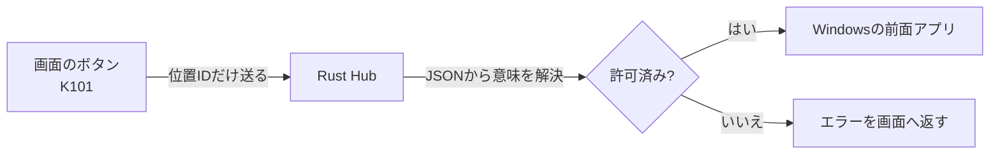
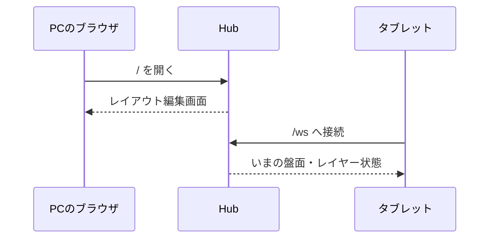
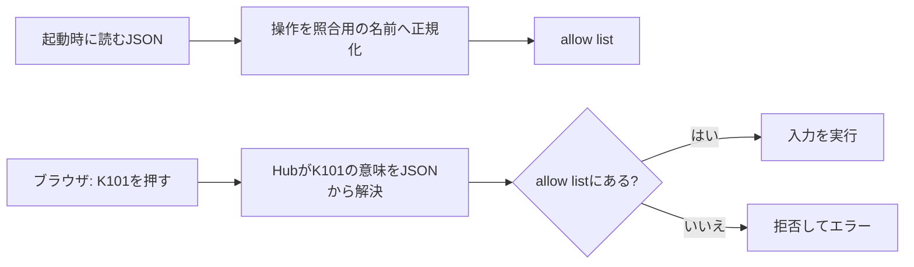
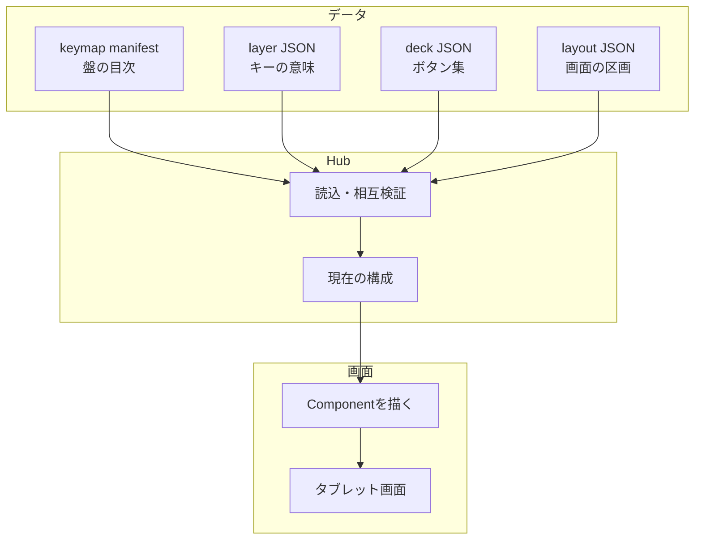
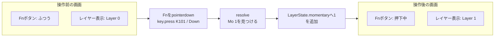
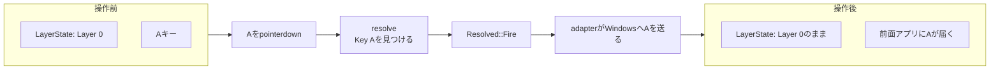

# 技術書 第2稿 — 第1〜5章 差し替え原稿

対象: `02_KeyDeck技術書_初稿.md`

この原稿は初稿を消さずに、次の改善を試すための差し替え版です。

- 最初の3章に、短く分けた注釈付きコードを置く
- 第5章を「状態が変わる」と「Windows入力が出る」の差分から読み直す
- 図は、画面の前 → 処理 → 画面の後、の順で読む
- 確認問題は本文から外し、`04_確認問題.md` → `05_確認問題_解答.md` の見開きにする

---

# 第I部　設計を先に決める

## 第1章　何を作ったのか

KeyDeckは、ブラウザを「ボタンの板」にし、PC上のRust Hubを「意味を決める頭脳」にした
入力デバイスです。ブラウザは押した**位置**を知らせ、HubはJSONを参照して、その位置に
許された意味があるときだけWindowsへ入力を渡します。



この図の重要点は、左のボタンが「何をするか」を決めていないことです。たとえばK101の
意味を変えたい場合、ブラウザのJavaScriptを「Ctrl+Zを送るコード」にせず、Hub側のJSONを
変更します。

### コードblock 1　Hubの入口を作る

```rust
// Webの入口を1つずつ登録する。
Router::new()
    .route_service("/", ServeFile::new("static/editor.html"))
    .route("/api/qr", get(qr_image))
    .route("/ws", get(ws_handler))
```

出典: `C:\00_master\DevApps\APP_KeyDeck01\crates\proto-hub\src\ws.rs` の `router`（40行目付近）。
説明に必要な3経路だけを抜いた**説明用に簡略化した引用**です。

| 行 | 読み方 |
|---|---|
| `Router::new()` | Hubの「受付カウンター」を新しく作る。まだWindows入力はしない。 |
| `route_service("/", ...)` | PCでトップを開いたとき、レイアウト編集画面を返す。 |
| `route("/api/qr", ...)` | QR画像を返す専用窓口を登録する。 |
| `route("/ws", ...)` | ボタンを押した後も会話を続けるWebSocket窓口を登録する。 |

### 画面で起こること



この段階では、まだキー入力は起きません。まず画面を見せ、端末がHubに接続して、
「いま何を表示すべきか」の状態を受け取ります。

### この章でできるようになったこと

- Hub、ブラウザ、Windowsの担当を分けて説明できる。
- WebSocketは「入力を送る魔法」ではなく、Hubとの会話を続ける通路だと分かる。

### 扱わなかったこと

- Tauri、PWA、インターネット公開、認証を外す手順。

---

## 第2章　先に決めた安全の境界

KeyDeckの安全設計は、クライアントに「任意の操作」を選ばせないことから始まります。
ブラウザが送るのは位置IDです。Hubは起動時に読んだJSONから**allow list（許可リスト）**を作り、
その一覧にある操作だけをWindowsへ渡します。



### コードblock 2　操作に照合用の名前を付ける

```rust
match action {
    // キー、組合せ、文字列を、比較しやすい一定の形へする。
    Action::Key { vk } => Some(format!("key:{vk}")),
    Action::Chord { keys } => Some(format!("chord:{}", keys.join("+"))),
    Action::Text { string } => Some(format!("text:{string}")),

    // 切替と実行を同時にするActionは、中の実行内容を照合する。
    Action::TgFire { fire, .. } => canonical_command_id(fire),
    _ => None,
}
```

出典: `C:\00_master\DevApps\APP_KeyDeck01\crates\proto-hub\src\state.rs` の
`canonical_command_id`（94行目付近）。`KeyHold`等を省いた**説明用に簡略化した引用**です。

この関数が作る`key:...`や`text:...`は、ブラウザが送ってくる命令ではありません。
Hubが自分の帳簿で使う照合札です。`TgFire`は「画面の状態を切り替え、同時に入力も出す」
Actionです。その内側の入力まで帳簿に載せないと、画面だけ変わってWindows入力だけが拒否されます。

### 非エンジニア向けの例え

会場の来場者は座席番号だけを係へ伝えます。係は座席番号から名簿を引き、そこに書かれた
食事だけを渡します。来場者が「好きな料理をください」と言っても、厨房には直接注文できません。

### この章でできるようになったこと

- tokenは接続者を、allow listは実行内容を、それぞれ確認するものだと説明できる。
- `TgFire`のような入れ子Actionでも、実行部分を許可リストで確認する理由を説明できる。

### 扱わなかったこと

- tokenを無効にする構成、外部から接続する構成。

---

## 第3章　JSONを正にする

KeyDeckは、画面・キー・Deckを「コードに埋めた決め打ち」にしません。何をどこに表示して、
どの位置が何をするかはJSONで記録します。コードはJSONを読み、壊れていないと確認し、
画面やWindows入力へつなぐ担当です。



### 用途分解図

```text
「キーの意味を変えたい」       → layers/*.json
「キーの位置を変えたい」       → keymap_*.json の board
「Deckのボタンを変えたい」     → decks/deck_*.json
「画面での部品の並びを変えたい」 → layouts/layout_*.json
```

この4つを分けると、「レイアウトを変えたのに、キーの意味まで変わった」という事故を避けやすくなります。

### コードblock 3　マニフェストを基準にレイヤーを読む

```rust
// 1. 盤面の目次となるマニフェストを読む。
let manifest_text = std::fs::read_to_string(path)?;

// 2. マニフェストのある場所を、レイヤーファイルの基準にする。
let base_dir = path.parent().unwrap_or_else(|| Path::new("."));

// 3. layerFilesにある相対パスを、この基準から読む。
load_keymap_with(&source, &manifest_text, |relative| {
    std::fs::read_to_string(base_dir.join(relative))
})
```

出典: `C:\00_master\DevApps\APP_KeyDeck01\crates\proto-keymap\src\lib.rs` の
`load_keymap_from_path`（349行目付近）。KeyDeck独自エラーへ包み直す部分を省いた
**説明用に簡略化した引用**です。

ここで重要なのは、レイヤーの場所をPCの「いま開いているフォルダ」に頼らない点です。
マニフェスト自身の場所を基準にするので、KeyDeck一式を別のフォルダへ移しても、
マニフェストとレイヤーの関係は変わりません。

### この章でできるようになったこと

- 変更したいものに応じて、どのJSONを見るか決められる。
- JSONを「自由に書くもの」でなく、検証される契約と捉えられる。

### 扱わなかったこと

- 任意のファイルをアップロードする機能、未実装の部品作成GUI。

---

# 第II部　Hubが状態を扱う

## 第4章　起動時に全部検査する

再読込で一部のデータだけを新しくすると、画面・Hub・JSONのどれが正しいのか分からなくなります。
`load_startup_data`は、keymap、Deck、Surface、layoutを揃えて読み、相互の参照も確認します。
ひとつでも壊れていた場合、新しい構成を部分的には採用しません。

この「全体を読んでから切り替える」考え方は、第5章の状態にもつながります。状態は途中で半分だけ
変わると追えません。何を前提にして、どこまで変えたかを1単位として扱います。

---

## 第5章　状態が変わることと、入力が出ることは別

この章の結論は先に言います。

> **状態を変える操作**は、Hubが覚えている「いまどのレイヤーか」を変え、画面を描き直します。
> **入力を出す操作**は、HubからWindowsへキーや文字を送ります。
> 1つの操作が両方を行うこともありますが、同じものではありません。

この区別が大切なのは、画面の色やラベルだけが変わってもWindowsへ入力は出ていない場合があり、
逆にWindowsへ文字を送ってもレイヤー状態は変わらない場合があるからです。

### まず、状態とは何か

`LayerState`は、主に次の2つを覚えます。

```text
momentary = 押している間だけ有効なレイヤー番号の集合
toggled   = 押すたびに有効・無効を切り替えるレイヤー番号の集合

active layers = {0} ∪ momentary ∪ toggled
```

レイヤー0は土台です。常に有効です。たとえばFnを押している間だけレイヤー1を使う場合、
Fnを押した瞬間に`momentary`へ1が入り、離した瞬間に1が消えます。

### UIの前 → 処理 → UIの後: Fnを押す場合



この経路では、**Windowsへ文字やキーは送りません**。変わるのはHubの状態と、それを受け取った
各ブラウザ画面です。別の端末が同じキーボードを表示していれば、その端末のLayer表示も追従します。

### コードblock 4　`Mo`は状態を変える

```rust
Action::Mo { layer } => match edge {
    Edge::Down => {
        // 押した間だけ有効にする番号を記録する。
        state.momentary.insert(*layer);
        Resolved::LayerChanged
    }
    Edge::Up => {
        // 離したら記録から取り除く。
        state.momentary.remove(layer);
        Resolved::LayerChanged
    }
}
```

出典: `C:\00_master\DevApps\APP_KeyDeck01\crates\proto-keymap\src\lib.rs` の `resolve`（774行目付近）。
`Ignored`の細かな分岐を省いた**説明用に簡略化した引用**です。

このblockの出力は`LayerChanged`です。`Fire`ではありません。つまり、この時点では
「Windowsへ送るもの」はありません。Hubが持つ状態を変え、Hubがその新しい状態を画面に配ります。

### UIの前 → 処理 → UIの後: Aキーを押す場合



この経路では、**レイヤー状態は変わりません**。変わる可能性があるのは、Windowsの前面アプリです。
Hubの画面でLayer 0の表示が変わらないのは、失敗ではなく正常です。

### コードblock 5　普通のキーは入力を出す

```rust
Action::Key { .. }
| Action::Chord { .. }
| Action::Text { .. } => match edge {
    // 押したときだけ、実行すべきActionとして返す。
    Edge::Down => Resolved::Fire(action.clone()),
    Edge::Up => Resolved::Ignored,
}
```

出典: `C:\00_master\DevApps\APP_KeyDeck01\crates\proto-keymap\src\lib.rs` の `resolve`（823行目付近）。
対象Actionを絞った**説明用に簡略化した引用**です。

`resolve`自身はWindows APIを呼びません。「これは入力を出すべき」という`Fire`を返すだけです。
その後、Hubの`handle_key_press`が受け取り、`fire_action`を経由してadapterへ渡します。
この分離があるため、レイヤー解決のルールはWindowsに触れずテストできます。

### 両方変わる場合: `TgFire`

`TgFire`は、トグル状態を変えながら、同時に入力を出すActionです。たとえばIME切替のように、
画面上の表示も変え、PCへもキー組合せを送りたい場合に使います。

```mermaid
flowchart LR
  B[操作前<br/>toggled = {}] --> P[ボタンを押す]
  P --> T[toggledへ対象レイヤーを追加または削除]
  T --> U[画面へ新しいLayerStateを配信]
  U --> F[内側のActionをFire]
  F --> W[Windowsへ入力]
  W --> A[操作後<br/>画面の状態とWindows入力の両方が変化]
```

KeyDeckは状態配信を先に行います。Windows入力は待ち時間を含む可能性があるので、画面の状態を
先に揃えておくと、入力送出が失敗しても「Hubが何を状態として採用したか」は曖昧になりません。

### コードblock 6　`KeyHold`は状態ではなく、DownとUpを入力として渡す

```rust
Action::KeyHold { vk } => Resolved::Fire(Action::KeyButton {
    vk: vk.clone(),
    // Downなら押す、Upなら離す。どちらもadapterへ渡す。
    down: matches!(edge, Edge::Down),
})
```

出典: `C:\00_master\DevApps\APP_KeyDeck01\crates\proto-keymap\src\lib.rs` の `resolve`（816行目付近）。

`KeyHold`は画面のレイヤー状態を変えるための機能ではありません。ゲームの十字キーのように
Windows側へ「押す」と「離す」を別々に伝えるための機能です。ブラウザが切断してUpを送れないときは、
Hubが接続者ごとの押下台帳を使って強制解放します。

### 3種類を並べて比べる

| 操作 | HubのLayerState | 画面のLayer表示 | Windowsへの入力 |
|---|---|---|---|
| `Mo`をDown | 変わる | 変わる | 出ない |
| `Mo`をUp | 元へ戻る | 元へ戻る | 出ない |
| `Key`をDown | 変わらない | 変わらない | 出る |
| `TgFire`をDown | 変わる | 変わる | 出る |
| `KeyHold`をDown／Up | 変わらない | 通常は変わらない | 押す／離すが出る |

この表のように、**「状態駆動」= すべての操作が状態を変える**ではありません。
状態駆動とは、「レイヤー表示のように状態を表示するUIは、ボタンが勝手に見た目を変えるのでなく、
Hubが確定した`LayerState`を正として描く」という意味です。

### 関数カード　`resolve`

出典: `C:\00_master\DevApps\APP_KeyDeck01\crates\proto-keymap\src\lib.rs` の `resolve`（746行目付近）

- **役割**: 位置IDとDown／Upを受け、状態を変えるか、入力を出すか、両方かを決めます。
- **呼ばれる場面**: Hubが`key.press`を受け取ったときです。
- **入力**: `Keymap`、可変の`LayerState`、位置ID、`Edge::Down`または`Edge::Up`です。
- **処理順**: キー存在確認 → 有効レイヤーを番号の大きい順で探索 → `trans`を通過 → Action別の結果を返す、の順です。
- **出力**: `LayerChanged`、`Fire`、`FireAndLayerChanged`、`Ignored`、`UnknownKey`、`NoResolution`です。
- **失敗時**: 未知キーや解決不能はエラー相当の結果で戻し、ランタイム入力でpanicしません。
- **関連関数**: `LayerState::active_layers`、`ws::handle_key_press`、`ws::fire_action`、`ws::release_held_keys`。
- **例え**: 受付が「表示だけを切り替える札」「実際に配送へ回す札」「両方する札」を分ける仕事です。

### この章でできるようになったこと

- `LayerChanged`と`Fire`を、見た目の変化とWindows入力の違いとして説明できる。
- `Mo`、`Key`、`TgFire`、`KeyHold`の違いを前後差分で追える。
- 画面のLayer表示がHubの状態から描かれる理由を説明できる。

### 扱わなかったこと

- レイヤー意味論の別案。D3のルールは固定です。

---

## この差し替え稿の確認方法

1. 第1章の図を見て、ブラウザが「意味」ではなく「位置」を送ると説明できるか確認します。
2. 第5章の`Mo`と`Key`の図を並べ、どちらで`LayerState`が変わるかを声に出して確認します。
3. その後、`04_確認問題.md`だけを開きます。答えを見たくなったら、次の
   `05_確認問題_解答.md`を開きます。

