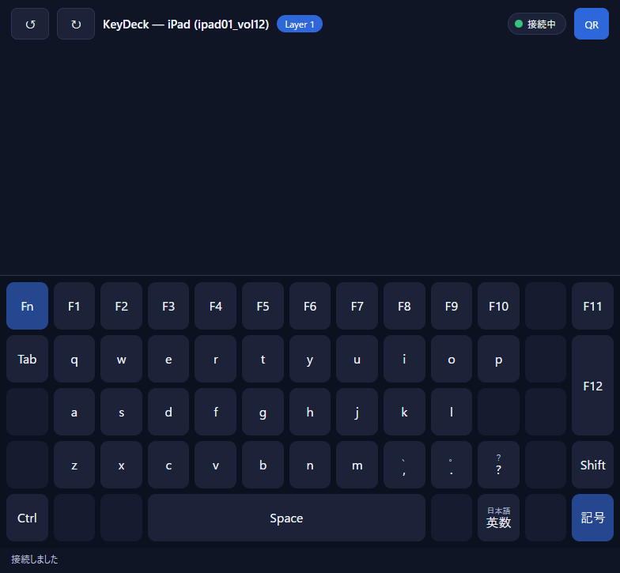
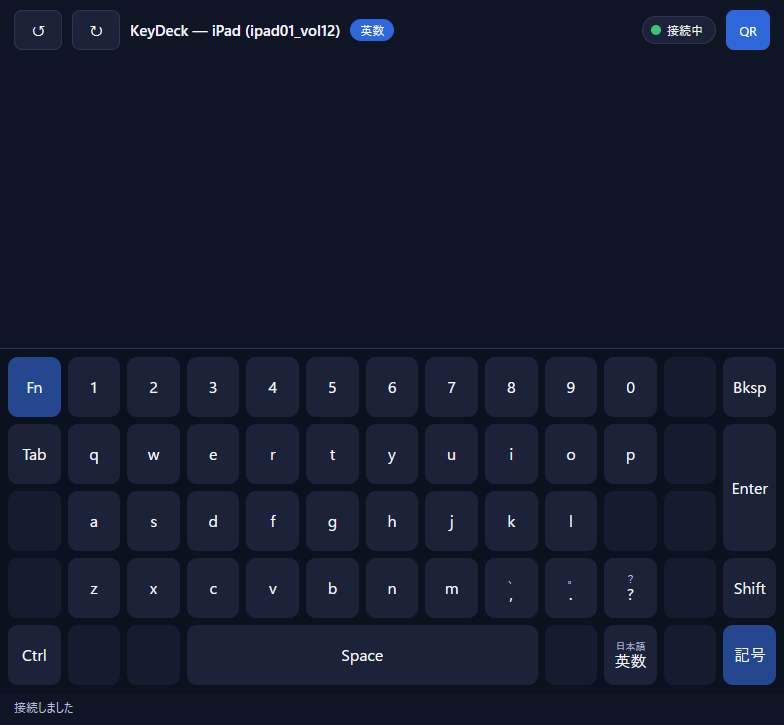

# 第6章　状態が変わることと、入力が出ることは別

## この章の問い

Fn キーを押すと、Hub の中・端末の画面・Windows の3か所で、それぞれ何が起きるのか。

## 先に結論

ボタンを押した結果は、次の3つを **別々に** 見る必要があります。

```text
Hub の状態      Hub が覚えている「いま有効なレイヤー」が変わるか
画面            Hub から配られた状態を受けて、表示が変わるか
Windows 入力    Windows へキーや文字が送られるか
```

**Fn（`mo`）は、Hub の状態と画面を変えますが、Windows には何も送りません。**
普通のキー（`key`）は反対に、Windows へ入力を送りますが、Hub の状態も画面も変えません。
この区別を決めているのが `resolve` という関数で、返す答えが `LayerChanged`（状態が変わった）か `Fire`（実行せよ）かで分かれます。

---

## 画面で起きること — Fn を押して、離す

同じ1枚の画面（`/ipad`）を開いたまま、Fn キー（位置 `K101`）の「押す」と「離す」を送り、3回撮影しました。

### ① 押す前


- 1段目は `1` `2` `3` … `0`、右端は `Bksp`、2〜3段目の右端は `Enter`
- タイトル横のバッジは `英数`

### ② Fn を押している間

端末は次の1通を送りました。

```json
{ "type": "key.press", "keyId": "K101", "edge": "down" }
```



- 1段目が `F1` 〜 `F10` に変わった
- `Bksp` の位置が `F11`、`Enter` の位置が `F12` に変わった
- `Fn` 自身、`Tab`、文字キー、`Shift`、`Ctrl` などは **変わっていない**（レイヤー1に書かれていないので、レイヤー0の意味のまま）
- バッジが `Layer 1` になった

このとき Hub のコンソールに出た2行です（2026-09-15 の実際の出力）。

```text
key press chk="T3-3" surface=Ipad keymap_id="-" key_id="K101" edge=Down layers=0 outcome=layer-change
layer state changed; broadcasting chk="T3-3" surface=Ipad wire=LayerStateWire { keymap_id: None, momentary: [1], toggled: [] }
```

### ③ Fn を離したあと

```json
{ "type": "key.press", "keyId": "K101", "edge": "up" }
```



①と同じ表示に戻りました（画像ファイルも①と同じ大きさ、29,170 バイトでした）。

```text
key press chk="T3-3" surface=Ipad keymap_id="-" key_id="K101" edge=Up layers=0,1 outcome=layer-change
layer state changed; broadcasting chk="T3-3" surface=Ipad wire=LayerStateWire { keymap_id: None, momentary: [], toggled: [] }
```

### この3枚から分かること

| | ① → ②（押す） | ② → ③（離す） |
|---|---|---|
| Hub の状態 | `momentary` が `[]` → `[1]` | `[1]` → `[]` |
| 画面 | キーの文字とバッジが変わる | 元に戻る |
| Windows 入力 | **出ない**（`outcome=layer-change`。`key:…` ではない） | **出ない** |

**画面を変えたのは、ボタン自身ではありません。**
「押す」を送った接続と、撮影していた画面の接続は **別の接続** です。
それでも画面が変わったのは、Hub が状態を変え、その状態を同じ種類の画面すべてに配ったからです。
画面は「自分が押されたから見た目を変える」のではなく、**Hub が確定した状態を描いているだけ** です。

---

## 状態とは何か

Hub はキーボードごとに、次の2つの集合を覚えています。

```rust
/// Hubがkeyboard単位で一元保持する状態。momentary=MO押下中の集合、toggled=TGでONの集合。
#[derive(Debug, Clone, Default, PartialEq, Eq)]
pub struct LayerState {
    momentary: BTreeSet<u8>,
    toggled: BTreeSet<u8>,
}

impl LayerState {
    /// 有効レイヤー = {0} ∪ momentary ∪ toggled。
    pub fn active_layers(&self) -> BTreeSet<u8> {
        let mut set = BTreeSet::new();
        set.insert(0);
        set.extend(self.momentary.iter().copied());
        set.extend(self.toggled.iter().copied());
        set
    }
}
```

出典: `crates/proto-keymap/src/lib.rs` の `LayerState` と `active_layers`。他のメソッドを省いた。**説明用に簡略化**。

| 集合 | 入るとき | 出るとき |
|---|---|---|
| `momentary` | `mo` のキーを押したとき | そのキーを離したとき |
| `toggled` | `tg` のキーを押したとき（入っていなければ） | もう一度押したとき |
| レイヤー0 | 常に有効 | 出ない |

**有効なレイヤー ＝ 0 と、`momentary` と、`toggled` を合わせたもの** です。これが不変条件2の前半です。

---

## コード1 — どのレイヤーの意味を使うか

```rust
pub fn resolve(keymap: &Keymap, state: &mut LayerState, key_id: &str, edge: Edge) -> Resolved {
    let exists_anywhere = keymap
        .layers
        .iter()
        .any(|layer| layer.keys.contains_key(key_id));
    if !exists_anywhere {
        return Resolved::UnknownKey;
    }

    // 有効レイヤーを番号の大きい順に走査し、非transの定義に当たったら採用（フォールスルー）。
    let active = state.active_layers();
    let mut found: Option<&Action> = None;
    for layer_id in active.iter().rev() {
        if let Some(layer) = keymap.layer(*layer_id) {
            if let Some(def) = layer.keys.get(key_id) {
                if !matches!(def.action, Action::Trans) {
                    found = Some(&def.action);
                    break;
                }
            }
        }
    }

    let Some(action) = found else {
        return Resolved::NoResolution;
    };

    match action {
        // …（コード2・3へ）…
    }
}
```

出典: `crates/proto-keymap/src/lib.rs` の `resolve` の前半。`match` の中身を省いた。**説明用に簡略化**。

| 行 | 読み方 |
|---|---|
| `exists_anywhere` | この位置 ID が、どのレイヤーにも無ければ `UnknownKey` |
| `active.iter().rev()` | 有効なレイヤーを **番号の大きい順** に見る |
| `layer.keys.get(key_id)` | そのレイヤーに、このキーの意味が書かれているか |
| `!matches!(… Action::Trans)` | 書かれていても `trans`（「この層では決めない」）なら、下のレイヤーへ進む |
| `break` | 最初に見つかった意味を使う。**番号の大きい方が勝つ** |
| `NoResolution` | どのレイヤーにも `trans` 以外の意味が無い |

Fn を押している間、有効なレイヤーは `{0, 1}` です。`K102` を押すと、まずレイヤー1を見て `F1` が見つかるので、それを使います。
`K202`（`q`）はレイヤー1に書かれていないので、レイヤー0の `q` を使います。②の画面で文字キーが変わらなかったのはこのためです。

**この関数は、乱数も時刻も使いません。** 同じ状態で同じ順に押せば、必ず同じ結果になります（不変条件2の「決定的」）。
不具合の報告があったとき、押した順番さえ分かれば、テストでそのまま再現できます。

---

## コード2 — `mo` は状態を変えて `LayerChanged` を返す

```rust
    match action {
        Action::Mo { layer } => {
            let layer = *layer;
            match edge {
                Edge::Down => {
                    state.momentary.insert(layer);
                    Resolved::LayerChanged
                }
                Edge::Up => {
                    if state.momentary.remove(&layer) {
                        Resolved::LayerChanged
                    } else {
                        Resolved::Ignored
                    }
                }
            }
        }
        Action::Tg { layer } => {
            let layer = *layer;
            match edge {
                Edge::Down => {
                    if !state.toggled.remove(&layer) {
                        state.toggled.insert(layer);
                    }
                    Resolved::LayerChanged
                }
                Edge::Up => Resolved::Ignored,
            }
        }
```

出典: `crates/proto-keymap/src/lib.rs` の `resolve` の `Mo` と `Tg` の枝。省略なし。

| 行 | 読み方 |
|---|---|
| `Edge::Down => { state.momentary.insert(layer); … }` | 押したら、レイヤー番号を `momentary` に入れる。**Hub の状態が変わるのはこの1行** |
| `Resolved::LayerChanged` | 「状態が変わった」と返す。**`Fire` ではない＝Windows へ送るものは無い** |
| `Edge::Up => { if state.momentary.remove(&layer) … }` | 離したら取り除く。取り除けたときだけ `LayerChanged` |
| `else { Resolved::Ignored }` | すでに入っていなかったら（二重に離したなど）何もしない |
| `Tg` の `Edge::Down` | 入っていれば取り除き、無ければ入れる。押すたびに入れ替わる |
| `Tg` の `Edge::Up` | 何もしない |

---

## コード3 — 普通のキーは `Fire` を返し、状態に触らない

```rust
        // 押した瞬間に1回だけ。離したときは何もしない
        Action::AppLaunch { .. }
        | Action::LayoutSwitch { .. }
        | Action::Key { .. }
        | Action::Chord { .. }
        | Action::KeyButton { .. }
        | Action::Text { .. }
        // …（キーマップ切り替え・マウス操作の6行。省略）…
        => match edge {
            Edge::Down => Resolved::Fire(action.clone()),
            Edge::Up => Resolved::Ignored,
        },
        Action::None => Resolved::Ignored,
        Action::Trans => unreachable!("Trans is filtered out during the active-layer walk"),
    }
}
```

出典: `crates/proto-keymap/src/lib.rs` の `resolve` の末尾。並んだ操作の一部とコメントを省いた。**説明用に簡略化**。

| 行 | 読み方 |
|---|---|
| `Edge::Down => Resolved::Fire(action.clone())` | 押したら「この操作を実行せよ」と返す。`state` には触らない |
| `Edge::Up => Resolved::Ignored` | 離しても何もしない |
| `Action::None => Resolved::Ignored` | 空きキー |
| `Action::Trans => unreachable!(…)` | `trans` はコード1で飛ばしているので、ここへは来ない |

**`resolve` 自身は Windows に何も送りません。** `Fire` は「送るべきだ」という答えを返すだけです。
実際に送るのは、この答えを受け取った Hub（`handle_key_press` → `fire_action`、第7章）です。
この分担のおかげで、レイヤーの規則は Windows のない環境でもテストできます。

---

## 状態も入力も変わる `tg.fire`

IME（英数・日本語）の切り替えボタンは、画面の表示を変え、**同時に** PC へ `Alt+`` を送ります。

```rust
        Action::TgFire { layer, fire } => {
            let layer = *layer;
            match edge {
                Edge::Down => {
                    if !state.toggled.remove(&layer) {
                        state.toggled.insert(layer);
                    }
                    Resolved::FireAndLayerChanged((**fire).clone())
                }
                Edge::Up => Resolved::Ignored,
            }
        }
```

出典: `crates/proto-keymap/src/lib.rs` の `resolve` の `TgFire` の枝。コメントを省いた。**説明用に簡略化**。

`FireAndLayerChanged` は「状態が変わった、**かつ** この操作を実行せよ」です。
`Resolved` の定義のコメントには、次のように書かれています。

> 呼び出し側はlayer.stateの配信とアクション発火の両方を行うこと（片方だけだと、「PCのIMEは変わったのに画面が変わらない」という元の不具合に戻る）。

---

## コード4 — 答えを受け取って、配るか・送るか

```rust
    match resolved {
        Resolved::UnknownKey => emit_error(/* … KEY_UNKNOWN_ID … */),
        Resolved::NoResolution => emit_error(/* … KEY_RESOLVE_NONE … */),
        Resolved::Ignored => {}
        Resolved::LayerChanged => {
            let wire = layer_state_wire(state, surface, keymap_id);
            tracing::info!(chk = "T3-3", ?surface, ?wire, "layer state changed; broadcasting");
            broadcast_layer_state(state, surface, &wire);
        }
        Resolved::Fire(action) => fire_action(state, client_id, action).await,
        // T21（tg.fire）: レイヤー配信と発火の**両方**を行う。順序は「先に配信 → 後に発火」。
        // 発火はadapterワーカー往復のawaitを挟むため、先に画面を更新した方が体感が速く、
        // かつ発火が失敗しても画面とHub状態の整合は保たれる（状態は既にresolve内で確定済み）。
        Resolved::FireAndLayerChanged(action) => {
            let wire = layer_state_wire(state, surface, keymap_id);
            broadcast_layer_state(state, surface, &wire);
            fire_action(state, client_id, action).await;
        }
    }
```

出典: `crates/proto-hub/src/ws.rs` の `handle_key_press` の後半。エラー応答の引数と、ログの1行を省いた。**説明用に簡略化**。

| 答え | Hub がすること | 画面 | Windows |
|---|---|---|---|
| `LayerChanged` | 状態を配る（`broadcast_layer_state`） | 変わる | 出ない |
| `Fire` | 実行する（`fire_action`） | 変わらない | 出る |
| `FireAndLayerChanged` | **先に配って、後で実行** | 変わる | 出る |
| `Ignored` | 何もしない | 変わらない | 出ない |
| `UnknownKey` / `NoResolution` | 押した端末へエラーを返す | エラー表示 | 出ない |

②の画面写真で出ていたログの `layer state changed; broadcasting` は、この表の1行目の `tracing::info!` です。

### 関数カード　`resolve`

| 項目 | 内容 |
|---|---|
| 役割 | 位置 ID と「押す／離す」から、状態を変えるか・実行するか・両方か・何もしないかを決める |
| 呼ばれる場面 | Hub が `key.press` を受け取ったとき（`handle_key_press` から） |
| 入力 | キーマップ、そのキーマップの `LayerState`（書き換えられる）、位置 ID、`Edge::Down` か `Edge::Up` |
| 処理順 | 位置 ID の存在確認 → 有効なレイヤーを大きい順に探す → `trans` は飛ばす → 見つかった操作の種類で答えを決める（`mo`・`tg` はここで状態を変える） |
| 出力 | `LayerChanged`／`Fire`／`FireAndLayerChanged`／`Ignored`／`UnknownKey`／`NoResolution` |
| 失敗時 | 知らない位置も、意味の無い位置も、答えの一種として返す。**Hub を止めない**（不変条件3） |
| 関連 | `LayerState::active_layers`、`ws::handle_key_press`、`ws::fire_action`（第7章） |
| たとえ | 透明なシートを何枚も重ねた指示書。上から見て、最初に字が書いてあるシートの指示に従う。指示が「表示を切り替えよ」なら事務所の掲示板を書き換え、「荷物を出せ」なら出荷口へ回す |

### 関数カード　`handle_key_press`

| 項目 | 内容 |
|---|---|
| 役割 | `key.press` 1通について、`resolve` を呼び、答えに応じて配るか実行するかを決め、必ずログを1行残す |
| 呼ばれる場面 | `handle_client_text`（第5章）が `key.press` を受け取ったとき |
| 入力 | 共有状態、接続番号、画面の種類、キーマップ ID（ボード面のときだけ）、位置 ID、押す／離す |
| 処理順 | 解決前の有効レイヤーを記録 → `resolve` → ログを1行 → 答えで分岐 |
| 出力 | 戻り値は無い。状態の配信、Windows 入力、エラー応答のどれかとして現れる |
| 失敗時 | `KEY_UNKNOWN_ID`／`KEY_RESOLVE_NONE` を押した端末へ返す |
| 関連 | `resolve`、`broadcast_layer_state`、`fire_action`、`emit_error` |
| たとえ | 窓口の係。指示書（`resolve`）を引いて、掲示板係と出荷係のどちらに回すかを決め、受付簿に必ず1行書く |

---

## 4つの操作を並べて比べる

| 操作 | JSON の書き方 | 押す（Down） | 離す（Up） | Hub の状態 | Windows 入力 |
|---|---|---|---|---|---|
| `mo` | `{"t":"mo","layer":1}` | `LayerChanged` | `LayerChanged` | 押している間だけ変わる | **出ない** |
| `key` | `{"t":"key","vk":"A"}` | `Fire` | `Ignored` | 変わらない | 押したときに1回（押して離す） |
| `tg.fire` | `{"t":"tg.fire","layer":3,"fire":{…}}` | `FireAndLayerChanged` | `Ignored` | 押すたびに入れ替わる | 押したときに1回 |
| `key.hold` | `{"t":"key.hold","vk":"UP"}` | `Fire`（押す） | `Fire`（離す） | 変わらない | 押したとき押し、離したとき離す（第8章） |

### 「状態駆動」という言葉について

この表のとおり、**すべての操作が状態を変えるわけではありません。**
KeyDeck で言う「状態駆動」は、「状態を表示する画面（レイヤーのバッジやキーの文字）は、ボタンが勝手に見た目を変えるのではなく、
**Hub が確定した状態を正として描く**」という意味です。
①〜③の写真で、押した接続と撮影した画面が別でも表示が変わったのは、この設計の結果です。

---

## この章でできるようになったこと

- `mo` を押したとき、Hub の状態・画面・Windows 入力のそれぞれで何が起きるかを、実際の画面とログで説明できる
- `LayerChanged` と `Fire` の違いを言える
- 有効なレイヤーと、番号の大きい方が勝つ規則、`trans` を小さな例で追える
- `mo`・`key`・`tg.fire`・`key.hold` を、状態・入力・押す／離すで比べられる

## 扱わなかったこと

- レイヤー規則の別案（規則は不変条件2で固定）
- ボード面（`/layout`）で、キーマップごとに別々の状態を持つ仕組み（`layer_state_for`）

## 確認問題

- **問 6-1**　Fn（`mo`）を押したとき、Windows に入力は出ますか。ログのどこを見れば分かりますか。
- **問 6-2**　レイヤー1が有効なとき、レイヤー1に書かれていないキーを押すと、どのレイヤーの意味が使われますか。
- **問 6-3**　`tg.fire` で「先に状態を配り、後で実行する」順番にしているのはなぜですか。
- **問 6-4**　写真②で画面が変わったのは、押したボタン自身が見た目を変えたからですか。

（答えは付録 E）
