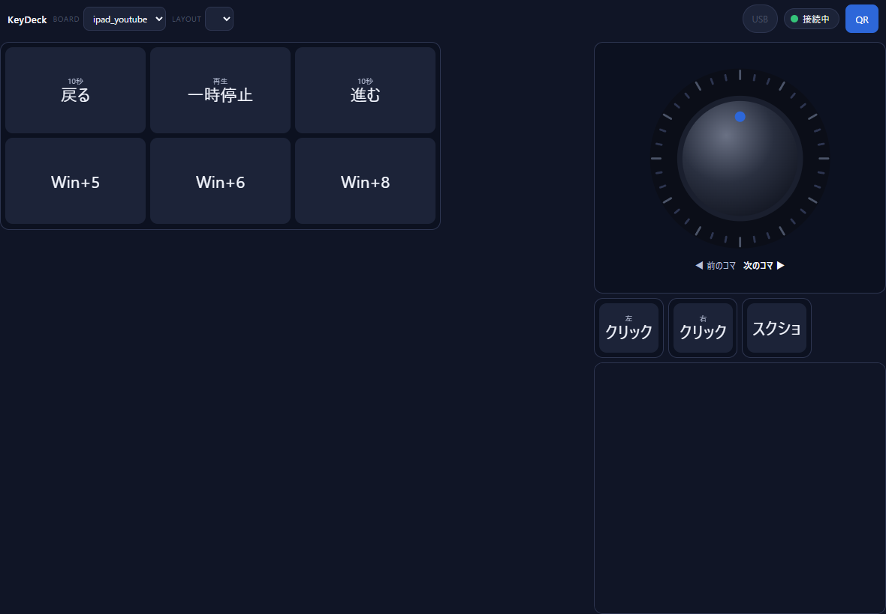

# 第10章　連続値という例外 — トラックボールとダイヤル

## この章の問い

マウスの移動のように「位置」では表せない操作を、境界を壊さずに受け付けるにはどうするか。

## 先に結論

トラックボールは、KeyDeck で唯一 **「位置 ID ではないもの」を端末から送る** 部品です。
その代わりに、送ってよいのは **面の ID と、上限の決まった2つの数（`dx`, `dy`）だけ** と決め、
**その数を何に使うか（出口）は Hub 側の JSON だけが決める** ことにしました。
この例外は、条件を文章にして利用者の裁定を取ってから作っています（2026-08-01）。

ダイヤルは、見た目は連続的でも、中身は **「目盛りを越えたら CW か CCW のキーを1回押す」小さなキーボード** です。例外ではありません。

---

## 画面で起きること



トラックボールの面を指でなぞると、PC のマウスカーソルが動きます。
面をタップするとクリック、2本指でタップすると貼り付け（Ctrl+V）になります。

ダイヤルを回すと、目盛りを1つ越えるごとに、YouTube の動画が1コマ進むか戻ります。

---

## なぜ例外が必要だったのか

マウスの移動を「位置 ID」で表そうとすると、「右へ1px」「右へ2px」……というキーを何百個も並べることになります。
現実的ではありません。

一方で、`dx` と `dy` を自由に受け付けると、第2章の境界が崩れるように見えます。
そこで、**何を守れば崩れないのか** を先に書き出しました。`CLAUDE.md` の不変条件1の下に、次の条件が並んでいます。

| 条件 | 内容 |
|---|---|
| 送ってよいもの | `surfaceId` ＋ 上限つきの数値だけ。上限を超えたら `SURFACE_STATE_RANGE` で拒否 |
| 出口 | **Hub 側の JSON だけが決める。** 端末は出口を送れない・選べない |
| 出口の種類 | 事前に登録した種類だけ。知らない値は読み込み時に拒否 |
| 送る頻度 | 上限あり（125Hz 相当。超えた分は捨てる） |

なお、送る頻度の上限は **端末の側**（`static/trackball.html`、送信の間隔を最低 8 ミリ秒にしている）で実装されています。
Hub の側でも頻度を絞っているかは、本書では確かめていません（付録 D）。
token を持つ人が自作の端末から高い頻度で送れば、端末側の上限は効きません。ただし③の上限により、1回に動かせる量は変わりません。

`CLAUDE.md` には、この形が一般的な USB マウスと同じ（相対移動量2つ）であること、
`Win+R` のようなキーがすでに送れる以上、危険の増え方は小さいことも、判断の根拠として書かれています。

**核心は「端末は、何につながるかを指定できない」ことです。** 数値は送れても、その数値でキーを打たせることはできません。

---

## 面の JSON

```json
{
  "surfaces": [
    {
      "id": "tb01",
      "type": "trackball",
      "binding": { "t": "mouse.move" },
      "clamp": 200,
      "gestures": {
        "tap1-left":  { "t": "mouse.click",       "button": "left" },
        "tap1-right": { "t": "mouse.click",       "button": "right" },
        "dtap1":      { "t": "mouse.dblclick",    "button": "left" },
        "tap2-left":  { "t": "chord",             "keys": ["CTRL", "V"] },
        "hold1":      { "t": "mouse.button.hold", "button": "left" },
        "copy1":      { "t": "chord",             "keys": ["CTRL", "C"] }
      }
    },
    {
      "id": "tb01-scroll",
      "type": "trackball",
      "binding": { "t": "mouse.scroll" },
      "clamp": 100
    }
  ]
}
```

出典: `surfaces/trackball.json`。省略なし。

| 項目 | 意味 |
|---|---|
| `binding` | この面の数値の出口。`tb01` はマウスの移動、`tb01-scroll` はスクロール |
| `clamp` | 1回に送ってよい `dx`・`dy` の上限（絶対値） |
| `gestures` | ジェスチャーの ID ごとの出口。**ID は位置と同じ扱い**で、意味はこの JSON が決める |

ジェスチャーの見分け方（何本の指で、どこを、どれだけ長く触ったらどの ID になるか）は、端末側の `static/trackball.html` が持っています。
面の左右で役割を分けており（左がカーソル、右の細い帯がスクロール）、判定の閾値は **Android 実機では未確認** です（付録 D）。

---

## コード — 数値を受け取る手順は5段で固定

```rust
async fn handle_surface_state(state: &SharedState, client_id: ClientId, surface_id: &str, dx: f64, dy: f64) {
    // ① surfaceIdをレジストリで引く。無ければSURFACE_UNKNOWN_IDを返して終了。
    let def = {
        let s = state.lock().unwrap();
        s.surfaces.get(surface_id).cloned()
    };
    let Some(def) = def else { /* SURFACE_UNKNOWN_ID を返して終わり */ return; };

    // ② dx/dyの有限性を確認。NaN/InfならSURFACE_STATE_RANGE。
    if !dx.is_finite() || !dy.is_finite() { /* SURFACE_STATE_RANGE を返して終わり */ return; }

    // ③ clamp超過ならSURFACE_STATE_RANGE（握りつぶさずクライアントへerrorを返す）。
    let clamp = def.clamp as f64;
    if dx.abs() > clamp || dy.abs() > clamp { /* SURFACE_STATE_RANGE を返して終わり */ return; }

    // ④ 丸めてi32にする。dx==0 && dy==0なら何も発火せず終了（無駄なSendInputを打たない）。
    let dx = dx.round() as i32;
    let dy = dy.round() as i32;
    if dx == 0 && dy == 0 {
        return;
    }

    // ⑤ bindingを解決してActionを作り、既存のadapter_txへ流す。
    let action = match def.binding_t.as_str() {
        "mouse.move" => Action::MouseMove { dx, dy },
        "mouse.scroll" => Action::MouseScroll { dy },
        other => { /* 読み込み時に弾いているので来ない想定。INTERNAL を返す */ return; }
    };
    // …（adapter の列へ流す。省略）…
}
```

出典: `crates/proto-hub/src/ws.rs` の `handle_surface_state`。各エラー応答の本体と、⑤の後半を省いた（`①〜⑤` のコメントは実物のもの）。**説明用に簡略化**。

| 段 | 読み方 |
|---|---|
| ① 面の ID を引く | 知らない面なら終わり。**端末が「どの面か」を名乗るだけで、出口は選べない** |
| ② 有限の数か | 「非数」や「無限大」を送られても、計算に使わない |
| ③ 上限 | `clamp` を超えたら、切り詰めて使うのではなく **拒否してエラーを返す**（おかしな端末に気づけるように） |
| ④ 丸めと0 | 整数にし、動きが0なら Windows に何も送らない |
| ⑤ 出口 | `binding` は Hub の JSON の値。端末から来た値ではない。移動なら `MouseMove`、スクロールなら `MouseScroll` |

### 関数カード　`handle_surface_state`

| 項目 | 内容 |
|---|---|
| 役割 | トラックボール面から届いた移動量を検査し、JSON が決めた出口（移動・スクロール）へ渡す |
| 呼ばれる場面 | `handle_client_text` が `surface.state` を受け取ったとき（指を動かしている間、何度も） |
| 入力 | 共有状態、接続番号、面の ID、`dx`、`dy` |
| 処理順 | ① 面を引く → ② 有限か → ③ 上限 → ④ 丸めて0なら終わり → ⑤ 出口を決めて adapter へ |
| 出力 | 戻り値は無い。マウスが動くか、エラーが返る |
| 失敗時 | `SURFACE_UNKNOWN_ID`／`SURFACE_STATE_RANGE` を送り主へ返す。Hub は止まらない |
| 関連 | `surface.rs`（面の JSON の読み込みと出口の検査）、`handle_surface_gesture`、`fire_action` |
| たとえ | 水道の蛇口。利用者は「どの蛇口を、どれだけ開けるか」は選べるが、どの水道管につながっているかは選べず、一度に開けられる量にも上限がある |

**段の順番がコメントで固定されている** ことにも意味があります。
たとえば③の上限の確認を④の丸めより後にすると、`200.4` が `200` に丸められてから確認され、通ってしまいます。

---

## ダイヤルは例外ではない

```json
{
  "keymapId": "jog_frame",
  "kind": "single",
  "jog": { "detentDeg": 10, "ring": false, "weight": 70, "sound": true },
  "board": {
    "cols": 2,
    "keys": [
      { "id": "CCW", "row": 1, "col": 1 },
      { "id": "CW", "row": 1, "col": 2 }
    ]
  },
  "layerFiles": [
    "layers/jog_frame_layer0.json"
  ]
}
```

出典: `keymaps/keymap_jog_frame.json`。説明文を省いた。**説明用に簡略化**。

ダイヤルの正体は、**`CW`（時計回り）と `CCW`（反時計回り）の2キーだけのキーボード** です。
回して目盛りを1つ越えるたびに、端末は普通の `key.press` を送ります。何のキーになるかはレイヤーの JSON が決めます（このダイヤルでは YouTube のコマ送りの `.` と `,`）。

| 項目 | 意味 | 範囲 |
|---|---|---|
| `detentDeg` | 目盛り1つの角度。10なら1周36コマ | 5〜90 |
| `ring` | 外周に進み具合の弧を出すか。終わりの無いコマ送りでは嘘になるので `false` | — |
| `weight` | つまみが指に遅れて付いてくる重さ | 0〜95 |
| `sound` | 目盛りごとに音を鳴らすか | — |

手ざわりの数値は、**端末の画面の中だけ** で使われます。Hub へ届くのは相変わらず位置（`CW` / `CCW`）です。

起動時の検査（第4章）では、ダイヤル部品が **ダイヤル設定を持つキーマップ** を指しているかを確かめています。

```rust
// ダイヤルは「jogを持つキーマップ」だけ。普通のキーボードを
// ダイヤルとして置くと、回しても押すキーが無く黙って無反応になる。
crate::layout::ComponentKind::Jog => {
    keymaps.get(reference).is_some_and(|k| k.jog.is_some())
}
```

出典: `crates/proto-hub/src/startup.rs` の `load_startup_data` の中。省略なし。

---

## 例外の作り方から学べること

```text
1. まず「位置」の形で表せないか考える     → ダイヤルは表せた。例外にしない
2. 表せないなら、守るべきことを書き出す    → 出口は Hub が決める、数値に上限、頻度に上限
3. その条件で、利用者の裁定を取る          → CLAUDE.md に日付と一緒に残す
4. 条件をコードの段として固定する          → ①〜⑤ の順番
```

**例外を1つ認めることと、境界を無くすことは違います。** 例外に条件を付けて文章にしておけば、
次に「これも例外にしてよいか」と迷ったとき、比べる相手があります。

---

## この章でできるようになったこと

- トラックボールが「位置だけ」の例外である理由と、その条件を説明できる
- `surface.state` を受け取る5段の手順と、その順番の意味を言える
- ダイヤルが例外ではなく小さなキーボードである理由を説明できる

## 扱わなかったこと

- ジェスチャーを見分ける端末側の判定（`static/trackball.html`）の詳細
- 横スクロール（対応していない）

## 確認問題

- **問 10-1**　トラックボールの端末が `{"binding": "key", "vk": "A"}` を送ったら、A キーが押されますか。
- **問 10-2**　`dx` が上限を超えていたとき、上限まで切り詰めて使わず拒否するのはなぜですか。
- **問 10-3**　ダイヤルを回したとき、Hub に届くのは角度ですか、位置 ID ですか。

（答えは付録 E）
