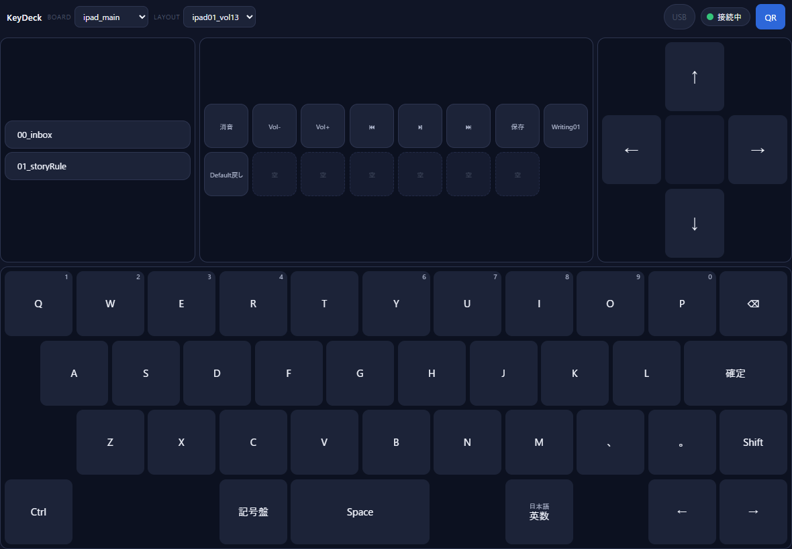

# Rust＋WebSocketで作る自作キーボード／Stream Deck
## ブラウザを入力デバイスに変える

```
版        初版（revision 1）
確認日    2026-09-15
題材      KeyDeck（Rust Hub ＋ 素の HTML/JavaScript 端末）
```

---

## この本は誰のための本か

iPad やスマートフォンのブラウザを、PC のキーボードや Stream Deck のような「押すための板」に変える。
この本は、実際に動いているそういう道具（KeyDeck）を題材に、**中で何が起きているのか**を
コードを読み慣れていない人でも追えるように書いたものです。

作り方の手順書ではありません。似た記事はたくさんあります。
この本が扱うのは、作りながら何度も立ち返ることになった、ひとつの問いです。

> **ネットワークの向こうの端末に、PC へ何を送らせてよいのか。**

キー入力を PC に注入する道具は、書き方を誤るとそのまま他人の PC を操る道具になります。
KeyDeck はこの問いに最初に答えを決め、その後のすべての機能をその答えの内側で作りました。
**制約を先に決めると、あとの設計が楽になる。** その実例として読んでください。

---

## この本の約束

| 約束 | 内容 |
|---|---|
| 対象 OS | **Windows 専用。** PC への入力は Windows の SendInput を使う。macOS・Linux では動かない |
| 使う場所 | **LAN 内で、自分の PC を操作するためのもの。** インターネットへ公開する構成は書かない |
| 書かないこと | token 認証・許可リスト・ロード時検証を外す手順。「とりあえず動かす」ための近道も書かない |
| 実装 | Hub は Rust（axum・tokio）、端末は素の HTML と JavaScript。Tauri・PWA・フロントエンドフレームワークは使っていないので扱わない |
| 借り物 | `crates/hub-core/` は外部から取り込んで凍結したコピー。KeyDeck が設計したものとしては説明しない |
| コード | 載せるコードはすべて実在するものからの引用。行を省いたものには **「説明用に簡略化」** と書く |
| 伏字 | 個人のパスは `C:\Users\<user>\...`、LAN の IP は `192.168.0.x`、認証値は `<token>` と書く |
| 未確認 | 確かめていないことは **「未確認」** と書く。付録 D に一覧がある |

---

## なぜこの順番にしたか

この本の前には 12 章の初稿と、第 1〜5 章の第 2 稿がありました。初版では構成を組み直しています。

**初稿は「話題ごと」に章が並んでいました。** 安全、JSON、検査、レイヤー、通信……と、
どれも正しい話ですが、読者から見ると「この章の話は、全体のどこで起きていることなのか」が
章をまたぐたびに途切れます。

**初版は、ボタンを1回押したときの旅を、始まりから終わりまで追う順番にしました。**

```text
第I部   地図を持つ          何を作ったのか／何を送らせないと決めたのか
第II部  1回の押下を追う     JSON → 起動時の検査 → 通信 → 意味の解決 → Windows → 離すとき
第III部 画面を部品から作る   部品と区画／連続値という例外／保存できる編集画面
第IV部  境界を広げるとき     アプリ起動を足す／踏んだ落とし穴／AIと一緒に変えていく
```

第II部は章の順番がそのまま処理の順番です。第6章を読んでいる人は、
「いま Hub の中の、第5章で届いたメッセージの続きを見ている」と分かります。

もうひとつの変更は **第12章「アプリ起動を足す」** です。初稿の時点では無かった機能で、
「すでに決めた境界を、壊さずに広げるにはどうするか」を1つの機能で最初から最後まで見られる、
この本でいちばん実践的な章になりました。

---

## 各章の型

どの章も同じ順で並んでいます。コードを読まない人は ★ の付いた項目だけ読んでも筋が通ります。

```text
★ この章の問い         1行
★ 先に結論             2〜3行
★ 画面で起きること      できるだけ実際の画面から入る
  コード                実在するコードの引用と、行ごとの読み方
  関数カード            役割／呼ばれる場面／入力／処理順／出力／失敗時／関連／たとえ
★ なぜこうしたのか      設計の理由
★ できるようになったこと・扱わなかったこと
  確認問題              答えは付録 E（本文の流れを止めないため巻末に分けた）
```

---

## 読み方は3通り

| あなたが | 読み方 |
|---|---|
| はじめて読む | 第1章から順に。第II部だけは飛ばさないこと（旅が途切れる） |
| コードは読まない | 各章の ★ だけ。第6章の図と第2章の表は必ず見る |
| 開発を引き継ぐ（人・AI） | 先に **付録 B「逆引き索引」** を開き、やりたいことから該当章へ飛ぶ。変更の前に第2章と第14章 |

---

## 目次

**第I部　地図を持つ**

- 第1章　何を作ったのか — 押した場所と、その意味を分ける
- 第2章　境界を先に決める — 端末に送らせてよいもの

**第II部　1回の押下を追う**

- 第3章　JSON が盤面の正体
- 第4章　起動時に全部検査する
- 第5章　WebSocket で「位置」だけを送る
- 第6章　状態が変わることと、入力が出ることは別
- 第7章　Windows へ渡す
- 第8章　押しっぱなしと、切断したときの解放

**第III部　画面を部品から作る**

- 第9章　部品と区画
- 第10章　連続値という例外 — トラックボールとダイヤル
- 第11章　保存できる編集画面

**第IV部　境界を広げるとき**

- 第12章　アプリ起動を足す — 任意コマンド実行にしない
- 第13章　実際に踏んだ落とし穴
- 第14章　AI と一緒に、安全に変えていく

**付録**

- 付録 A　用語集
- 付録 B　逆引き索引（やりたいこと → 章・ファイル・関数）
- 付録 C　コード索引
- 付録 D　未確認事項
- 付録 E　確認問題の解答

---

## この版で確かめたこと

```
cargo test --workspace   139 passed / 0 failed（2026-09-15、Windows 上で実行）
起動ログ                 keymaps=13 decks=2 surfaces=2 layouts=2 apps=1
                         allow-list built allowed_commands=139
第6章の画面写真          同じ /ipad 画面を1つ開いたまま、別の WebSocket 接続から
                         実際の key.press（Fn の Down → Up）を送って3回撮影した
```

画面写真は **PC 上のブラウザ（Chrome のヘッドレスモード）で撮ったもの** です。
iPad 実機の画面ではありません。描いているのは同じ HTML ですが、実機の文字の大きさや余白とは異なる場合があります。

# 第I部　地図を持つ

# 第1章　何を作ったのか — 押した場所と、その意味を分ける

## この章の問い

KeyDeck は何をする道具で、普通の「リモコンアプリ」とどこが違うのか。

## 先に結論

端末（iPad のブラウザ）は **「どこを押したか」だけ** を PC に伝えます。
それが何を意味するか（どのキーを打つか、何の文字を入れるか）は、**PC 側の Hub が JSON を見て決めます。**
この「位置」と「意味」の分け方が、KeyDeck のすべての設計の出発点です。

---

## 画面で起きること



これは KeyDeck の主ボードです。上の段に3つの部品（左がコピペ用の一覧、中央が Stream Deck 風のボタン、右が十字キー）、
下の段にキーボードが並んでいます。

ここで `Ctrl` を押すと、PC の前面にあるアプリに Ctrl が届きます。
ところが、**このボタンの HTML には「Ctrl を送る」とは1文字も書かれていません。**
ボタンが知っているのは自分の場所の名前（このボードの Ctrl なら `K410`）だけです。

---

## 3人の登場人物

```text
 ┌──────────────┐   「K410 を押した」    ┌──────────────┐   Ctrl を押す    ┌──────────────┐
 │  端末          │ ──────────────────▶ │  Hub（PC）    │ ──────────────▶ │ Windows の     │
 │  ブラウザ      │     位置ID だけ       │  Rust         │   SendInput     │ 前面アプリ     │
 └──────────────┘                      └──────┬───────┘                 └──────────────┘
                                                │ 意味を調べる
                                                ▼
                                        ┌──────────────┐
                                        │  JSON          │
                                        │  K410 = Ctrl   │
                                        └──────────────┘
```

| 登場人物 | 実体 | 担当 |
|---|---|---|
| 端末 | `static/*.html` と `static/components.js`（素の HTML と JavaScript） | ボタンを描き、押した場所を送る。**意味は知らない** |
| Hub | Rust のプログラム（`crates/proto-hub` ほか） | 押された場所の意味を JSON から調べ、許可されたものだけを Windows へ渡す |
| JSON | `keymaps/` `layouts/` `decks/` `surfaces/` `apps/` | 「どこに何を置き、押したら何が起きるか」の正体 |

Hub の中はさらに4つの部品（Rust では crate と呼びます）に分かれています。

| crate | 役目 | 備考 |
|---|---|---|
| `proto-hub` | 通信の入口、状態の保持、全体の組み立て | いちばん大きい |
| `proto-keymap` | キーマップの型、読み込みの検査、レイヤーの解決 | Windows を知らない。だからテストしやすい |
| `proto-adapter-win` | Windows へ実際に入力を送る | **Windows API に触るのはここだけ** |
| `hub-core` | コマンドの許可判定などの土台 | 外部から取り込んだ凍結コピー。KeyDeck の設計ではない |

---

## コード — Hub の入口を並べる

Hub が起動すると、まず「どの URL に来たら何を返すか」の一覧を作ります。

```rust
pub fn router(state: SharedState) -> Router {
    Router::new()
        // トップ = レイアウトエディタ（PCで開く。区画の並べ替えをする画面）
        .route_service("/", ServeFile::new("static/editor.html"))
        .route("/api/qr", get(qr_image))
        // P-005 段階D: レイアウトの保存。**書き込みはこの1本だけ**。
        .route("/api/layout/save", post(layout_save_handler))
        .route("/ws", get(ws_handler))
        .route_service("/ipad", ServeFile::new("static/ipad.html"))
        .route_service("/layout", ServeFile::new("static/layout.html"))
        // …（省略）…
        .layer(SetResponseHeaderLayer::overriding(
            header::CACHE_CONTROL,
            axum::http::HeaderValue::from_static("no-store"),
        ))
        .with_state(state)
}
```

出典: `crates/proto-hub/src/ws.rs` の `router`。実際には約30本の経路があり、ここでは6本だけ残した。**説明用に簡略化**。
（コメント「書き込みはこの1本だけ」は保存機能を作った当時のもので、現在の書き込み経路は4本ある。第11章）

| 行 | 読み方 |
|---|---|
| `Router::new()` | 受付カウンターを新しく作る。この時点では何も送らない |
| `route_service("/", …)` | PC で `http://<PC>:8770/` を開くと、レイアウト編集画面の HTML を返す |
| `route("/api/qr", …)` | 端末で読み取る QR コードの画像を返す |
| `route("/ws", …)` | 端末とつなぎっぱなしで会話する WebSocket の入口。**ボタンの押下はすべてここを通る** |
| `route_service("/ipad", …)` など | 端末に配る画面。中身はただの HTML ファイル |
| `.layer(… no-store)` | すべての応答に「キャッシュするな」を付ける。理由は第13章 |

### 関数カード　`router`

| 項目 | 内容 |
|---|---|
| 役割 | URL と、それを処理する関数の対応表を作る |
| 呼ばれる場面 | Hub の起動時に1回だけ |
| 入力 | Hub の共有状態（`SharedState`） |
| 処理順 | 画面の経路 → API の経路 → WebSocket の経路 → 全応答へのヘッダ付与 |
| 出力 | axum の `Router`（あとでサーバーに渡される） |
| 失敗時 | 実行時に失敗する処理を含まない。知らない URL には axum が 404 を返す |
| 関連 | `ws_handler`（第5章）、`layout_save_handler`（第11章） |
| たとえ | 建物の案内板。「2階は窓口、3階は倉庫」と書くだけで、案内板自身は何も運ばない |

---

## なぜブラウザを入力デバイスにしたのか

- **端末に何も入れなくてよい。** iPad はブラウザで URL を開くだけ。アプリのインストールも審査も要らない
- **端末が増えても同じ。** iPad でも Android でも、2台目のタブレットでも、同じ Hub につながる
- **見た目を変えるのに端末を触らない。** 画面の並びは PC 側の JSON にあるので、PC で書き換えれば全端末が変わる

その代わり、**ブラウザは誰でも開けます。** だからこそ、端末に何を言わせてよいかを先に決める必要がありました。
それが次の章です。

---

## 規模の目安（2026-09-15 時点）

```
Rust と画面のコード   約 18,900 行（crates/*/src/*.rs と static/*.html・*.js の合計）
読み込まれる JSON     キーマップ 13、Deck 2、面 2、ボード 2、起動許可アプリ 1
許可リストの項目      139
自動テスト            139 件（数が許可リストと同じなのは偶然）
```

---

## この章でできるようになったこと

- 端末・Hub・JSON の役割を、それぞれ1文で言える
- 「位置」と「意味」を分けると、意味を変えるときに端末を触らなくてよい理由を説明できる

## 扱わなかったこと

- Hub をデスクトップアプリとして包むこと（Tauri など）。KeyDeck は使っていない
- インターネット越しの操作。この道具は LAN 内・自分の PC 専用

## 確認問題

- **問 1-1**　端末から Hub へ送られるのは、キーの「意味」と「位置」のどちらですか。
- **問 1-2**　Windows API を直接呼ぶのは、4つの crate のうちどれですか。
- **問 1-3**　ボタンを押したときの意味を変えたいとき、書き換えるのは端末の HTML と PC の JSON のどちらですか。

（答えは付録 E）

# 第2章　境界を先に決める — 端末に送らせてよいもの

## この章の問い

ネットワークの向こうから PC へキー入力を注入する道具で、端末に何を送らせてよいのか。

## 先に結論

端末が送ってよいのは **「押した場所の ID」** と **「上限の決まった数値」** だけです。
Hub はこれを **3つの門** で確かめます。

```text
門1  token          いま話しているのは、この Hub が発行した URL を持つ人か
門2  位置ID → JSON  その場所に、意味が書かれているか（意味は端末からは来ない）
門3  許可リスト     実行する直前にもう一度、起動時に読んだ JSON に載っている操作か
```

---

## 画面で起きること

端末で QR コードを読むと、次のような URL が開きます。

```text
http://192.168.0.x:8770/layout?id=ipad_main&token=<token>
```

`<token>` は Hub を起動するたびに作り直される 32 文字の値です。
Hub を再起動すると古い URL は使えなくなり、端末には「token が古い」という案内が出ます。

---

## 端末が送れるメッセージは4種類しかない

```rust
#[derive(Debug, Deserialize)]
#[serde(tag = "type")]
pub enum ClientMessage {
    #[serde(rename = "key.press")]
    KeyPress { keymap_id: Option<String>, key_id: String, edge: EdgeWire },
    #[serde(rename = "deck.press")]
    DeckPress { deck_id: Option<String>, slot_id: String },
    #[serde(rename = "surface.state")]
    SurfaceState { surface_id: String, delta: Delta, /* … */ },
    #[serde(rename = "surface.gesture")]
    SurfaceGesture { surface_id: String, gesture_id: String, edge: Option<EdgeWire> },
}
```

出典: `crates/proto-hub/src/protocol.rs` の `ClientMessage`。各フィールドの `rename` 属性とコメントを省き、1行にまとめた。**説明用に簡略化**。

| メッセージ | 中身 | 何の ID か |
|---|---|---|
| `key.press` | キーボードのどのキーを、押したか離したか | 位置 |
| `deck.press` | Deck のどのボタンを押したか | 位置 |
| `surface.state` | トラックボールをどれだけ動かしたか（`dx`, `dy`） | 面の ID ＋ 上限つきの数値（第10章） |
| `surface.gesture` | トラックボール面でどのジェスチャーをしたか | 面の ID ＋ ジェスチャーの ID |

**「Ctrl を押して」「この文字列を入力して」「このプログラムを起動して」というメッセージは、型として存在しません。**
存在しない型は、送っても JSON の解釈の段階で失敗します（第5章）。

---

## コード1 — 門1: token を定数時間で比べる

```rust
/// 定数時間比較（D8）。文字列長が異なる場合はまず不一致だが、長さの違い自体は
/// タイミング差として実用上の脅威にならない（LAN限定・トークンは固定長16進32文字のため）。
pub fn is_valid(&self, candidate: &str) -> bool {
    if candidate.len() != self.value.len() {
        return false;
    }
    self.value.as_bytes().ct_eq(candidate.as_bytes()).into()
}
```

出典: `crates/proto-hub/src/state.rs` の `AccessToken::is_valid`。

| 行 | 読み方 |
|---|---|
| `candidate.len() != …` | 長さが違えば、中身を見ずに不一致 |
| `ct_eq(…)` | **1文字目で違っても最後まで比べる** 比較。普通の比較は違った瞬間に止まるので、かかった時間から「何文字目まで合っていたか」を推測されうる |

token は起動時に 16 バイトの乱数から作られ、`generate` で 16 進 32 文字になります。有効期限はありません。Hub を止めるまで有効です。

---

## コード2 — 門3: 操作に照合札を付ける

起動時に読んだ JSON の操作は、1つずつ「照合札」に変換されて許可リストに載ります。

```rust
pub fn canonical_command_id(action: &Action) -> Option<String> {
    match action {
        Action::Key { vk } => Some(format!("key:{vk}")),
        Action::AppLaunch { id, .. } => Some(format!("app:{id}")),
        Action::Chord { keys } => Some(format!("chord:{}", keys.join("+"))),
        Action::Text { string } => Some(format!("text:{string}")),
        // T21: tg.fire自体はOSへ届かないが、**中の`fire`は届く**。ここで潜らないと
        // 起動時の許可リストに内側のアクションが載らず、発火が実行時に
        // 「absent from the startup allow-list」で弾かれる（実際に一度そうなった。
        // 症状は「画面表示だけ切り替わり、PCのIMEが切り替わらない」）。
        Action::TgFire { fire, .. } => canonical_command_id(fire),
        Action::KeyHold { vk } | Action::KeyButton { vk, .. } => Some(format!("key.hold:{vk}")),
        _ => None,
    }
}
```

出典: `crates/proto-hub/src/state.rs` の `canonical_command_id`。マウスクリックの2行と、他のコメントを省いた。**説明用に簡略化**。

| 行 | 読み方 |
|---|---|
| `Key { vk } => "key:{vk}"` | 「A キー」は `key:A` という札になる |
| `Text { string } => "text:{string}"` | 決まった文字列を入れる操作は、**文字列ごと** 札になる。JSON に書いた文字列しか載らない |
| `TgFire { fire, .. } => canonical_command_id(fire)` | 入れ子の操作は **中身の札** を使う。潜らないと中身が載らない（第13章の実話） |
| `_ => None` | レイヤーの切り替えなど、Windows へ何も届かない操作は札を持たない |

照合札は **端末が送ってくる命令ではありません。** Hub が自分の帳簿のために使う名前です。
端末は `key:A` と送ることもできません。送れるのは `K202` のような位置だけです。

### 関数カード　`canonical_command_id`

| 項目 | 内容 |
|---|---|
| 役割 | 操作（`Action`）を、許可リストで比べられる1本の文字列にする |
| 呼ばれる場面 | ① 起動時、全 JSON の操作から許可リストを作るとき ② 発火の直前、許可リストと照らすとき |
| 入力 | `Action` 1つ |
| 処理順 | 操作の種類を見る → 種類ごとの書式で文字列を作る → 入れ子なら中身へ潜る |
| 出力 | 札の文字列。Windows へ届かない操作なら `None` |
| 失敗時 | 失敗しない。知らない種類は `None` |
| 関連 | `startup::load_startup_data`（第4章）、`ws::fire_action`（第7章） |
| たとえ | 入館名簿の社員番号。受付は顔ではなく番号で名簿と照らす |

---

## token が漏れたら、何ができてしまうか

正直に書きます。**token は「この Hub の利用者である」ことしか確かめません。**

token を知った人が同じ LAN にいれば、次のことができます。

- ボードに置かれた **すべてのボタンを押せる**（キー、ショートカット、登録済みの文字列、登録済みアプリの起動）
- トラックボールでマウスを動かし、クリックできる

逆に、token があっても次のことはできません。

- JSON に書かれていないキーやショートカットを送る
- 任意の文字列を入力する
- `apps/apps.json` に無いプログラムを起動する、プログラムに引数を渡す
- PC の任意の場所にファイルを書く

つまり **被害の上限は「ボードに置いたものの合計」** です。
だから、ボードに何を置くかは「どこまで許すか」を決めることでもあります。
`Win+R`（ファイル名を指定して実行）のようなショートカットを置けば、その分だけ上限は上がります。

token を守るために、KeyDeck は次のようにしています。

- 起動のたびに作り直す（古い URL は使えなくなる）
- 比較を定数時間で行う
- LAN 内でのみ使う前提で、外部に公開する構成を持たない

---

## 7つの不変条件

KeyDeck のリポジトリには、AI も人も守る規則が `CLAUDE.md` に書かれています。
そのうち「アーキテクチャの不変条件」は次の7つです。**この本のすべての章は、このどれかの説明です。**

| # | 内容（要約） | 主に扱う章 |
|---|---|---|
| 1 | 端末が送ってよいのは位置 ID か、面が発する正規化された状態だけ。意味は Hub が決める | 2, 5, 10 |
| 2 | レイヤーの規則は固定（`{0} ∪ momentary ∪ toggled`、番号の大きい方が勝つ、`trans` は下へ、決定的） | 6 |
| 3 | エラーは必ずコードと原因つきで1行。実行時の入力が原因で Hub を落とさない | 5, 7, 12 |
| 4 | 端末に PWA・フロントエンドフレームワーク・ビルドツール・CDN を入れない | 9 |
| 5 | 文字の直接入力は `KEYEVENTF_UNICODE`。クリップボードを黙って書き換えない | 7 |
| 6 | 書き込めるのは決まった3か所だけ。検査と `.bak` つき。任意の場所への書き込み・任意のコマンド実行の API は作らない | 11 |
| 7 | アプリ起動は許可リスト方式だけ。パスも引数も端末から受け取らない | 12 |

---

## なぜ制約を先に決めると楽になるのか

機能を足すたびに「これは安全か」をゼロから考えると、判断が毎回ぶれます。
KeyDeck では「位置だけ」と先に決めてあったので、新しい機能の設計は **「これを位置の形で表せるか」** の1問で済みました。

- ボードの切り替え → 「ボードの ID を持つボタン」として JSON に書く
- アプリの起動 → 「アプリの ID を持つボタン」として JSON に書く（第12章）
- トラックボール → 位置の形では表せない。**だから例外として条件を明文化し、利用者の裁定を取った**（第10章）

**表せないものが出てきたときに、はじめて議論が要る。** これが、先に境界を決めることの効き目です。

---

## この章でできるようになったこと

- token、位置 ID と JSON、許可リストの3つが、それぞれ何を確かめているか言える
- token が漏れたときに、できることとできないことを区別できる

## 扱わなかったこと

- token を無効にする方法、外部から接続する方法（書かない）
- 期限つき token やユーザーごとの権限（KeyDeck には無い）

## 確認問題

- **問 2-1**　端末が任意のキー名を送れる API を足すと、許可リストが意味を失うのはなぜですか。
- **問 2-2**　token を知っている人でも、できないことを2つ挙げてください。
- **問 2-3**　`TgFire` の照合札を作るとき、中の操作へ潜らないと何が起きますか。

（答えは付録 E）

# 第II部　1回の押下を追う

# 第3章　JSON が盤面の正体

## この章の問い

「このボタンを押したら何が起きるか」は、どこに書かれているのか。

## 先に結論

**すべて JSON に書かれています。** コードは JSON を読み、検査し、画面と Windows へつなぐ道具です。
JSON は「どこに置くか」と「押したら何が起きるか」を **別のファイルに分けて** 持っています。
だから、配置を変えても意味は変わらず、意味を変えても配置は変わりません。

---

## 画面で起きること

第1章の主ボードの左上にある `Fn` キーを押している間、数字の段が `F1`〜`F10` に変わります（第6章で実際の画面を見ます）。
この「Fn の位置」「Fn を押すとレイヤー1になる」「レイヤー1では数字の段が F キーになる」は、それぞれ別の JSON の別の行に書かれています。

---

## 変えたいもの → 開く JSON

| 変えたいもの | 開く JSON | 例 |
|---|---|---|
| キーの **意味**（押したら何が起きるか） | `keymaps/layers/<名前>_layer<N>.json` | A キーを B キーにする |
| キーの **位置**（盤面のどこに置くか） | `keymaps/keymap_<ID>.json` の `board` | Bksp を右上へ移す |
| Stream Deck 風ボタンの中身 | `decks/deck_<ID>.json` | 「保存」ボタンを足す |
| ボードの **区画割り**（部品の並び） | `layouts/layout_<ID>.json` | 十字キーをトラックボールにする |
| トラックボール面の出口 | `surfaces/*.json` | 2本指タップを Ctrl+V にする |
| 起動してよいアプリ | `apps/apps.json` | Unity を登録する（第12章） |

この表の左の列を1つ決めれば、開くファイルは1つに決まります。
**「配置を変えたつもりが、意味まで変わった」という事故は、ファイルが分かれていることで起きにくくなります。**

---

## 意味 — レイヤーの JSON

```json
{
  "layer": 0,
  "keys": {
    "K101": {"label": "Fn", "action": {"t": "mo", "layer": 1}},
    "K102": {"label": "1", "action": {"t": "key", "vk": "1"}},
    "K103": {"label": "2", "action": {"t": "key", "vk": "2"}}
  }
}
```

出典: `keymaps/layers/ipad01_vol12_layer0.json`。3キーだけ残し、説明文を省いた。**説明用に簡略化**。

```json
{
  "layer": 1,
  "keys": {
    "K102": { "label": "F1", "action": { "t": "key", "vk": "F1" } },
    "K103": { "label": "F2", "action": { "t": "key", "vk": "F2" } }
  }
}
```

出典: `keymaps/layers/ipad01_vol12_layer1.json`。2キーだけ残し、説明文を省いた。**説明用に簡略化**。

| 項目 | 意味 |
|---|---|
| `"K101"` | 位置の ID。「K ＋ 行 ＋ 列2桁」の決まりで、`K101` は1行目の1列目 |
| `"label"` | 画面に出す文字 |
| `"action"` | 押したら何が起きるか。`"t"` が種類 |
| `{"t": "mo", "layer": 1}` | 押している間だけレイヤー1にする（第6章） |
| `{"t": "key", "vk": "F1"}` | F1 キーを押す |

レイヤー1に `K101` は書かれていません。**書かれていないキーは、下のレイヤー（0）の意味がそのまま使われます**（第6章）。

---

## 位置 — キーマップの JSON

```json
{
  "keymapId": "ipad01_vol12",
  "board": {
    "cols": 13,
    "keys": [
      {"id": "K101", "row": 1, "col": 1},
      {"id": "K102", "row": 1, "col": 2},
      {"id": "K103", "row": 1, "col": 3}
    ]
  },
  "layerFiles": [
    "layers/ipad01_vol12_layer0.json",
    "layers/ipad01_vol12_layer1.json",
    "layers/ipad01_vol12_layer2.json",
    "layers/ipad01_vol12_layer3.json"
  ]
}
```

出典: `keymaps/keymap_ipad01_vol12.json`。`kind` と説明文を省き、`board.keys` を3つだけ残した。**説明用に簡略化**。

キーマップは **目次** です。どの位置にどの ID を置くか（`board`）と、意味の書かれたレイヤーのファイル（`layerFiles`）を並べています。
意味そのものは持っていません。

---

## コード — 目次を読み、そこからレイヤーを読む

```rust
/// ファイルパスからロード。マニフェストを読み、layerFilesをマニフェストと同じ
/// ディレクトリ基準の相対パスとして解決してすべて読み込み、結合してから検証する。
pub fn load_keymap_from_path(path: impl AsRef<Path>) -> Result<Keymap, KeymapError> {
    let path = path.as_ref();
    let manifest_text = std::fs::read_to_string(path).map_err(|error| {
        KeymapError::new(
            LOAD_JSON_SYNTAX,
            format!("{}: failed to read file: {error}", path.display()),
        )
    })?;
    let base_dir: PathBuf = path
        .parent()
        .map(|parent| parent.to_path_buf())
        .unwrap_or_else(|| PathBuf::from("."));
    let source = path.display().to_string();

    load_keymap_with(&source, &manifest_text, |relative| {
        let layer_path = base_dir.join(relative);
        std::fs::read_to_string(&layer_path).map_err(|error| {
            // …（どの目次の、どのレイヤーが読めなかったかを付けてエラーにする。省略）…
        })
    })
}
```

出典: `crates/proto-keymap/src/lib.rs` の `load_keymap_from_path`。レイヤーが読めなかったときのエラー文の組み立てを省いた。**説明用に簡略化**。

| 行 | 読み方 |
|---|---|
| `read_to_string(path)` | 目次（キーマップ）の JSON を読む。読めなければ `LOAD_JSON_SYNTAX` |
| `path.parent()` | 目次が置かれているフォルダを、レイヤーを探す基準にする |
| `load_keymap_with(…, \|relative\| { … })` | 目次を解釈し、`layerFiles` の1つずつについて、この小さな関数でファイルを読んでもらう |
| `base_dir.join(relative)` | 「目次のフォルダ ＋ `layers/…json`」でレイヤーの場所を作る |

### 関数カード　`load_keymap_from_path`

| 項目 | 内容 |
|---|---|
| 役割 | キーマップの目次と、そこに並んだレイヤーをすべて読み、1つのキーマップとして検査して返す |
| 呼ばれる場面 | 起動時と再読込時。`load_startup_data`（第4章）が、見つけたキーマップの数だけ呼ぶ |
| 入力 | 目次の JSON ファイルの場所 |
| 処理順 | 目次を読む → 基準のフォルダを決める → レイヤーを1枚ずつ読む → 結合する → 検査する |
| 出力 | `Keymap`、または `KeymapError`（コードと原因） |
| 失敗時 | 目次もレイヤーも、読めなければ `LOAD_JSON_SYNTAX`。どのファイルかが原因に入る |
| 関連 | `load_keymap_with`（検査の本体。テストはメモリ上の文字列でここを通す）、`load_startup_data` |
| たとえ | 本の目次を開き、「第2章は p.30」と書いてあるページを順にめくって、1冊に綴じ直す |

### なぜ「目次のフォルダ」を基準にするのか

もし「Hub を起動したフォルダ」を基準にすると、Hub をどこから起動したかでレイヤーが見つかったり見つからなかったりします。
目次自身の場所を基準にすれば、KeyDeck 一式を別のフォルダへ移しても、目次とレイヤーの関係は変わりません。

`load_keymap_with` が「ファイルを読む関数」を引数で受け取るのも工夫です。
テストではファイルの代わりに文字列を渡せるので、ディスクに触らず同じ検査を通せます。

---

## JSON は自由帳ではない

JSON で盤面を変えられるのは便利ですが、**何を書いてもよいわけではありません。**

- 知らない項目があれば拒否（`deny_unknown_fields`。書き間違いを黙って無視しない）
- `vk` に書けるキーの名前は辞書にあるものだけ（92種類）
- `layerFiles` は端末から絶対に受け取らない（ファイルの場所の一覧なので、受け取ると任意の場所を読めてしまう。第11章）

---

## この章でできるようになったこと

- 変えたいものから、開く JSON を1つに決められる
- キーマップ（目次＝位置）とレイヤー（意味）の分担を説明できる
- レイヤーの場所を、目次のフォルダを基準に探す理由を言える

## 扱わなかったこと

- 各 JSON の schema の全項目（`schemas/` にある）
- 分割キーボード（左右2台）の JSON の形

## 確認問題

- **問 3-1**　Bksp キーを盤面の別の場所へ移したいとき、開くのはレイヤーの JSON とキーマップの JSON のどちらですか。
- **問 3-2**　レイヤー1に書かれていないキーを、レイヤー1が有効なときに押すと、どの意味が使われますか。
- **問 3-3**　レイヤーのファイルの場所を「Hub を起動したフォルダ」基準で探すと、何が困りますか。

（答えは付録 E）

# 第4章　起動時に全部検査する

## この章の問い

JSON が1か所でも壊れていたら、Hub はどうするべきか。

## 先に結論

**1つでも壊れていたら、何も使わずに止まります。** 壊れた部分だけを捨てて残りで動く、ということをしません。
検査はすべてのファイルを読み終えてから行い、見つかったエラーは **まとめて全部** 報告します。
許可リスト（第2章）もこの検査を通ったあとで作られます。

---

## 画面で起きること — 正常なとき

Hub を起動すると、コンソールに次の2行が出ます（2026-09-15 の実際の出力から、時刻と色の制御文字を除いたもの）。

```text
INFO proto_hub: startup data loaded successfully chk="T3-1" keymaps=13 decks=2 surfaces=2 layouts=2 apps=1
INFO proto_hub: allow-list built chk="T3-1" allowed_commands=139
```

## 画面で起きること — 壊れているとき

キーマップのボタンが、登録されていないアプリを指していた場合（2026-09-12 に意図的に作って確かめた例）。

```text
[APP_LAUNCH_UNKNOWN] keymap 'zzztest' layer 0 key 'T1': app.launch references unknown app id 'nosuchapp' (add it to apps/apps.json)
```

Hub は起動せずに終了します。**どのファイルの、どのレイヤーの、どのキーが悪いか** まで名指しされています。

---

## コード — 読み込みと検査の流れ

```rust
pub fn load_startup_data(
    keymaps_dir: &Path,
    decks_dir: &Path,
    surfaces_dir: &Path,
    layouts_dir: &Path,
    apps_dir: &Path,
) -> Result<StartupData, Vec<String>> {
    let mut errors: Vec<String> = Vec::new();

    // ① キーマップを全部読む。失敗しても止まらず、エラーを貯める
    for path in &paths {
        match proto_keymap::load_keymap_from_path(path) {
            Ok(keymap) => { keymaps.insert(keymap.keymap_id.clone(), keymap); }
            Err(error) => errors.push(format!("{}: {error}", path.display())),
        }
    }
    // ② Deck、③ 面、④ ボード、⑤ 起動許可アプリも同じ形で読む
    // …（省略）…

    // ⑥ 参照先の実在確認。全部読み終えた今しかできない
    if errors.is_empty() {
        for layout in layouts.values() {
            // 区画が指すキーマップ・Deck・面が実在するか
            // …（省略）…
        }
    }

    if !errors.is_empty() {
        return Err(errors);
    }

    // ⑦ ここまで来て、はじめて許可リストを作る
    let command_ids: Vec<String> = all_actions(&keymaps, &decks)
        .filter_map(canonical_command_id)
        .collect();
    let command_registry = hub_core::CommandRegistry::new(command_ids);
    // …（省略）…
}
```

出典: `crates/proto-hub/src/startup.rs` の `load_startup_data`。実物は約 190 行。Deck・面・ボード・アプリの読み込みと参照確認の本体を省き、`①〜⑦` の日本語コメントは説明のために足した。**説明用に簡略化**。

| 行 | 読み方 |
|---|---|
| `Result<StartupData, Vec<String>>` | 成功なら読み込んだもの一式、失敗なら **エラーの一覧**（1件ではない） |
| `errors.push(…)` | 失敗してもその場で止まらない。全部読んでから報告するため |
| `if errors.is_empty() { … 参照確認 … }` | 読み込みで既に失敗しているなら、参照確認はしない（壊れた前提で確認しても意味のないエラーが増えるだけ） |
| `return Err(errors)` | 1件でもあれば、読んだものは全部捨てる |
| `all_actions(…).filter_map(canonical_command_id)` | 全キー・全ボタンの操作から照合札を作る。`None`（Windows に届かない操作）は除かれる |
| `hub_core::CommandRegistry::new` | 許可リストの本体。**この型は hub-core（外部から取り込んだ凍結コピー）のもの** |

### 関数カード　`load_startup_data`

| 項目 | 内容 |
|---|---|
| 役割 | すべての JSON を読み、単体の検査と、ファイル同士の参照の検査を行い、使える一式を返す |
| 呼ばれる場面 | ① Hub の起動時 ② 設定画面からの再読込（`/api/reload`）③ 編集画面で保存した直後（第11章） |
| 入力 | 5つのフォルダ（キーマップ・Deck・面・ボード・起動許可アプリ） |
| 処理順 | キーマップ → Deck → Deck 内の `keymap.switch` の参照 → 面 → ボード → アプリ → ボードの区画の参照 → `app.launch` の参照 → 許可リスト |
| 出力 | `StartupData`（キーマップ、Deck、ボード、許可リスト、面、アプリ） |
| 失敗時 | エラー文字列の一覧を返す。各行は `[コード] どこで: 何が` の形 |
| 関連 | `proto_keymap::load_keymap_from_path`（第3章）、`canonical_command_id`（第2章） |
| たとえ | 出発前の改札。全員の切符と行き先を確かめ、1人でも合わなければ列車を出さない |

---

## なぜ部分適用しないのか

壊れた部分だけ捨てて動く設計にすると、次のことが起きます。

```text
ボード ipad_main が、キーマップ foo を指している
キーマップ foo の JSON に書き間違いがある
  ↓ foo だけ捨てて起動した
端末でボードを開くと、下半分が空っぽ
  ↓
利用者から見えるのは「キーボードが消えた」だけ
原因（foo の書き間違い）は、コンソールのどこかに1行流れて消えている
```

**症状が出る場所と、原因がある場所が遠い** と、調べるのに時間がかかります。
起動の時点で止まれば、症状と原因は同じ画面に並びます。

参照の検査を「押したとき」ではなく「起動時」にしているのも同じ理由です。
第12章のアプリ起動では、`app.launch` の参照先を起動時にまとめて確かめています。
押した瞬間に「そんなアプリは無い」と分かるのでは、原因が遠すぎるからです。

---

## 読み込み時の検査で止めているもの（抜粋）

| 検査 | エラーコード | どこで |
|---|---|---|
| JSON の書式が壊れている | `LOAD_JSON_SYNTAX` など | 各ファイルの読み込み |
| 同じ ID のボードや Deck が2つある | `LOAD_LAYOUT_INVALID` など | `load_startup_data` |
| ボードの区画が、無いキーマップ・Deck・面を指している | `LOAD_LAYOUT_REF_UNKNOWN` | `load_startup_data` |
| ダイヤル部品が、ダイヤル設定を持たないキーマップを指している | `LOAD_LAYOUT_REF_UNKNOWN` | 同上 |
| ボタンが、登録されていないアプリを指している | `APP_LAUNCH_UNKNOWN` | 同上 |
| 区画が重なっている・はみ出している | ボードの読み込みで拒否 | `layout.rs` |

---

## この章でできるようになったこと

- 「再読込」が、ファイルを読み直すだけでなく全体の検査であることを説明できる
- 起動時にまとめて止める設計が、原因を探す時間を短くする理由を言える

## 扱わなかったこと

- 壊れた設定を自動で直す機能（KeyDeck には無い。直すのは人）
- 各エラーコードの完全な一覧（`crates/proto-hub/src/error.rs` と各 crate の定数にある）

## 確認問題

- **問 4-1**　読み込みで失敗したとき、`load_startup_data` がその場で止まらずエラーを貯めるのはなぜですか。
- **問 4-2**　ボードが存在しないキーマップを指していたとき、それが見つかるのは「起動時」と「端末で開いたとき」のどちらですか。
- **問 4-3**　許可リストが、全部の検査が終わったあとに作られるのはなぜですか。

（答えは付録 E）

# 第5章　WebSocket で「位置」だけを送る

## この章の問い

端末で押したボタンは、どうやって Hub に届き、Hub の中のどこへ回されるのか。

## 先に結論

端末は Hub と **WebSocket を1本つなぎっぱなし** にします。
押すと `{"type":"key.press","keyId":"K101","edge":"down"}` のような短い JSON が1つ飛びます。
Hub は **① 接続を張る前に token を確かめ**、**② 届いた JSON を4種類のどれかとして読み**、読めなければその場で「読めなかった」と返します。

---

## 画面で起きること

端末が実際に送る1通です（第6章の撮影で送ったものと同じ）。

```json
{ "type": "key.press", "keyId": "K101", "edge": "down" }
```

指を離すと、`"edge": "up"` の1通がもう一度飛びます。**押す・離すは別々のメッセージ** です。

Hub のコンソールには、押したキーが必ず1行残ります（2026-09-15 の実際の出力）。

```text
key press chk="T3-3" surface=Ipad keymap_id="-" key_id="K101" edge=Down layers=0 outcome=layer-change
```

---

## HTTP と WebSocket の使い分け

| 通信 | 使いどころ | KeyDeck での例 |
|---|---|---|
| HTTP | 1回聞いて1回答えてもらう | 画面の HTML を取る、QR 画像を取る、保存する |
| WebSocket | つなぎっぱなしで、どちらからでも話しかける | 押した・離した、レイヤーが変わった、ボードを切り替えろ |

押す・離すは1秒に何回も起き、しかも **Hub の側から「レイヤーが変わった」と画面へ知らせる** 必要があります。
だから押下は WebSocket を通します。

---

## コード1 — 接続を張る前に token を確かめる

```rust
async fn ws_handler(
    State(state): State<SharedState>,
    Query(query): Query<WsQuery>,
    upgrade: WebSocketUpgrade,
) -> Response {
    // [T3-2] token検証。切断ではなく、まだ確立していないアップグレード自体を401で拒否する。
    if !token_ok(&state, query.token.as_deref()) {
        tracing::error!(
            chk = "T3-2",
            code = WS_TOKEN_INVALID,
            cause = "missing or invalid token on websocket upgrade",
            "rejecting websocket upgrade"
        );
        return (StatusCode::UNAUTHORIZED, WS_TOKEN_INVALID).into_response();
    }
    let surface = SurfaceKind::from_query(query.surface.as_deref());
    tracing::info!(chk = "T3-2", ?surface, "websocket upgrade authorized");
    upgrade.on_upgrade(move |socket| handle_socket(socket, state, surface))
}
```

出典: `crates/proto-hub/src/ws.rs` の `ws_handler`。省略なし。

| 行 | 読み方 |
|---|---|
| `Query(query)` | URL の `?token=…&surface=ipad` を読む |
| `if !token_ok(…)` | token が無い・違うなら、**つながる前に** 401 を返して終わる。一度つないでから切るのではない |
| `tracing::error!(… code …, cause …)` | エラーは必ずコードと原因つきで1行（不変条件3） |
| `SurfaceKind::from_query` | どの種類の画面からの接続か（iPad 一枚・分割キーボード・ボード面・トラックボール） |
| `upgrade.on_upgrade(…)` | ここで初めて WebSocket になり、以降は `handle_socket` が受け持つ |

---

## コード2 — つないでいる間の1接続

```rust
async fn handle_socket(socket: WebSocket, state: SharedState, surface: SurfaceKind) {
    // …（接続に番号を振り、送信用の通路を登録する。省略）…

    send_surface_config_to(&state, client_id, surface);

    while let Some(Ok(message)) = receiver.next().await {
        match message {
            Message::Text(text) => handle_client_text(&state, client_id, surface, text.as_str()).await,
            Message::Close(_) => break,
            _ => {}
        }
    }

    // P-005 段階C: 切断時に押しっぱなしのキーを必ず離す。
    // これを飛ばすと、十字キーを押したまま画面を閉じた瞬間にPCが操作不能になる。
    release_held_keys(&state, client_id).await;

    // …（登録を外す。省略）…
}
```

出典: `crates/proto-hub/src/ws.rs` の `handle_socket`。接続番号の採番、送信タスク、後片付けを省いた。**説明用に簡略化**。

| 行 | 読み方 |
|---|---|
| `send_surface_config_to` | つながった直後に「いま何を表示すべきか」を端末へ送る。端末は自分では何も決めない |
| `while let Some(Ok(message))` | 端末が話しかけてくる限り、1通ずつ待つ |
| `Message::Text(text) => handle_client_text(…)` | 文字のメッセージは、受付（次のコード）へ回す |
| `release_held_keys` | ループを抜けた＝切断した。押しっぱなしのキーをここで必ず離す（第8章） |

---

## コード3 — 受付: 4種類のどれかとして読む

```rust
async fn handle_client_text(state: &SharedState, client_id: ClientId, surface: SurfaceKind, text: &str) {
    let parsed: Result<ClientMessage, _> = serde_json::from_str(text);
    let message = match parsed {
        Ok(message) => message,
        Err(error) => {
            emit_error(
                state,
                client_id,
                "T3-3",
                WS_PARSE,
                format!("failed to parse client message: {error}"),
                json!({ "raw": text }),
            );
            return;
        }
    };

    match message {
        ClientMessage::KeyPress { keymap_id, key_id, edge } => {
            handle_key_press(state, client_id, surface, keymap_id.as_deref(), &key_id, edge.into()).await
        }
        ClientMessage::DeckPress { deck_id, slot_id } => {
            let deck_id = deck_id.as_deref().unwrap_or(DEFAULT_DECK_ID);
            handle_deck_press(state, client_id, deck_id, &slot_id).await
        }
        ClientMessage::SurfaceState { surface_id, delta, .. } => {
            handle_surface_state(state, client_id, &surface_id, delta.dx, delta.dy).await
        }
        ClientMessage::SurfaceGesture { surface_id, gesture_id, edge } => {
            handle_surface_gesture(state, client_id, &surface_id, &gesture_id, edge.map(Edge::from)).await
        }
    }
}
```

出典: `crates/proto-hub/src/ws.rs` の `handle_client_text`。途中のコメント2行を省いた。**説明用に簡略化**。

| 行 | 読み方 |
|---|---|
| `serde_json::from_str(text)` | 文字列を、第2章の `ClientMessage` の4種類のどれかとして読む |
| `Err(error) => emit_error(… WS_PARSE …)` | 4種類のどれでもない（知らない `type`、足りない項目）なら、送り主に「読めなかった」と返して終わる。**Hub は落ちない** |
| `match message { … }` | 種類ごとに窓口が分かれる。キーは `handle_key_press`（第6章）へ |

### 関数カード　`handle_client_text`

| 項目 | 内容 |
|---|---|
| 役割 | 端末から届いた文字列を型に読み、種類ごとの窓口へ回す |
| 呼ばれる場面 | つながっている端末からメッセージが1通届くたび |
| 入力 | 接続番号、画面の種類、受け取った文字列 |
| 処理順 | JSON として読む → 4種類のどれかに当てはめる → 窓口の関数を呼ぶ |
| 出力 | 戻り値は無い。結果は窓口の先で、画面への配信や Windows への入力として現れる |
| 失敗時 | `WS_PARSE` を送り主へ返す。接続は切らず、Hub も止めない |
| 関連 | `handle_key_press`（第6章）、`handle_surface_state`（第10章）、`emit_error` |
| たとえ | 郵便の仕分け。封筒の種類を見て窓口に回すだけで、中身の手続きはしない |

**この関数は Windows へ何も送りません。** 仕分けと実行を分けてあるので、
「知らない種類のメッセージが Windows 入力になる」経路がそもそもありません。

---

## Hub から端末へ届くもの

Hub から端末へ送るメッセージも、種類が決まっています。

| メッセージ | 意味 |
|---|---|
| `surface.config` | いま表示すべき盤面（つながった直後など） |
| `layer.state` | レイヤーが変わった（第6章） |
| `layout.switch` | 別のボードへ移れ（ボード切り替えボタン） |
| `error` | 何かが通らなかった。コードと原因つき |

`crates/proto-hub/src/protocol.rs` の冒頭のコメントには「Hub→client は3種のみ」と書かれていますが、
後から `layout.switch` が足されて今は4種類です。**コメントは実装を追いかけ損ねることがある** という実例として残しておきます。

---

## この章でできるようになったこと

- HTTP と WebSocket を、KeyDeck ではどう使い分けているか言える
- token の確認が「つないだ後に切る」ではなく「つなぐ前に断る」であることを説明できる
- 知らないメッセージが届いても Hub が止まらない理由を言える

## 扱わなかったこと

- 端末側の再接続の仕組み（`/api/ping` で「切れただけか、token が古いのか」を見分ける）
- 独自のメッセージ種別を足す方法（足すなら第2章の境界を先に検討する）

## 確認問題

- **問 5-1**　token が間違っているとき、Hub は WebSocket を「つないでから切る」のと「つなぐ前に断る」のどちらをしますか。
- **問 5-2**　`{"type":"run","command":"calc"}` が届いたら、Hub はどうなりますか。
- **問 5-3**　`handle_client_text` が Windows へ直接入力を送らないことで、何が守られていますか。

（答えは付録 E）

# 第6章　状態が変わることと、入力が出ることは別

## この章の問い

Fn キーを押すと、Hub の中・端末の画面・Windows の3か所で、それぞれ何が起きるのか。

## 先に結論

ボタンを押した結果は、次の3つを **別々に** 見る必要があります。

```text
Hub の状態      Hub が覚えている「いま有効なレイヤー」が変わるか
画面            Hub から配られた状態を受けて、表示が変わるか
Windows 入力    Windows へキーや文字が送られるか
```

**Fn（`mo`）は、Hub の状態と画面を変えますが、Windows には何も送りません。**
普通のキー（`key`）は反対に、Windows へ入力を送りますが、Hub の状態も画面も変えません。
この区別を決めているのが `resolve` という関数で、返す答えが `LayerChanged`（状態が変わった）か `Fire`（実行せよ）かで分かれます。

---

## 画面で起きること — Fn を押して、離す

同じ1枚の画面（`/ipad`）を開いたまま、Fn キー（位置 `K101`）の「押す」と「離す」を送り、3回撮影しました。

### ① 押す前


- 1段目は `1` `2` `3` … `0`、右端は `Bksp`、2〜3段目の右端は `Enter`
- タイトル横のバッジは `英数`

### ② Fn を押している間

端末は次の1通を送りました。

```json
{ "type": "key.press", "keyId": "K101", "edge": "down" }
```


- 1段目が `F1` 〜 `F10` に変わった
- `Bksp` の位置が `F11`、`Enter` の位置が `F12` に変わった
- `Fn` 自身、`Tab`、文字キー、`Shift`、`Ctrl` などは **変わっていない**（レイヤー1に書かれていないので、レイヤー0の意味のまま）
- バッジが `Layer 1` になった

このとき Hub のコンソールに出た2行です（2026-09-15 の実際の出力）。

```text
key press chk="T3-3" surface=Ipad keymap_id="-" key_id="K101" edge=Down layers=0 outcome=layer-change
layer state changed; broadcasting chk="T3-3" surface=Ipad wire=LayerStateWire { keymap_id: None, momentary: [1], toggled: [] }
```

### ③ Fn を離したあと

```json
{ "type": "key.press", "keyId": "K101", "edge": "up" }
```


①と同じ表示に戻りました（画像ファイルも①と同じ大きさ、29,170 バイトでした）。

```text
key press chk="T3-3" surface=Ipad keymap_id="-" key_id="K101" edge=Up layers=0,1 outcome=layer-change
layer state changed; broadcasting chk="T3-3" surface=Ipad wire=LayerStateWire { keymap_id: None, momentary: [], toggled: [] }
```

### この3枚から分かること

| | ① → ②（押す） | ② → ③（離す） |
|---|---|---|
| Hub の状態 | `momentary` が `[]` → `[1]` | `[1]` → `[]` |
| 画面 | キーの文字とバッジが変わる | 元に戻る |
| Windows 入力 | **出ない**（`outcome=layer-change`。`key:…` ではない） | **出ない** |

**画面を変えたのは、ボタン自身ではありません。**
「押す」を送った接続と、撮影していた画面の接続は **別の接続** です。
それでも画面が変わったのは、Hub が状態を変え、その状態を同じ種類の画面すべてに配ったからです。
画面は「自分が押されたから見た目を変える」のではなく、**Hub が確定した状態を描いているだけ** です。

---

## 状態とは何か

Hub はキーボードごとに、次の2つの集合を覚えています。

```rust
/// Hubがkeyboard単位で一元保持する状態。momentary=MO押下中の集合、toggled=TGでONの集合。
#[derive(Debug, Clone, Default, PartialEq, Eq)]
pub struct LayerState {
    momentary: BTreeSet<u8>,
    toggled: BTreeSet<u8>,
}

impl LayerState {
    /// 有効レイヤー = {0} ∪ momentary ∪ toggled。
    pub fn active_layers(&self) -> BTreeSet<u8> {
        let mut set = BTreeSet::new();
        set.insert(0);
        set.extend(self.momentary.iter().copied());
        set.extend(self.toggled.iter().copied());
        set
    }
}
```

出典: `crates/proto-keymap/src/lib.rs` の `LayerState` と `active_layers`。他のメソッドを省いた。**説明用に簡略化**。

| 集合 | 入るとき | 出るとき |
|---|---|---|
| `momentary` | `mo` のキーを押したとき | そのキーを離したとき |
| `toggled` | `tg` のキーを押したとき（入っていなければ） | もう一度押したとき |
| レイヤー0 | 常に有効 | 出ない |

**有効なレイヤー ＝ 0 と、`momentary` と、`toggled` を合わせたもの** です。これが不変条件2の前半です。

---

## コード1 — どのレイヤーの意味を使うか

```rust
pub fn resolve(keymap: &Keymap, state: &mut LayerState, key_id: &str, edge: Edge) -> Resolved {
    let exists_anywhere = keymap
        .layers
        .iter()
        .any(|layer| layer.keys.contains_key(key_id));
    if !exists_anywhere {
        return Resolved::UnknownKey;
    }

    // 有効レイヤーを番号の大きい順に走査し、非transの定義に当たったら採用（フォールスルー）。
    let active = state.active_layers();
    let mut found: Option<&Action> = None;
    for layer_id in active.iter().rev() {
        if let Some(layer) = keymap.layer(*layer_id) {
            if let Some(def) = layer.keys.get(key_id) {
                if !matches!(def.action, Action::Trans) {
                    found = Some(&def.action);
                    break;
                }
            }
        }
    }

    let Some(action) = found else {
        return Resolved::NoResolution;
    };

    match action {
        // …（コード2・3へ）…
    }
}
```

出典: `crates/proto-keymap/src/lib.rs` の `resolve` の前半。`match` の中身を省いた。**説明用に簡略化**。

| 行 | 読み方 |
|---|---|
| `exists_anywhere` | この位置 ID が、どのレイヤーにも無ければ `UnknownKey` |
| `active.iter().rev()` | 有効なレイヤーを **番号の大きい順** に見る |
| `layer.keys.get(key_id)` | そのレイヤーに、このキーの意味が書かれているか |
| `!matches!(… Action::Trans)` | 書かれていても `trans`（「この層では決めない」）なら、下のレイヤーへ進む |
| `break` | 最初に見つかった意味を使う。**番号の大きい方が勝つ** |
| `NoResolution` | どのレイヤーにも `trans` 以外の意味が無い |

Fn を押している間、有効なレイヤーは `{0, 1}` です。`K102` を押すと、まずレイヤー1を見て `F1` が見つかるので、それを使います。
`K202`（`q`）はレイヤー1に書かれていないので、レイヤー0の `q` を使います。②の画面で文字キーが変わらなかったのはこのためです。

**この関数は、乱数も時刻も使いません。** 同じ状態で同じ順に押せば、必ず同じ結果になります（不変条件2の「決定的」）。
不具合の報告があったとき、押した順番さえ分かれば、テストでそのまま再現できます。

---

## コード2 — `mo` は状態を変えて `LayerChanged` を返す

```rust
    match action {
        Action::Mo { layer } => {
            let layer = *layer;
            match edge {
                Edge::Down => {
                    state.momentary.insert(layer);
                    Resolved::LayerChanged
                }
                Edge::Up => {
                    if state.momentary.remove(&layer) {
                        Resolved::LayerChanged
                    } else {
                        Resolved::Ignored
                    }
                }
            }
        }
        Action::Tg { layer } => {
            let layer = *layer;
            match edge {
                Edge::Down => {
                    if !state.toggled.remove(&layer) {
                        state.toggled.insert(layer);
                    }
                    Resolved::LayerChanged
                }
                Edge::Up => Resolved::Ignored,
            }
        }
```

出典: `crates/proto-keymap/src/lib.rs` の `resolve` の `Mo` と `Tg` の枝。省略なし。

| 行 | 読み方 |
|---|---|
| `Edge::Down => { state.momentary.insert(layer); … }` | 押したら、レイヤー番号を `momentary` に入れる。**Hub の状態が変わるのはこの1行** |
| `Resolved::LayerChanged` | 「状態が変わった」と返す。**`Fire` ではない＝Windows へ送るものは無い** |
| `Edge::Up => { if state.momentary.remove(&layer) … }` | 離したら取り除く。取り除けたときだけ `LayerChanged` |
| `else { Resolved::Ignored }` | すでに入っていなかったら（二重に離したなど）何もしない |
| `Tg` の `Edge::Down` | 入っていれば取り除き、無ければ入れる。押すたびに入れ替わる |
| `Tg` の `Edge::Up` | 何もしない |

---

## コード3 — 普通のキーは `Fire` を返し、状態に触らない

```rust
        // 押した瞬間に1回だけ。離したときは何もしない
        Action::AppLaunch { .. }
        | Action::LayoutSwitch { .. }
        | Action::Key { .. }
        | Action::Chord { .. }
        | Action::KeyButton { .. }
        | Action::Text { .. }
        // …（キーマップ切り替え・マウス操作の6行。省略）…
        => match edge {
            Edge::Down => Resolved::Fire(action.clone()),
            Edge::Up => Resolved::Ignored,
        },
        Action::None => Resolved::Ignored,
        Action::Trans => unreachable!("Trans is filtered out during the active-layer walk"),
    }
}
```

出典: `crates/proto-keymap/src/lib.rs` の `resolve` の末尾。並んだ操作の一部とコメントを省いた。**説明用に簡略化**。

| 行 | 読み方 |
|---|---|
| `Edge::Down => Resolved::Fire(action.clone())` | 押したら「この操作を実行せよ」と返す。`state` には触らない |
| `Edge::Up => Resolved::Ignored` | 離しても何もしない |
| `Action::None => Resolved::Ignored` | 空きキー |
| `Action::Trans => unreachable!(…)` | `trans` はコード1で飛ばしているので、ここへは来ない |

**`resolve` 自身は Windows に何も送りません。** `Fire` は「送るべきだ」という答えを返すだけです。
実際に送るのは、この答えを受け取った Hub（`handle_key_press` → `fire_action`、第7章）です。
この分担のおかげで、レイヤーの規則は Windows のない環境でもテストできます。

---

## 状態も入力も変わる `tg.fire`

IME（英数・日本語）の切り替えボタンは、画面の表示を変え、**同時に** PC へ `Alt+`` を送ります。

```rust
        Action::TgFire { layer, fire } => {
            let layer = *layer;
            match edge {
                Edge::Down => {
                    if !state.toggled.remove(&layer) {
                        state.toggled.insert(layer);
                    }
                    Resolved::FireAndLayerChanged((**fire).clone())
                }
                Edge::Up => Resolved::Ignored,
            }
        }
```

出典: `crates/proto-keymap/src/lib.rs` の `resolve` の `TgFire` の枝。コメントを省いた。**説明用に簡略化**。

`FireAndLayerChanged` は「状態が変わった、**かつ** この操作を実行せよ」です。
`Resolved` の定義のコメントには、次のように書かれています。

> 呼び出し側はlayer.stateの配信とアクション発火の両方を行うこと（片方だけだと、「PCのIMEは変わったのに画面が変わらない」という元の不具合に戻る）。

---

## コード4 — 答えを受け取って、配るか・送るか

```rust
    match resolved {
        Resolved::UnknownKey => emit_error(/* … KEY_UNKNOWN_ID … */),
        Resolved::NoResolution => emit_error(/* … KEY_RESOLVE_NONE … */),
        Resolved::Ignored => {}
        Resolved::LayerChanged => {
            let wire = layer_state_wire(state, surface, keymap_id);
            tracing::info!(chk = "T3-3", ?surface, ?wire, "layer state changed; broadcasting");
            broadcast_layer_state(state, surface, &wire);
        }
        Resolved::Fire(action) => fire_action(state, client_id, action).await,
        // T21（tg.fire）: レイヤー配信と発火の**両方**を行う。順序は「先に配信 → 後に発火」。
        // 発火はadapterワーカー往復のawaitを挟むため、先に画面を更新した方が体感が速く、
        // かつ発火が失敗しても画面とHub状態の整合は保たれる（状態は既にresolve内で確定済み）。
        Resolved::FireAndLayerChanged(action) => {
            let wire = layer_state_wire(state, surface, keymap_id);
            broadcast_layer_state(state, surface, &wire);
            fire_action(state, client_id, action).await;
        }
    }
```

出典: `crates/proto-hub/src/ws.rs` の `handle_key_press` の後半。エラー応答の引数と、ログの1行を省いた。**説明用に簡略化**。

| 答え | Hub がすること | 画面 | Windows |
|---|---|---|---|
| `LayerChanged` | 状態を配る（`broadcast_layer_state`） | 変わる | 出ない |
| `Fire` | 実行する（`fire_action`） | 変わらない | 出る |
| `FireAndLayerChanged` | **先に配って、後で実行** | 変わる | 出る |
| `Ignored` | 何もしない | 変わらない | 出ない |
| `UnknownKey` / `NoResolution` | 押した端末へエラーを返す | エラー表示 | 出ない |

②の画面写真で出ていたログの `layer state changed; broadcasting` は、この表の1行目の `tracing::info!` です。

### 関数カード　`resolve`

| 項目 | 内容 |
|---|---|
| 役割 | 位置 ID と「押す／離す」から、状態を変えるか・実行するか・両方か・何もしないかを決める |
| 呼ばれる場面 | Hub が `key.press` を受け取ったとき（`handle_key_press` から） |
| 入力 | キーマップ、そのキーマップの `LayerState`（書き換えられる）、位置 ID、`Edge::Down` か `Edge::Up` |
| 処理順 | 位置 ID の存在確認 → 有効なレイヤーを大きい順に探す → `trans` は飛ばす → 見つかった操作の種類で答えを決める（`mo`・`tg` はここで状態を変える） |
| 出力 | `LayerChanged`／`Fire`／`FireAndLayerChanged`／`Ignored`／`UnknownKey`／`NoResolution` |
| 失敗時 | 知らない位置も、意味の無い位置も、答えの一種として返す。**Hub を止めない**（不変条件3） |
| 関連 | `LayerState::active_layers`、`ws::handle_key_press`、`ws::fire_action`（第7章） |
| たとえ | 透明なシートを何枚も重ねた指示書。上から見て、最初に字が書いてあるシートの指示に従う。指示が「表示を切り替えよ」なら事務所の掲示板を書き換え、「荷物を出せ」なら出荷口へ回す |

### 関数カード　`handle_key_press`

| 項目 | 内容 |
|---|---|
| 役割 | `key.press` 1通について、`resolve` を呼び、答えに応じて配るか実行するかを決め、必ずログを1行残す |
| 呼ばれる場面 | `handle_client_text`（第5章）が `key.press` を受け取ったとき |
| 入力 | 共有状態、接続番号、画面の種類、キーマップ ID（ボード面のときだけ）、位置 ID、押す／離す |
| 処理順 | 解決前の有効レイヤーを記録 → `resolve` → ログを1行 → 答えで分岐 |
| 出力 | 戻り値は無い。状態の配信、Windows 入力、エラー応答のどれかとして現れる |
| 失敗時 | `KEY_UNKNOWN_ID`／`KEY_RESOLVE_NONE` を押した端末へ返す |
| 関連 | `resolve`、`broadcast_layer_state`、`fire_action`、`emit_error` |
| たとえ | 窓口の係。指示書（`resolve`）を引いて、掲示板係と出荷係のどちらに回すかを決め、受付簿に必ず1行書く |

---

## 4つの操作を並べて比べる

| 操作 | JSON の書き方 | 押す（Down） | 離す（Up） | Hub の状態 | Windows 入力 |
|---|---|---|---|---|---|
| `mo` | `{"t":"mo","layer":1}` | `LayerChanged` | `LayerChanged` | 押している間だけ変わる | **出ない** |
| `key` | `{"t":"key","vk":"A"}` | `Fire` | `Ignored` | 変わらない | 押したときに1回（押して離す） |
| `tg.fire` | `{"t":"tg.fire","layer":3,"fire":{…}}` | `FireAndLayerChanged` | `Ignored` | 押すたびに入れ替わる | 押したときに1回 |
| `key.hold` | `{"t":"key.hold","vk":"UP"}` | `Fire`（押す） | `Fire`（離す） | 変わらない | 押したとき押し、離したとき離す（第8章） |

### 「状態駆動」という言葉について

この表のとおり、**すべての操作が状態を変えるわけではありません。**
KeyDeck で言う「状態駆動」は、「状態を表示する画面（レイヤーのバッジやキーの文字）は、ボタンが勝手に見た目を変えるのではなく、
**Hub が確定した状態を正として描く**」という意味です。
①〜③の写真で、押した接続と撮影した画面が別でも表示が変わったのは、この設計の結果です。

---

## この章でできるようになったこと

- `mo` を押したとき、Hub の状態・画面・Windows 入力のそれぞれで何が起きるかを、実際の画面とログで説明できる
- `LayerChanged` と `Fire` の違いを言える
- 有効なレイヤーと、番号の大きい方が勝つ規則、`trans` を小さな例で追える
- `mo`・`key`・`tg.fire`・`key.hold` を、状態・入力・押す／離すで比べられる

## 扱わなかったこと

- レイヤー規則の別案（規則は不変条件2で固定）
- ボード面（`/layout`）で、キーマップごとに別々の状態を持つ仕組み（`layer_state_for`）

## 確認問題

- **問 6-1**　Fn（`mo`）を押したとき、Windows に入力は出ますか。ログのどこを見れば分かりますか。
- **問 6-2**　レイヤー1が有効なとき、レイヤー1に書かれていないキーを押すと、どのレイヤーの意味が使われますか。
- **問 6-3**　`tg.fire` で「先に状態を配り、後で実行する」順番にしているのはなぜですか。
- **問 6-4**　写真②で画面が変わったのは、押したボタン自身が見た目を変えたからですか。

（答えは付録 E）

# 第7章　Windows へ渡す

## この章の問い

「この操作を実行する」と決まったあと、Windows に届くまでに何を確かめているのか。

## 先に結論

Windows へ渡す直前に、Hub は **もう一度、許可リストと照らします**（第2章の門3）。
通ったものだけが、**1本の順番待ちの列**（adapter のワーカー）に並び、`proto-adapter-win` が SendInput で Windows へ送ります。
文字列の入力はクリップボードを使わず、**1文字ずつ Unicode として直接** 送ります。

---

## 画面で起きること

キーボードの `A` を押すと、PC の前面アプリに `a` が入ります。
Hub のコンソールには、何に解決して何を送ったかが1行残ります。行の形は次のとおりです。

```text
key press chk="T3-3" surface=Ipad keymap_id="-" key_id="K302" edge=Down layers=0 outcome=key:A
```

（この行は **形を示すための例** で、撮影時の実際の出力ではありません。項目の並びは `handle_key_press` のログ出力のとおり。
本書の撮影では、前面のアプリへ意図しない文字が入るのを避けるため、文字キーは押していません）

最後の `outcome=key:A` が、第2章の照合札です。
**画面のほうは何も変わりません。** レイヤーは変わっていないからです（第6章）。

---

## コード1 — 発火の直前にもう一度照らす

```rust
async fn fire_action(state: &SharedState, client_id: ClientId, action: Action) {
    match &action {
        // …（ボード切り替え・アプリ起動・キーマップ切り替えは別の枝。省略）…
        Action::Key { .. }
        | Action::Chord { .. }
        | Action::Text { .. }
        | Action::KeyButton { .. }
        | Action::MouseClick { .. }
        | Action::MouseDoubleClick { .. } => {
            let Some(command_id) = canonical_command_id(&action) else {
                emit_error(state, client_id, "T3-3", INTERNAL,
                    "action has no canonical command id".to_string(), json!({}));
                return;
            };

            // D5: 許可リストに無いアクションはOSに届かせない。resolve()はロード済みキーマップ
            // からしかActionを取り出せないため通常は必ず許可されるが、防御として再検証する。
            let allowed = {
                let s = state.lock().unwrap();
                s.command_registry.is_allowed(&command_id)
            };
            if !allowed {
                emit_error(state, client_id, "T3-3", INTERNAL,
                    format!("action resolved but is absent from the startup allow-list: {command_id}"),
                    json!({ "commandId": command_id }));
                return;
            }

            // …（押しっぱなしの台帳を更新する。第8章）…

            let (reply_tx, reply_rx) = tokio::sync::oneshot::channel();
            if adapter_tx.send(AdapterJob { action, reply: reply_tx }).is_err() {
                // …（省略）…
            }
            // …（結果を待ち、失敗ならエラーを返す。省略）…
        }
        // …（省略）…
    }
}
```

出典: `crates/proto-hub/src/ws.rs` の `fire_action`。別の枝と、台帳・結果待ちの処理を省き、`emit_error` の引数を詰めて書いた。**説明用に簡略化**。

| 行 | 読み方 |
|---|---|
| `canonical_command_id(&action)` | 実行しようとしている操作の照合札を作る |
| `command_registry.is_allowed(…)` | 起動時に作った許可リストに、その札があるか |
| `if !allowed { … return; }` | 無ければ Windows へは何も送らず、エラーを返して終わる |
| `adapter_tx.send(AdapterJob { … })` | 通ったものを adapter の列に並べる。**入力を送るのは1本の列が順番に行う** |
| `reply_tx` / `reply_rx` | 列の先で送り終わったら、成否が返ってくる |

コメントにあるとおり、`resolve` は読み込み済みのキーマップからしか操作を取り出せないので、ここで弾かれることは通常ありません。
**それでも照らすのは、「通常ありえない」を前提にしないため** です。
実際、入れ子の操作（`tg.fire`）を足したときには、ここで弾かれました（第13章）。

### 関数カード　`fire_action`

| 項目 | 内容 |
|---|---|
| 役割 | 解決済みの操作を、種類ごとに実行する。Windows に届く操作は許可リストで再確認してから adapter へ渡す |
| 呼ばれる場面 | キー（第6章）、Deck のボタン、ジェスチャーが「実行する」に解決されたとき |
| 入力 | 共有状態、接続番号、操作 |
| 処理順 | 種類で分岐 → 照合札 → 許可リスト → 押しっぱなし台帳 → adapter の列へ → 結果を待つ |
| 出力 | 戻り値は無い。失敗は `error` として送り主へ |
| 失敗時 | 札が無い・許可リストに無い・adapter が失敗、のどれもエラーを返すだけで Hub は止まらない |
| 関連 | `canonical_command_id`（第2章）、`proto_adapter_win::send`、`release_held_keys`（第8章） |
| たとえ | 倉庫の出荷口。伝票を名簿と照らし、合っていれば配送の列に並べる |

---

## なぜ1本の列にするのか

2人が同時に別のキーを押すと、Windows へのキー入力が混ざる恐れがあります。
たとえば Ctrl+C（Ctrl を押す → C を押す → C を離す → Ctrl を離す）の途中に、別の人の `V` が割り込むと、
Windows から見れば Ctrl+V になってしまいます。
**入力を送る係を1人にし、依頼を順番に処理する** ことで、1つの操作の途中に他の操作が割り込まないようにしています。

---

## コード2 — adapter: 種類ごとに送り方を変える

```rust
pub fn send(action: &Action) -> Result<(), AdapterError> {
    match action {
        Action::Key { vk } => send_key(vk),
        Action::Chord { keys } => send_chord(keys),
        Action::Text { string } => send_text(string),
        // P-005 段階C: 押しっぱなし。pressとreleaseを別々に打つ（send_key()はpress+releaseで一体）。
        Action::KeyButton { vk, down } => {
            let code = resolve_code(vk)?;
            if *down { press(code, vk) } else { release(code, vk) }
        }
        Action::MouseMove { dx, dy } => send_mouse_move(*dx, *dy),
        // …（マウスのクリック・ボタン・スクロール。省略）…
        other => Err(AdapterError::Unsupported {
            cause: format!("action cannot be sent to the OS: {other:?}"),
        }),
    }
}
```

出典: `crates/proto-adapter-win/src/lib.rs` の `send`。マウスの4行を省いた。**説明用に簡略化**。

最後の `other => Err(…)` が大事です。レイヤーの切り替えのような **Windows に届くはずのない操作が万一ここへ来ても、送らずにエラーにします。**

---

## コード3 — ショートカットは「修飾キーを必ず離す」

```rust
fn send_chord(keys: &[String]) -> Result<(), AdapterError> {
    // …（最後の1つを本体、それ以外を修飾キーに分ける。省略）…

    // 修飾↓ …本体↓ → 本体↑ … 修飾↑ の順（例 CTRL+S: CTRL↓ S↓ S↑ CTRL↑）。
    let mut pressed: Vec<(u16, &str)> = Vec::with_capacity(modifiers.len());
    for modifier in modifiers {
        // …（押す。途中で失敗したら、それまでに押した修飾キーを離してから返す。省略）…
        pressed.push((code, modifier.as_str()));
    }

    let main_result = resolve_code(main).and_then(|code| {
        press(code, main)?;
        release(code, main)
    });

    // 本体キーの成否に関わらず、押しっぱなしの修飾キーを残さないよう逆順で必ず離す。
    release_all_best_effort(&pressed);

    main_result
}
```

出典: `crates/proto-adapter-win/src/lib.rs` の `send_chord`。**説明用に簡略化**。

本体キーの送信に失敗しても、**修飾キーは必ず離します。** Ctrl が押されたまま残ると、
そのあと利用者が PC のキーボードで打つ文字がすべて Ctrl 付きになり、PC が壊れたように見えるからです。

---

## コード4 — 文字列はクリップボードを使わない

```rust
/// [T8-1] D20: KEYEVENTF_UNICODEで文字列を直接注入する。vk辞書は経由しない。
/// サロゲートペア対応のためUTF-16コード単位ごとにdown→upを1組ずつ送出する。
fn send_text(string: &str) -> Result<(), AdapterError> {
    if string.is_empty() {
        return Err(AdapterError::Unsupported {
            cause: "text action string must not be empty".into(),
        });
    }
    for code_unit in string.encode_utf16() {
        press_unicode(code_unit)?;
        release_unicode(code_unit)?;
    }
    Ok(())
}
```

出典: `crates/proto-adapter-win/src/lib.rs` の `send_text`。省略なし。

| 行 | 読み方 |
|---|---|
| `if string.is_empty()` | 空の文字列は送らない（何も起きないのに「送った」ことになるのを防ぐ） |
| `string.encode_utf16()` | 文字列を Windows が扱う単位（UTF-16）に分ける。絵文字などは2単位になる |
| `press_unicode` / `release_unicode` | 1単位ずつ「押して離す」。キーの位置ではなく **文字そのもの** として送る |

### 関数カード　`send_text`

| 項目 | 内容 |
|---|---|
| 役割 | 決まった文字列を、Windows の前面アプリへ文字として入力する |
| 呼ばれる場面 | JSON に書かれた `text` 操作が許可リストを通り、adapter の列で順番が来たとき |
| 入力 | 文字列（JSON に書かれていたもの。端末からは来ない） |
| 処理順 | 空なら拒否 → UTF-16 に分ける → 1単位ずつ `KEYEVENTF_UNICODE` で押して離す |
| 出力 | 成功、または `AdapterError` |
| 失敗時 | 途中の1単位で失敗したら、そこでエラーを返す（それまでの文字は入力済み） |
| 関連 | `send`、`press_unicode`、`release_unicode` |
| たとえ | 共有の机（クリップボード）に置いて持っていってもらうのではなく、1文字ずつ手渡しする |

### なぜクリップボードを使わないのか

コピーして貼り付ける方法なら速いですが、**利用者がコピーしていた内容を黙って上書き** してしまいます（不変条件5）。
また、キーの位置として送る方法は、日本語入力が有効かどうかで結果が変わります。
Unicode 直接入力なら、IME の状態に関係なく同じ文字が入ります。

**未確認:** Hub が送り終えたことと、**利用者が意図した入力欄に文字が入ったこと** は別です。
SendInput は「いま前面にあるウィンドウ」へ届くので、どの欄に入ったかは Hub からは確かめられません。

---

## この章でできるようになったこと

- 発火の直前に許可リストで照らし直す理由を説明できる
- 入力を1本の列で送る理由を、Ctrl+C の例で説明できる
- `key`、`chord`、`text` の送り方の違いを言える

## 扱わなかったこと

- macOS・Linux 向けの adapter（無い）
- 入力先のウィンドウを選ぶ機能（無い。常に前面のウィンドウ）

## 確認問題

- **問 7-1**　`resolve` はキーマップにある操作しか返さないのに、`fire_action` がもう一度許可リストで照らすのはなぜですか。
- **問 7-2**　`send_chord` が本体キーの失敗時にも修飾キーを離すのはなぜですか。
- **問 7-3**　`text` 操作が「送信に成功した」ことは、「入力欄に文字が入った」ことを意味しますか。

（答えは付録 E）

# 第8章　押しっぱなしと、切断したときの解放

## この章の問い

「押している間ずっと効く」キーを作ったら、指を離す前に通信が切れたときどうなるのか。

## 先に結論

押しっぱなしのキー（`key.hold`）は、**押したとき・離したときの両方** で Windows へ入力を送る唯一の操作です。
離す通知が届かないと、PC のキーは押されたまま残ります。
そこで Hub は **接続ごとに「いま押しているキー」の台帳** を持ち、切断したらその台帳のキーを全部離します。

---

## 画面で起きること

ゲーム用の十字キーで `↑` を押し続けると、キャラクターは押している間ずっと前へ進みます。
ここで iPad の画面を閉じたり、Wi-Fi が切れたりすると、端末は「離した」を送れません。

もし何もしなければ、PC から見ると **↑ が押されっぱなし** です。
キャラクターは走り続け、PC のキーボードで何を打っても ↑ が混ざります。

---

## 押しっぱなしが最初は作れなかった

KeyDeck の最初の adapter には、キーを送る関数が `send_key` しかありませんでした。

```rust
fn send_key(vk: &str) -> Result<(), AdapterError> {
    let code = resolve_code(vk)?;
    press(code, vk)?;
    release(code, vk)?;
    Ok(())
}
```

出典: `crates/proto-adapter-win/src/lib.rs` の `send_key`。省略なし。

**押した直後に離す** が1つの関数になっているので、「押したまま」を表せません。
十字キーを作ろうとして初めて、それが分かりました。

そこで「押す」と「離す」を別々に送る操作を足したのですが、
**押しっぱなしを足した瞬間に、離し忘れという新しい危険が生まれました。** この章はその対策の話です。

---

## コード1 — `key.hold` は離したときも「実行する」

```rust
// P-005 段階C: 押しっぱなし。**upでもFireを返す唯一のアクション**
// （他の葉アクションはupがIgnored）。ここでdownフラグを確定させるので、
// Hub側は受け取ったKeyButtonをそのままadapterへ流すだけでよい。
Action::KeyHold { vk } => Resolved::Fire(Action::KeyButton {
    vk: vk.clone(),
    down: matches!(edge, Edge::Down),
}),
```

出典: `crates/proto-keymap/src/lib.rs` の `resolve` の中の `KeyHold` の枝。省略なし。

| 行 | 読み方 |
|---|---|
| `Action::KeyHold { vk }` | JSON には `{"t":"key.hold","vk":"UP"}` と書く |
| `Resolved::Fire(Action::KeyButton { … })` | 押したときも離したときも「実行する」を返す |
| `down: matches!(edge, Edge::Down)` | 押したなら `down: true`、離したなら `down: false` |

JSON に書くのは `KeyHold`、実際に adapter へ流れるのは `KeyButton` です。
第2章の `canonical_command_id` で **この2つが同じ照合札 `key.hold:UP` になるようにしてある** のは、
片方だけだと実行時に許可リストで弾かれるからです。

---

## コード2 — 送る前に台帳へ書く

```rust
// P-005 段階C: 押しっぱなしの台帳を更新してからadapterへ送る。
// 先に記録するのは、発火が失敗しても「押したかもしれない」側に倒して
// 切断時に必ずreleaseを打つため（取りこぼしより二重releaseの方が安全）。
if let Action::KeyButton { vk, down } = &action {
    let mut s = state.lock().unwrap();
    s.note_key_hold(client_id, vk, *down);
}
```

出典: `crates/proto-hub/src/ws.rs` の `fire_action` の中。省略なし。

**Windows へ送るより先に、台帳に書きます。**
送信が途中で失敗した場合、「押せたかどうか分からない」状態になります。
そのとき台帳に「押した」と残っていれば、切断時に離す処理が走ります。
押していないキーを離しても害はありませんが、押したキーを離し忘れると PC が操作できなくなります。
**間違えるなら、安全な側に間違える。** これがコメントの「二重releaseの方が安全」の意味です。

---

## コード3 — 切断したら台帳のキーを全部離す

```rust
async fn release_held_keys(state: &SharedState, client_id: ClientId) {
    let (held, adapter_tx) = {
        let mut s = state.lock().unwrap();
        (s.take_held_keys(client_id), s.adapter_tx.clone())
    };
    if held.is_empty() {
        return;
    }
    tracing::info!(
        chk = "P005-C",
        client_id,
        keys = ?held,
        "releasing keys still held by a disconnecting client"
    );
    for vk in held {
        let (reply_tx, reply_rx) = tokio::sync::oneshot::channel();
        let action = Action::KeyButton { vk: vk.clone(), down: false };
        if adapter_tx.send(AdapterJob { action, reply: reply_tx }).is_err() {
            tracing::error!(code = INTERNAL, vk = %vk, "adapter worker gone; cannot release held key");
            continue;
        }
        match reply_rx.await {
            Ok(Ok(())) => {}
            Ok(Err(error)) => {
                tracing::error!(code = ADAPTER_SENDINPUT_FAIL, vk = %vk, cause = %error, "failed to release held key")
            }
            Err(error) => {
                tracing::error!(code = INTERNAL, vk = %vk, cause = %error, "adapter reply dropped while releasing held key")
            }
        }
    }
}
```

出典: `crates/proto-hub/src/ws.rs` の `release_held_keys`。省略なし。

| 行 | 読み方 |
|---|---|
| `take_held_keys(client_id)` | この接続の台帳を **取り出して空にする**（二度離さないため） |
| `if held.is_empty() { return; }` | 何も押していなければ何もしない |
| `KeyButton { vk, down: false }` | 「離す」だけを作る |
| `adapter_tx.send(…)` | 普通の入力と同じ列に並べる。割り込まない |
| `continue` と `tracing::error!` | 1つ離せなくても、残りのキーは離し続ける |

### 関数カード　`release_held_keys`

| 項目 | 内容 |
|---|---|
| 役割 | 切断した端末が押したままにしていたキーを、すべて離す |
| 呼ばれる場面 | `handle_socket` の受信ループを抜けたとき（画面を閉じた、通信が切れた、端末がスリープした） |
| 入力 | 共有状態、接続番号 |
| 処理順 | 台帳を取り出す → 空なら終わり → ログを1行 → 1キーずつ「離す」を adapter の列へ → 結果を待つ |
| 出力 | 戻り値は無い。台帳は空になる |
| 失敗時 | そのキーをログに残し、次のキーへ進む。**途中で止めない** |
| 関連 | `handle_socket`（第5章）、`fire_action`（第7章）、`KeyHold`（`resolve`） |
| たとえ | 貸出中の鍵の回収。利用者が黙って帰っても、受付が台帳を見て全部回収する |

---

## `Mo`（レイヤーの押しっぱなし）は台帳の対象外

第6章の `Mo`（押している間だけレイヤーを変える）も「押しっぱなし」ですが、この台帳には載りません。
`Mo` は **Hub の中の状態** を変えるだけで、Windows には何も押していないからです。
台帳は「Windows に押したままのキーがあるか」を記録するためのもので、目的が違います。

### 観測したこと — `Mo` は切断しても残る

第6章の撮影では、Fn の「押す」を送った接続を、**「離す」を送る前に閉じています。**
それでも撮影中の画面は `Layer 1` のまま残り、あとで別の接続から「離す」を送ったときのログは次のとおりでした。

```text
key press chk="T3-3" surface=Ipad keymap_id="-" key_id="K101" edge=Up layers=0,1 outcome=layer-change
```

`layers=0,1` は「離す」を処理する直前の有効レイヤーです。つまり **押した接続が切れても、レイヤー1は有効なまま残っていました。**

これは Windows を操作不能にはしません（Windows には何も押していないため）。
ただ、Fn を押したまま iPad の画面を閉じると、次に開いたときもキーの文字が F キーのままになりえます。
その場合は Fn をもう一度押して離せば戻ります。
**これを直すべき不具合とするかは、この本の執筆時点では判断していません**（付録 D）。

---

## この章でできるようになったこと

- `key.hold` だけが「離したとき」にも入力を送る理由を説明できる
- 台帳に先に書くことで、失敗したときにも安全な側に倒れる理由を言える
- 押しっぱなしの機能と切断時の解放を、同時に作らなければならない理由を言える

## 扱わなかったこと

- Hub そのものが異常終了したときの解放（Hub が動いていないので、この仕組みでは離せない）
- OS 全体の非常停止キー

## 確認問題

- **問 8-1**　`KeyHold` が、他のキー操作と違って `Up` でも `Fire` を返すのはなぜですか。
- **問 8-2**　押しっぱなしの台帳を、Windows へ送った「後」ではなく「前」に更新するのはなぜですか。
- **問 8-3**　`Mo` を押したまま画面を閉じたとき、`release_held_keys` はそれを離しますか。

（答えは付録 E）

# 第III部　画面を部品から作る

# 第9章　部品と区画

## この章の問い

HTML を書き換えずに、ボードの並びを組み替えるにはどうするか。

## 先に結論

ボードは **12×9 のマス目** に **区画（section）** を置き、区画ごとに **部品（Component）を1つ** 指定します。
部品は4種類しかありません。**キーボード・Deck・トラックボール・ダイヤル。**
画面を描く JavaScript は `static/components.js` の1か所だけで、実機の画面と編集画面が同じものを使います。

---

## 画面で起きること


2枚のボードは、同じ HTML（`static/layout.html`）で描かれています。
違うのは読み込む JSON だけです。
2枚目には、主ボードに無い **トラックボール** と **ダイヤル** が置かれています。

---

## ボードの JSON

```json
{
  "layoutId": "ipad_main",
  "grid": { "cols": 12, "rows": 9 },
  "sections": [
    { "id": "SEC-LEFT",     "row": 1, "col": 1,  "colSpan": 3,  "rowSpan": 4,
      "component": { "kind": "deck",     "ref": "story_paths" } },
    { "id": "SEC-CENTER",   "row": 1, "col": 4,  "colSpan": 6,  "rowSpan": 4,
      "component": { "kind": "deck",     "ref": "default" } },
    { "id": "SEC-RIGHT",    "row": 1, "col": 10, "colSpan": 3,  "rowSpan": 4,
      "component": { "kind": "keyboard", "ref": "dpad_arrows" } },
    { "id": "SEC-KEYBOARD", "row": 5, "col": 1,  "colSpan": 12, "rowSpan": 5,
      "component": { "kind": "keyboard", "ref": "ipad01_vol13" } }
  ]
}
```

出典: `layouts/layout_ipad_main.json`。`description`（運用メモの長文）を省き、1区画を2行に詰めた。**説明用に簡略化**。

| 項目 | 意味 |
|---|---|
| `row` `col` | 区画の左上がマス目のどこか |
| `colSpan` `rowSpan` | 何マス分の幅と高さか |
| `component.kind` | 部品の種類（4種類のどれか） |
| `component.ref` | 部品の中身の ID。キーボードならキーマップの ID、Deck なら Deck の ID |

**十字キーをトラックボールに取り替える** なら、`SEC-RIGHT` の `component` を `{"kind":"trackball","ref":"tb01"}` に書き換えるだけです。HTML は1行も触りません。

---

## 4種類の部品

| kind | 中身はどこにあるか | 押すと送るもの |
|---|---|---|
| `keyboard` | `keymaps/keymap_<ref>.json` | `key.press`（位置） |
| `deck` | `decks/deck_<ref>.json` | `deck.press`（位置） |
| `trackball` | `surfaces/*.json` の `id` | `surface.state`・`surface.gesture`（第10章） |
| `jog`（ダイヤル） | ダイヤル設定を持つキーマップ | 目盛りを越えるたびに `CW` か `CCW` の `key.press`（第10章） |

**十字キーも、電卓も、ラジアルメニューも、中身は「小さいキーボード」です。**
見た目が新しくても、たいていはこの4種類の組み合わせで作れます。

---

## コード1 — 種類で描き分ける

```javascript
function renderComponent(body, component, effectiveRef) {
  switch (component.kind) {
    case "keyboard": return renderKeyboard(body, effectiveRef || component.ref);
    case "deck":     return renderDeck(body, component.ref);
    case "trackball":return renderTrackball(body, component.ref);
    case "jog":      return renderJog(body, component.ref);
    default: {
      const oops = document.createElement("div");
      oops.className = "oops";
      oops.textContent = "未知の部品 '" + component.kind + "'";
      body.appendChild(oops);
      log("ERR", "LAYOUT_UNKNOWN_KIND", "unknown component kind", component);
    }
  }
}
```

出典: `static/layout.html` の `renderComponent`。省略なし。

| 行 | 読み方 |
|---|---|
| `switch (component.kind)` | 部品の種類を見る |
| `case "keyboard": …` | 種類ごとの描画関数に任せる。キーボードだけは、切り替え中のキーマップ（`effectiveRef`）を優先する |
| `default: { … }` | 知らない種類なら、黙って空にせず **「未知の部品」と画面に出し**、コードつきでログに残す |

### 関数カード　`renderComponent`

| 項目 | 内容 |
|---|---|
| 役割 | 区画の部品を、種類に応じた描画関数へ振り分ける |
| 呼ばれる場面 | Hub からボードの設定（`surface.config`）を受け取り、区画を並べるとき |
| 入力 | 描く場所（区画の中身の要素）、部品の指定、切り替え中のキーマップ ID |
| 処理順 | 種類を見る → 描画関数を呼ぶ → 知らない種類なら表示とログ |
| 出力 | 区画の中に部品が描かれる |
| 失敗時 | 未知の種類は「未知の部品」と表示。Hub の起動時検査（第4章）を通っているので通常は起きない |
| 関連 | `KDComponents.renderKeyboard` ほか（`static/components.js`）、`load_startup_data` の参照確認 |
| たとえ | 棚の組み立て図。「この枠は引き出し、この枠は扉」と、枠ごとに部品を当てはめる |

---

## コード2 — 正方形のマス目は、高さから大きさを決める

Deck のボタンは正方形です。CSS で「正方形」とだけ指定すると、**幅** から大きさが決まります。
すると、横長の区画に行数の多い Deck を置いたとき、下の段が区画からはみ出します。

```javascript
/// 正方形スロットは幅で大きさが決まるため、行数が多いと区画からはみ出す。
/// 区画の高さから1マスの上限を逆算する。
function fitDeck(host, grid, cols, rows, minCell) {
  var gap = 6;
  var floor = minCell === undefined ? 40 : minCell;
  var style = getComputedStyle(host);
  var padY = parseFloat(style.paddingTop) + parseFloat(style.paddingBottom);
  var avail = host.clientHeight - padY;
  var cell = Math.max(floor, (avail - gap * (rows - 1)) / rows);
  grid.style.maxWidth = (cell * cols + gap * (cols - 1)) + "px";
}
```

出典: `static/components.js` の `fitDeck`。省略なし。

| 行 | 読み方 |
|---|---|
| `avail = host.clientHeight - padY` | 区画の中で、実際に使える高さ |
| `(avail - gap * (rows - 1)) / rows` | 行と行のすき間を引いて、行数で割る ＝ 高さから見た1マスの上限 |
| `Math.max(floor, …)` | ただし 40px（既定）より小さくはしない。指で押せなくなるため |
| `grid.style.maxWidth = …` | 1マスの大きさ × 列数 ＋ すき間 を **全体の最大幅** にする。幅が決まれば、正方形の高さも決まる |

### 関数カード　`fitDeck`

| 項目 | 内容 |
|---|---|
| 役割 | 正方形のマス目が区画の高さに収まるよう、マス目全体の最大幅を決める |
| 呼ばれる場面 | Deck を描いたとき、区画の大きさが変わったとき |
| 入力 | 区画の要素、マス目の要素、列数、行数、1マスの最小値 |
| 処理順 | 使える高さを測る → 1マスの上限を出す → 最小値と比べる → 最大幅を設定 |
| 出力 | マス目の `max-width` |
| 失敗時 | 例外は出ない。最小値を優先するので、区画が極端に低いとはみ出す（それは JSON の区画設計で直す） |
| 関連 | `renderDeck` |
| たとえ | 箱にタイルを並べるとき、横幅だけでなく箱の深さも測ってからタイルの大きさを決める |

---

## 部品の描画を1か所にした理由

Hub の `router`（第1章）で `/components.js` を配る行には、次のコメントがあります。

> 部品の描画は static/components.js が唯一の実装。実機の面とエディタがこれを共有するので、プレビューと実機の絵がズレない。

編集画面のプレビューと、iPad の実機画面を別々のコードで描くと、いつか必ずずれます。
「編集画面では収まっていたのに、実機でははみ出す」は、利用者から見れば嘘の画面です。
**同じ絵を描く場所は1つにする。**

ビルドツールもフレームワークも使わず（不変条件4）、ただの `<script src="/components.js">` で読み込んでいます。

---

## 共有する部品を直すか、複製するか

キーマップ `ipad01_vol13` は、主ボードの下段に使われています。
これを別のボードでも使っていれば、中身を書き換えると **両方のボードが変わります。**

| やりたいこと | 選ぶ方法 |
|---|---|
| 誤字を直す、どのボードでも効いてほしい修正 | そのまま直す |
| このボードだけキー数や配置を変えたい | **別の ID に複製してから** 変える |

迷ったら複製します。KeyDeck では、完成した版（Vol）を凍結し、変えるときは新しい Vol を作る決まりがあります（第14章）。

---

## この章でできるようになったこと

- ボード・区画・部品・部品の中身の関係を説明できる
- HTML を触らずに部品を取り替える手順を言える
- 正方形のマス目を高さから決める理由を説明できる

## 扱わなかったこと

- 5種類目の部品を足す方法（Hub の型・検査・描画・外部向け資料を同時に直す必要がある）
- 編集画面での区画のドラッグ操作の実装（第11章は保存の側だけを扱う）

## 確認問題

- **問 9-1**　十字キーをトラックボールに取り替えるとき、書き換えるのは何ですか。
- **問 9-2**　`fitDeck` が幅ではなく高さから1マスの大きさを決めるのはなぜですか。
- **問 9-3**　編集画面と実機画面が同じ `components.js` を使うことで、何が防げますか。

（答えは付録 E）

# 第10章　連続値という例外 — トラックボールとダイヤル

## この章の問い

マウスの移動のように「位置」では表せない操作を、境界を壊さずに受け付けるにはどうするか。

## 先に結論

トラックボールは、KeyDeck で唯一 **「位置 ID ではないもの」を端末から送る** 部品です。
その代わりに、送ってよいのは **面の ID と、上限の決まった2つの数（`dx`, `dy`）だけ** と決め、
**その数を何に使うか（出口）は Hub 側の JSON だけが決める** ことにしました。
この例外は、条件を文章にして利用者の裁定を取ってから作っています（2026-08-01）。

ダイヤルは、見た目は連続的でも、中身は **「目盛りを越えたら CW か CCW のキーを1回押す」小さなキーボード** です。例外ではありません。

---

## 画面で起きること


トラックボールの面を指でなぞると、PC のマウスカーソルが動きます。
面をタップするとクリック、2本指でタップすると貼り付け（Ctrl+V）になります。

ダイヤルを回すと、目盛りを1つ越えるごとに、YouTube の動画が1コマ進むか戻ります。

---

## なぜ例外が必要だったのか

マウスの移動を「位置 ID」で表そうとすると、「右へ1px」「右へ2px」……というキーを何百個も並べることになります。
現実的ではありません。

一方で、`dx` と `dy` を自由に受け付けると、第2章の境界が崩れるように見えます。
そこで、**何を守れば崩れないのか** を先に書き出しました。`CLAUDE.md` の不変条件1の下に、次の条件が並んでいます。

| 条件 | 内容 |
|---|---|
| 送ってよいもの | `surfaceId` ＋ 上限つきの数値だけ。上限を超えたら `SURFACE_STATE_RANGE` で拒否 |
| 出口 | **Hub 側の JSON だけが決める。** 端末は出口を送れない・選べない |
| 出口の種類 | 事前に登録した種類だけ。知らない値は読み込み時に拒否 |
| 送る頻度 | 上限あり（125Hz 相当。超えた分は捨てる） |

なお、送る頻度の上限は **端末の側**（`static/trackball.html`、送信の間隔を最低 8 ミリ秒にしている）で実装されています。
Hub の側でも頻度を絞っているかは、本書では確かめていません（付録 D）。
token を持つ人が自作の端末から高い頻度で送れば、端末側の上限は効きません。ただし③の上限により、1回に動かせる量は変わりません。

`CLAUDE.md` には、この形が一般的な USB マウスと同じ（相対移動量2つ）であること、
`Win+R` のようなキーがすでに送れる以上、危険の増え方は小さいことも、判断の根拠として書かれています。

**核心は「端末は、何につながるかを指定できない」ことです。** 数値は送れても、その数値でキーを打たせることはできません。

---

## 面の JSON

```json
{
  "surfaces": [
    {
      "id": "tb01",
      "type": "trackball",
      "binding": { "t": "mouse.move" },
      "clamp": 200,
      "gestures": {
        "tap1-left":  { "t": "mouse.click",       "button": "left" },
        "tap1-right": { "t": "mouse.click",       "button": "right" },
        "dtap1":      { "t": "mouse.dblclick",    "button": "left" },
        "tap2-left":  { "t": "chord",             "keys": ["CTRL", "V"] },
        "hold1":      { "t": "mouse.button.hold", "button": "left" },
        "copy1":      { "t": "chord",             "keys": ["CTRL", "C"] }
      }
    },
    {
      "id": "tb01-scroll",
      "type": "trackball",
      "binding": { "t": "mouse.scroll" },
      "clamp": 100
    }
  ]
}
```

出典: `surfaces/trackball.json`。省略なし。

| 項目 | 意味 |
|---|---|
| `binding` | この面の数値の出口。`tb01` はマウスの移動、`tb01-scroll` はスクロール |
| `clamp` | 1回に送ってよい `dx`・`dy` の上限（絶対値） |
| `gestures` | ジェスチャーの ID ごとの出口。**ID は位置と同じ扱い**で、意味はこの JSON が決める |

ジェスチャーの見分け方（何本の指で、どこを、どれだけ長く触ったらどの ID になるか）は、端末側の `static/trackball.html` が持っています。
面の左右で役割を分けており（左がカーソル、右の細い帯がスクロール）、判定の閾値は **Android 実機では未確認** です（付録 D）。

---

## コード — 数値を受け取る手順は5段で固定

```rust
async fn handle_surface_state(state: &SharedState, client_id: ClientId, surface_id: &str, dx: f64, dy: f64) {
    // ① surfaceIdをレジストリで引く。無ければSURFACE_UNKNOWN_IDを返して終了。
    let def = {
        let s = state.lock().unwrap();
        s.surfaces.get(surface_id).cloned()
    };
    let Some(def) = def else { /* SURFACE_UNKNOWN_ID を返して終わり */ return; };

    // ② dx/dyの有限性を確認。NaN/InfならSURFACE_STATE_RANGE。
    if !dx.is_finite() || !dy.is_finite() { /* SURFACE_STATE_RANGE を返して終わり */ return; }

    // ③ clamp超過ならSURFACE_STATE_RANGE（握りつぶさずクライアントへerrorを返す）。
    let clamp = def.clamp as f64;
    if dx.abs() > clamp || dy.abs() > clamp { /* SURFACE_STATE_RANGE を返して終わり */ return; }

    // ④ 丸めてi32にする。dx==0 && dy==0なら何も発火せず終了（無駄なSendInputを打たない）。
    let dx = dx.round() as i32;
    let dy = dy.round() as i32;
    if dx == 0 && dy == 0 {
        return;
    }

    // ⑤ bindingを解決してActionを作り、既存のadapter_txへ流す。
    let action = match def.binding_t.as_str() {
        "mouse.move" => Action::MouseMove { dx, dy },
        "mouse.scroll" => Action::MouseScroll { dy },
        other => { /* 読み込み時に弾いているので来ない想定。INTERNAL を返す */ return; }
    };
    // …（adapter の列へ流す。省略）…
}
```

出典: `crates/proto-hub/src/ws.rs` の `handle_surface_state`。各エラー応答の本体と、⑤の後半を省いた（`①〜⑤` のコメントは実物のもの）。**説明用に簡略化**。

| 段 | 読み方 |
|---|---|
| ① 面の ID を引く | 知らない面なら終わり。**端末が「どの面か」を名乗るだけで、出口は選べない** |
| ② 有限の数か | 「非数」や「無限大」を送られても、計算に使わない |
| ③ 上限 | `clamp` を超えたら、切り詰めて使うのではなく **拒否してエラーを返す**（おかしな端末に気づけるように） |
| ④ 丸めと0 | 整数にし、動きが0なら Windows に何も送らない |
| ⑤ 出口 | `binding` は Hub の JSON の値。端末から来た値ではない。移動なら `MouseMove`、スクロールなら `MouseScroll` |

### 関数カード　`handle_surface_state`

| 項目 | 内容 |
|---|---|
| 役割 | トラックボール面から届いた移動量を検査し、JSON が決めた出口（移動・スクロール）へ渡す |
| 呼ばれる場面 | `handle_client_text` が `surface.state` を受け取ったとき（指を動かしている間、何度も） |
| 入力 | 共有状態、接続番号、面の ID、`dx`、`dy` |
| 処理順 | ① 面を引く → ② 有限か → ③ 上限 → ④ 丸めて0なら終わり → ⑤ 出口を決めて adapter へ |
| 出力 | 戻り値は無い。マウスが動くか、エラーが返る |
| 失敗時 | `SURFACE_UNKNOWN_ID`／`SURFACE_STATE_RANGE` を送り主へ返す。Hub は止まらない |
| 関連 | `surface.rs`（面の JSON の読み込みと出口の検査）、`handle_surface_gesture`、`fire_action` |
| たとえ | 水道の蛇口。利用者は「どの蛇口を、どれだけ開けるか」は選べるが、どの水道管につながっているかは選べず、一度に開けられる量にも上限がある |

**段の順番がコメントで固定されている** ことにも意味があります。
たとえば③の上限の確認を④の丸めより後にすると、`200.4` が `200` に丸められてから確認され、通ってしまいます。

---

## ダイヤルは例外ではない

```json
{
  "keymapId": "jog_frame",
  "kind": "single",
  "jog": { "detentDeg": 10, "ring": false, "weight": 70, "sound": true },
  "board": {
    "cols": 2,
    "keys": [
      { "id": "CCW", "row": 1, "col": 1 },
      { "id": "CW", "row": 1, "col": 2 }
    ]
  },
  "layerFiles": [
    "layers/jog_frame_layer0.json"
  ]
}
```

出典: `keymaps/keymap_jog_frame.json`。説明文を省いた。**説明用に簡略化**。

ダイヤルの正体は、**`CW`（時計回り）と `CCW`（反時計回り）の2キーだけのキーボード** です。
回して目盛りを1つ越えるたびに、端末は普通の `key.press` を送ります。何のキーになるかはレイヤーの JSON が決めます（このダイヤルでは YouTube のコマ送りの `.` と `,`）。

| 項目 | 意味 | 範囲 |
|---|---|---|
| `detentDeg` | 目盛り1つの角度。10なら1周36コマ | 5〜90 |
| `ring` | 外周に進み具合の弧を出すか。終わりの無いコマ送りでは嘘になるので `false` | — |
| `weight` | つまみが指に遅れて付いてくる重さ | 0〜95 |
| `sound` | 目盛りごとに音を鳴らすか | — |

手ざわりの数値は、**端末の画面の中だけ** で使われます。Hub へ届くのは相変わらず位置（`CW` / `CCW`）です。

起動時の検査（第4章）では、ダイヤル部品が **ダイヤル設定を持つキーマップ** を指しているかを確かめています。

```rust
// ダイヤルは「jogを持つキーマップ」だけ。普通のキーボードを
// ダイヤルとして置くと、回しても押すキーが無く黙って無反応になる。
crate::layout::ComponentKind::Jog => {
    keymaps.get(reference).is_some_and(|k| k.jog.is_some())
}
```

出典: `crates/proto-hub/src/startup.rs` の `load_startup_data` の中。省略なし。

---

## 例外の作り方から学べること

```text
1. まず「位置」の形で表せないか考える     → ダイヤルは表せた。例外にしない
2. 表せないなら、守るべきことを書き出す    → 出口は Hub が決める、数値に上限、頻度に上限
3. その条件で、利用者の裁定を取る          → CLAUDE.md に日付と一緒に残す
4. 条件をコードの段として固定する          → ①〜⑤ の順番
```

**例外を1つ認めることと、境界を無くすことは違います。** 例外に条件を付けて文章にしておけば、
次に「これも例外にしてよいか」と迷ったとき、比べる相手があります。

---

## この章でできるようになったこと

- トラックボールが「位置だけ」の例外である理由と、その条件を説明できる
- `surface.state` を受け取る5段の手順と、その順番の意味を言える
- ダイヤルが例外ではなく小さなキーボードである理由を説明できる

## 扱わなかったこと

- ジェスチャーを見分ける端末側の判定（`static/trackball.html`）の詳細
- 横スクロール（対応していない）

## 確認問題

- **問 10-1**　トラックボールの端末が `{"binding": "key", "vk": "A"}` を送ったら、A キーが押されますか。
- **問 10-2**　`dx` が上限を超えていたとき、上限まで切り詰めて使わず拒否するのはなぜですか。
- **問 10-3**　ダイヤルを回したとき、Hub に届くのは角度ですか、位置 ID ですか。

（答えは付録 E）

# 第11章　保存できる編集画面

## この章の問い

ブラウザから JSON を保存させると、「任意の場所にファイルを書ける」穴にならないか。

## 先に結論

書き込める場所は **3種類に固定** され、ファイル名は端末から受け取りません。
保存は「届いた本文をそのまま書く」ではなく、**解釈し直す → ID を確かめる → 控えを取る → 書く → 全体を読み直す → だめなら控えに戻す** の順です。
全体の読み直しには、第4章の起動時と **同じ検査** を使います。

---

## 画面で起きること

PC で Hub のトップ（`/`）を開くと、ボードの編集画面が出ます。区画を動かして保存すると、
接続中の iPad の画面が、再読み込みしなくても新しい並びに変わります。

保存に失敗したとき（たとえば区画が重なっていたとき）は、画面上部に理由が数秒表示され、
**ファイルは保存前の状態のまま** です。

---

## 書き込める場所は3種類だけ

| API | 書き先 | 書き換えてよいもの |
|---|---|---|
| `POST /api/layout/save` | `layouts/layout_<layoutId>.json` | ボード全体 |
| `POST /api/layer/save` | `keymaps/layers/` の下 | レイヤー1枚（キーの意味） |
| `POST /api/keymap/board/save` | `keymaps/keymap_<keymapId>.json` | **`board`（キーの位置）だけ** |
| `POST /api/keymap/new` | 上の2か所 | 新しいキーボード1枚 |

API は4本ありますが、書き先のフォルダは `layouts/`、`keymaps/layers/`、`keymaps/keymap_<id>.json` の3種類だけです。
これが不変条件6です。`apps/apps.json`（第12章）も、テーマや既定のボードの設定も、**ここには含まれません。**

---

## コード1 — ファイル名になる ID を厳しく確かめる

```rust
fn layout_id_is_safe(id: &str) -> bool {
    !id.is_empty()
        && id.len() <= 64
        && id.bytes().all(|b| b.is_ascii_lowercase() || b.is_ascii_digit() || b == b'_')
}
```

出典: `crates/proto-hub/src/ws.rs` の `layout_id_is_safe`。省略なし。

使ってよい文字は **英小文字・数字・`_` の3種類、1〜64文字** です。
`..` も `/` も `\` も `:` も通りません。

この ID はファイル名の一部になります（`layout_<id>.json`）。
`CLAUDE.md` はこの関数を「**パスを組み立てる前の唯一の関門**であり、ここを緩めると任意パス書込になる」と書いています。
たとえば `-` を許すだけなら無害ですが、`.` や `\` を許した瞬間に `..\..\` で上のフォルダへ出られます。

---

## コード2 — 保存の手順

```rust
async fn layout_save_handler(
    State(state): State<SharedState>,
    Query(query): Query<TokenQuery>,
    body: String,
) -> Response {
    // ① token
    if !token_ok(&state, query.token.as_deref()) {
        return (StatusCode::UNAUTHORIZED, WS_TOKEN_INVALID).into_response();
    }

    // ② 本文をボードとして解釈し直す（重なり・はみ出し・区画idの重複はここで拒否）
    let layout = match crate::layout::load_layout_str("request body", &body) { /* … */ };

    // ③ ファイル名になる ID を確かめる
    if !layout_id_is_safe(&layout.layout_id) { /* 422 を返して終わり */ }

    let path = dir.join(format!("layout_{}.json", layout.layout_id));
    let backup = dir.join(format!("layout_{}.json.bak", layout.layout_id));

    // ④ 説明文を黙って消させない（本文に無ければ既存の説明を引き継ぐ）
    // …（省略）…

    // ⑤ 既存を退避。**巻き戻せる状態を作ってから書く**
    let had_previous = path.exists();
    if had_previous {
        if let Err(error) = std::fs::copy(&path, &backup) { /* 500 を返して終わり */ }
    }

    // ⑥ 受け取った本文をそのまま書かず、**解釈し直したものを整形して書く**。
    let text = match serde_json::to_string_pretty(&layout) { /* … */ };
    if let Err(error) = std::fs::write(&path, &text) { /* 500 を返して終わり */ }

    // ⑦ **書いた後に全体を読み直す。**
    let loaded = match crate::startup::load_startup_data(keymaps_dir, decks_dir, surfaces_dir, dir, apps_dir) {
        Ok(data) => data,
        Err(errors) => {
            // 巻き戻す。壊れた構成をディスクに残さない
            // …（省略）…
        }
    };
    // ⑧ 新しい構成を Hub に入れ、接続中の画面へ配る
    // …（省略）…
}
```

出典: `crates/proto-hub/src/ws.rs` の `layout_save_handler`。実物は約 150 行。ログ出力と各エラー応答の本体を省き、`①〜⑧` のコメントは説明のために足した（`**` で囲んだコメントは実物のもの）。**説明用に簡略化**。

| 手順 | 何を防いでいるか |
|---|---|
| ① token | 利用者以外の保存 |
| ② 解釈し直す | 形の壊れたボード、重なった区画 |
| ③ ID の確認 | 任意の場所への書き込み |
| ④ 説明文の引き継ぎ | 編集画面が送らない情報（運用メモ）が、保存のたびに消えること |
| ⑤ 控えを取る | 書いたあとに問題が見つかったとき、戻せなくなること |
| ⑥ 整形したものを書く | 余計な項目や書式の揺れがディスクに入ること |
| ⑦ 全体の読み直し | 単体では正しいが、他のファイルと合わない（無いキーマップを指す等）ボード |

### 関数カード　`layout_save_handler`

| 項目 | 内容 |
|---|---|
| 役割 | ボードを1枚保存し、全体の整合を確かめ、接続中の画面へ反映する |
| 呼ばれる場面 | 編集画面で保存したとき |
| 入力 | URL の token、本文（ボードの JSON） |
| 処理順 | token → 解釈 → ID → 説明文の引き継ぎ → 控え → 整形して書く → 全体の読み直し → 反映 |
| 出力 | 成功なら新しい構成。失敗なら `{code, cause}` の JSON と HTTP の状態コード |
| 失敗時 | ①〜③ならファイルに触らない。⑦で失敗したら控えから戻し、今の構成のまま動き続ける |
| 関連 | `layout_id_is_safe`、`layout::load_layout_str`、`startup::load_startup_data`（第4章） |
| たとえ | 書類の差し替え窓口。形式を確かめ、元の書類の写しを取り、差し替えたあと綴り全体を読み直し、合わなければ写しに戻す |

---

## なぜ保存専用の検査を作らないのか

保存のときだけ使う「軽い検査」を作ると、次のことが起きます。

```text
保存の検査は通った
  ↓
Hub を再起動した
  ↓
起動時の検査で拒否され、Hub が起動しない
```

**保存できたのに、次に起動できない。** これを防ぐには、保存と起動で同じ検査を使うしかありません。
`CLAUDE.md` にも「保存専用の緩い検査を作らない」と明記されています。

---

## 保存されないもの（正直に）

次の2つは、画面から変更できますが **Hub を再起動すると元に戻ります。**

- 見た目のテーマ（青・赤・緑）
- 最初に開くボードとキーボード（「default にする」）

これらはメモリの中にしか持っていません。保存するには4つ目の書き込み場所を許す判断が要り、
その判断はまだされていません（不変条件6の外側）。

---

## この章でできるようになったこと

- 保存 API がファイル名を受け取らない理由と、ID の文字を絞る理由を説明できる
- 控えを取ってから書き、全体を読み直して戻す流れを追える
- 保存と起動で同じ検査を使う理由を言える

## 扱わなかったこと

- 任意の場所への保存、ファイル名の指定（作らない）
- 編集画面の操作の作り（区画のドラッグ、取り消し）

## 確認問題

- **問 11-1**　`layout_id_is_safe` に `.` と `\` を許すと、何ができてしまいますか。
- **問 11-2**　書いた後に全体を読み直すのは、単体の検査では見つからないどんな問題のためですか。
- **問 11-3**　テーマを赤にして Hub を再起動すると、テーマはどうなりますか。

（答えは付録 E）

# 第IV部　境界を広げるとき

# 第12章　アプリ起動を足す — 任意コマンド実行にしない

## この章の問い

「ボタンを押したらアプリが起動する」機能を、決めた境界を壊さずに足すにはどうするか。

## 先に結論

**端末が送れるのは、登録したアプリの ID だけ** にします。
実行ファイルの場所も引数も PC 側の `apps/apps.json` が持ち、端末からは一切受け取りません。
シェルを通さず、`.exe` だけを、絶対パスで起動します。
この7つの条件は利用者の裁定を経て **不変条件7** になりました。**1つでも緩めた瞬間に、任意コマンド実行になります。**

---

## きっかけ

Unity でゲームを作る作業が始まり、「ボタン1つで Unity を起動して、同時に Unity 用のボードへ切り替えたい」という要望が出ました。

その時点で考えられた作り方は2つありました。

| 作り方 | 中身 | 判断 |
|---|---|---|
| A. 既存の機能だけで作る | タスクバーの N 番目のアプリを前に出す `Win+数字` のショートカットを置く | 境界に触らない。ただしアプリが起動していないと何も起きない |
| B. 許可リスト式の起動 | 登録したアプリだけを起動する新しい操作 `app.launch` | 本当に起動できる。**不変条件6「任意コマンド実行 API は作らない」に触れる** |

B は境界に触れるので、AI が勝手に選んではいけない判断です。利用者に2案を示し、利用者が B を選びました（2026-09-12）。
**この章は、その B をどう「任意」にしないで作ったかの記録です。**

---

## 危険はどこにあるのか

「アプリを起動する API」を素朴に作ると、こうなります。

```text
端末 → {"type":"launch", "path":"C:\\Program Files\\<アプリ>\\<アプリ>.exe", "args":"..."}
```

これは端末が **何でも** 起動できる API です。`path` に別のプログラムを書けば、それが動きます。
第2章の「token が漏れても、被害の上限はボードに置いたものの合計」が崩れます。

---

## 7つの条件

| # | 条件 | 緩めると何が起きるか |
|---|---|---|
| 1 | パスも引数も端末から受け取らない。送れるのは登録済みの `id` だけ | 端末が何でも起動できる |
| 2 | **シェルを通さない**（`cmd /C` や `start` を使わない） | 引数の `&` や `\|` が、別のコマンドとして実行される |
| 3 | `.exe` だけ。`.bat` `.cmd` `.ps1` は拒否 | スクリプトは中身に1行足すだけで、任意のコマンドを実行できる |
| 4 | 絶対パスだけ | 相対パスは Hub の作業フォルダ次第で、別のファイルを掴む |
| 5 | 端末へ出すのは `id` と `label` だけ | PC の中のフォルダ構成を教えることになる |
| 6 | 参照先（どの `id` を押すか）は起動時にまとめて確かめる | 押した瞬間に初めて「無い」と分かり、原因が遠い |
| 7 | 実行ファイルがあるかは、起動時と押したときの両方で確かめる | 後で消した・動かしたときに、押しても何も起きない嘘のボタンが残る |

---

## 登録の書き方

```json
{
  "apps": [
    {
      "id": "memo",
      "label": "メモ帳",
      "exe": "C:\\<Windows のフォルダ>\\System32\\notepad.exe",
      "args": []
    }
  ]
}
```

出典: `apps/apps.json` の書式。実物には説明文の項目があり、`args` は省略されている。`exe` の値は伏字にした。**説明用に簡略化**。
実物には、仕組みが生きているかを試すための見本として、Windows に付属するメモ帳が1件だけ登録されている。

ボードのボタン側は、ID だけを書きます。

```json
{ "label": "メモ帳", "action": { "t": "app.launch", "id": "memo" } }
```

---

## コード1 — 起動する

```rust
pub fn launch(registry: &AppRegistry, id: &str) -> Result<(), AppError> {
    let Some(def) = registry.get(id) else {
        return Err(AppError::new(
            APP_LAUNCH_UNKNOWN,
            format!("app '{id}' is not in apps/apps.json"),
        ));
    };
    // 起動時に在っても、その後に消された／動かされた可能性がある。押された時に見る。
    if !Path::new(&def.exe).is_file() {
        return Err(AppError::new(
            APP_LAUNCH_FAILED,
            format!("app '{id}': {} does not exist", def.exe),
        ));
    }
    std::process::Command::new(&def.exe)
        .args(&def.args)
        .spawn()
        .map(|_| ())
        .map_err(|error| {
            AppError::new(
                APP_LAUNCH_FAILED,
                format!("app '{id}': failed to start {}: {error}", def.exe),
            )
        })
}
```

出典: `crates/proto-hub/src/app_launch.rs` の `launch`。省略なし。

| 行 | 読み方 |
|---|---|
| `registry.get(id)` | 登録簿から `id` を引く。**端末から来るのはこの `id` だけ** |
| `else { … APP_LAUNCH_UNKNOWN … }` | 登録に無ければ断る |
| `Path::new(&def.exe).is_file()` | 押された今も、そのファイルがあるか（条件7） |
| `Command::new(&def.exe).args(&def.args)` | 実行ファイルを **直接** 起動する。シェルを通さないので、引数の中の記号はただの文字（条件2） |
| `.spawn()` | 起動したら終わるのを待たない。Hub は次の入力を受け付け続ける |

### 関数カード　`launch`

| 項目 | 内容 |
|---|---|
| 役割 | 登録済みのアプリを1つ、シェルを通さず起動する |
| 呼ばれる場面 | `app.launch` のボタンが押され、`fire_action` がこの操作を実行するとき |
| 入力 | 登録簿（起動時に `apps/apps.json` から作ったもの）、アプリの `id` |
| 処理順 | 登録簿を引く → ファイルの実在 → 直接起動 |
| 出力 | 成功、または `AppError`（コードと原因） |
| 失敗時 | 未登録は `APP_LAUNCH_UNKNOWN`、ファイルが無い・起動できないは `APP_LAUNCH_FAILED`。Hub は止まらず、押した端末にエラーが返る |
| 関連 | `load_app_registry`（登録簿の読み込みと検査）、`fire_action`、`load_startup_data` の参照確認 |
| たとえ | 鍵のかかった道具棚。利用者は棚の番号を言うだけで、棚の中身と置き場所は管理人しか知らない |

---

## コード2 — スクリプトを拒否することをテストで固定する

```rust
#[test]
fn refuses_script_interpreters() {
    for exe in [
        "C:\\tools\\run.bat",
        "C:\\tools\\run.cmd",
        "C:\\tools\\run.ps1",
        "C:\\tools\\RUN.BAT",
    ] {
        let text = format!(
            r#"{{ "apps": [ {{ "id": "x", "label": "x", "exe": "{}" }} ] }}"#,
            exe.replace('\\', "\\\\")
        );
        let err = load(&text).expect_err("script files must be refused");
        assert_eq!(err.code, LOAD_APP_EXE_INVALID, "exe={exe}");
        // …（省略）…
    }
}
```

出典: `crates/proto-hub/src/app_launch.rs` のテスト `refuses_script_interpreters`。末尾を省いた。**説明用に簡略化**。

大文字の `RUN.BAT` まで試しているのは、「拡張子の比較で大文字小文字を区別していた」という間違いを後から誰かが入れても、テストが落ちるようにするためです。
**条件を文章で書くだけでなく、テストで固定する。** 将来この部分を触る人（や AI）が、条件を知らずに緩めることを防げます。

同じファイルには、他に次のテストがあります。

```text
refuses_relative_exe                               相対パスを拒否する
refuses_bad_id                                     ID の文字を絞る
refuses_duplicate_id                               同じ ID を2つ登録できない
refuses_unknown_fields                             知らない項目があれば拒否
launching_an_unregistered_id_is_refused            未登録の ID は起動しない
launching_a_missing_exe_is_refused_without_spawning ファイルが無ければ起動を試みない
missing_file_is_not_an_error                       apps.json が無くても Hub は起動する
```

---

## 照合札にも載せる

第2章の `canonical_command_id` に、次の1行が足されています。

```rust
// アプリ起動も**キーと同じ強さの許可リストに載せる**。載せないと、
// 起動時に読んだキーマップに書かれていないものが撃てる余地が残る。
Action::AppLaunch { id, .. } => Some(format!("app:{id}")),
```

出典: `crates/proto-hub/src/state.rs` の `canonical_command_id` の中。省略なし。

---

## 確かめたこと（2026-09-12）

| 確かめたこと | 結果 |
|---|---|
| 一時的なキーマップに `app.launch` のボタンを置き、実際の WebSocket の `key.press` で押す | Hub のログに `outcome=app:memo` と `app launched`。**メモ帳が実際に起動した** |
| 同じボタンを離す | `outcome=ignored`（押した瞬間に1回だけ） |
| ボタンが未登録の ID を指すようにする | Hub が起動を拒否し、どのキーマップのどのキーかを名指しした（第4章の例） |
| `/api/schema` の応答 | アプリは `id` と `label` だけが出ており、`exe` は出ていない |

確認に使った一時的なキーマップは、確認後に削除しています。

---

## 起動のあとに、ボードを切り替える

`app.launch` には、起動のあとに続けて実行する操作（`fire`）を1つだけ付けられます。
入れられるのはキー・ショートカット・文字列だけです（ボード切り替えの操作も同じ制限）。

**起動を先に、続けての操作を後に** しています。逆にすると、アプリが前に出る前にキーが飛び、
いま前面にある別のアプリがそのキーを受け取ってしまうからです。

---

## この章でできるようになったこと

- 「アプリ起動 API」と「任意コマンド実行 API」の違いを、7つの条件で説明できる
- シェルを通さないこと、スクリプトを拒否することの理由を言える
- 境界に触れる機能を、AI が選ばず利用者に裁定を求めた理由を説明できる

## 扱わなかったこと

- 起動したアプリを前面に出す・終了させる機能（無い）
- 端末からアプリを登録する機能（作らない。登録は PC で `apps/apps.json` を書く）

## 確認問題

- **問 12-1**　`Command::new(exe).args(args)` の代わりに `cmd /C` を通すと、どんな危険がありますか。
- **問 12-2**　`.bat` を登録できないようにしているのはなぜですか。
- **問 12-3**　実行ファイルの実在を、起動時だけでなく押したときにも確かめるのはなぜですか。

（答えは付録 E）

# 第13章　実際に踏んだ落とし穴

## この章の問い

設計を変えることになった失敗から、何を学べるか。

## 先に結論

KeyDeck で起きた不具合の多くは、**「症状が出る場所」と「原因がある場所」が離れていた** ものでした。
直し方も、見た目を直すのではなく、**原因の場所で止める**（読み込み時に拒否する、テストで固定する）形になっています。
ここに挙げたものは、すべてリポジトリのコード中のコメント、または開発記録に残っている実話です。

---

## 一覧

| # | 症状 | 原因 | どう直したか | 根拠 |
|---|---|---|---|---|
| 1 | IME 切替ボタンで、画面の表示は変わるのに PC の IME が変わらない | 入れ子の操作の中身が許可リストに載っていなかった | 照合札を作るときに中身へ潜る | `state.rs` `canonical_command_id` のコメント |
| 2 | Deck の行数を 2 にしても2段にならない | 型と schema に `rows` はあったが、描画も検査も `cols` しか見ていなかった | 使う側まで確認し、描画に反映 | 開発記録 |
| 3 | 押しっぱなしができない | `send_key` が押した直後に離していた | 押す・離すを分け、切断時の解放を同時に作る | 第8章 |
| 4 | 狭い画面で 13 列のキーボードの右端が切れる | CSS Grid の `1fr` は中身の最小幅より縮まない | `minmax(0, 1fr)` と `min-width: 0` | 開発記録 |
| 5 | 行数の多い Deck が区画からはみ出す | 正方形のマス目は幅から大きさが決まる | 高さから1マスの上限を逆算（`fitDeck`） | 第9章 |
| 6 | 区画を動かすと、片方の部品が消えたように見える | 区画が重なっていた | 読み込み時に重なりを拒否 | `layouts/layout_ipad_main.json` の説明文 |
| 7 | 保存すると、ボードの説明文が消える | 編集画面が送らない項目が、空で上書きされた | 本文に無ければ既存の説明を引き継ぐ | `ws.rs` `layout_save_handler` のコメント |
| 8 | Hub が新しい画面を配っているのに、iPad が何時間も古い画面を出す | iOS Safari のキャッシュ。端末を再起動しても消えない | 全応答に `Cache-Control: no-store` | `ws.rs` `router` のコメント |
| 9 | iPad の画面に、押したときの波紋が溜まり続ける（実測で9個） | 画面が非表示の間は CSS アニメが進まず、終了の合図が来ない | 片付けを2重にする | `static/layout.html` のコメント |
| 10 | ボードを足したのに、起動時のコンソールにだけ出ない | 接続先の一覧が3か所に手書きされ、1か所だけ更新漏れ | 一覧の出所を1つにする | `ws.rs` `connection_targets` のコメント |
| 11 | 既定のボードを変えても、編集画面が毎回別のボードで開く | 名前順で先頭のボードを選んでいた。既定の読み込みが最初の設定配信と競争していた | 選ぶ順を「指定 → 既定 → 先頭」に。既定を読み終えてから接続 | 2026-09-12 の修正 |
| 12 | AI 向けの機能一覧に、実装済みの「ボード切り替え」が載っていない | `/api/schema` の辞書を、機能を足したときに更新していなかった | 辞書に追加。機能追加と同じ作業で資料を直す規約を足した | 2026-09-12 の修正 |

---

## 詳しく — 1. 防御が正しく働いた結果として壊れる

IME（英数・日本語）の切り替えボタンは、2つのことを同時にします。

```text
① 画面の表示を「日本語」に切り替える    ← レイヤーの状態を変える
② PC へ Alt+` を送る                  ← Windows への入力
```

これを1つの操作 `tg.fire` として足したところ、**①だけが起きて②が起きない** という症状が出ました。

原因は第2章の照合札でした。許可リストを作る関数は `tg.fire` を「Windows へ届かない操作」として扱い、`None` を返していました。
中にある `Alt+`` が許可リストに載らないので、第7章の `fire_action` が **正しく** 弾いたのです。

```text
action resolved but is absent from the startup allow-list: chord:ALT+GRAVE
```

この1行は Hub のコンソールにしか出ておらず、画面からは分かりませんでした。

**学び:** 防御の仕組みがあると、新しい種類のデータを足したときに「防御が正しく働いた結果として」機能が壊れます。
入れ子のデータを足したら、許可リストを作る関数がその中まで見ているかを確かめる。
そして同じ形の罠は、あとで `key.hold`（JSON に書く名前と、実際に流れる名前が違う）でも出かかりました。そのときはコメントで先回りしています。

---

## 詳しく — 2. 宣言されているのに、一度も使われていない

Deck の JSON には、最初から `grid.rows` がありました。schema でも必須、Rust の構造体にもあります。
ところが、描画も検査も `cols` しか見ていませんでした。

**型があることと、使われていることは別です。**
型検査も schema 検査も「書かれているか」は確かめますが、「読まれているか」は確かめません。
見つけたのは、`rows` を 2 にしても2段にならなかった、という触った結果でした。

---

## 詳しく — 11. 「直したはず」が戻ってくる

利用者から「既定のボードを変えても、編集画面では毎回 `ipad_main` に戻る」と報告がありました。

経路を追うと、原因は2つ重なっていました。

```text
原因A  開くボードが指定されていないとき、読み込んだボードの名前順で先頭を選んでいた
        → ipad_main は名前順で先頭
原因B  「既定のボードは何か」を Hub へ聞きに行く処理と、
        WebSocket の最初の設定配信が競争していた
        → 設定配信が先に着くと、既定を知る前にボードを選んでしまう
```

A だけ直すと、B のせいで「たまに直らない」になります。
**「たまに起きる」不具合は、2つ以上の原因が重なっていることが多い。**
直した後は、選ぶ順を関数1つ（「指定されたもの → 既定 → 先頭」）にまとめ、既定を読み終えてから接続するようにしました。

---

## 詳しく — 12. 資料が実装より少ない

KeyDeck には、他のプロジェクトの AI が「KeyDeck で何が作れるか」を判断するための口（`/api/schema`）があります。
ここは **機械が読む正本** と決めていました。

ところが、実装では使えるボード切り替えの操作（`layout.switch`）が、辞書に載っていませんでした。
このままだと、辞書を読んだ AI は「KeyDeck ではボードを切り替えられない」と判断します。

**学び:** 「正本」と名乗る資料ほど、古くなったときの害が大きい。人は怪しいと思えば実物を見ますが、AI は正本を信じます。
そこで `CLAUDE.md` に「機能を足したら、同じ作業の中で資料を直す」「どの種類の変更をしたら、どこを直すか」を書き足しました（第14章）。

---

## 検証のしかたで踏んだもの

不具合そのものではなく、**確かめ方** を誤った例も残しておきます。

| 誤り | 何が起きたか | 今のやり方 |
|---|---|---|
| JavaScript で押下のイベントを「作って」送り、動いたことにした | 実際の指やマウスの当たり判定を通らないので、画面の上に別の要素が重なっていても「押せた」ことになる | 実際のポインタ操作か、実際の WebSocket メッセージで確かめる |
| 画面写真の座標を目で見てクリックした | 表示の縮尺と実際の座標がずれていて、押したつもりのボタンに当たっていなかった（通信記録に何も出ていなかった） | 要素を指定してクリックし、通信記録で届いたことを確かめる |
| Windows のパスを含む JSON を、シェルの一時ファイル機能で書いた | `\\` が `\` に潰れ、JSON として壊れた | パスやバックスラッシュを含むファイルは、シェルを通さず直接書く |

第6章の画面写真は、この反省から **画面を1つ開いたまま、別の接続から本物の `key.press` を送って** 撮っています。

---

## この章でできるようになったこと

- 不具合を「見た目」ではなく「どこで止めるか」で直す考え方を説明できる
- 型や schema があることと、それが使われていることの違いを言える
- 検証の方法そのものが嘘の結論を出しうることを説明できる

## 扱わなかったこと

- まだ確かめていない問題（付録 D に分けた。解決済みのように書かない）

## 確認問題

- **問 13-1**　`tg.fire` の不具合で、許可リストの防御は「壊れていた」のですか、「正しく働いていた」のですか。
- **問 13-2**　`grid.rows` の不具合は、型検査や schema 検査でなぜ見つからなかったのですか。
- **問 13-3**　JavaScript で作ったイベントで「押せた」と確かめることの問題は何ですか。

（答えは付録 E）

# 第14章　AI と一緒に、安全に変えていく

## この章の問い

人と複数の AI が同じ道具を少しずつ変えていくとき、境界が崩れないようにするには何を置けばよいか。

## 先に結論

KeyDeck は、ほとんどの変更を AI と一緒に行っています。
崩れないように置いているのは、**① 理由つきの規則（`CLAUDE.md`）② 規則を固定するテスト ③ 実物から作る資料 ④ AI が選ばない判断の線引き** の4つです。
変更の前に「直すのか、複製するのか」を選び、終わったら **実物で** 確かめます。

---

## ① 理由つきの規則

リポジトリの `CLAUDE.md` は、AI が作業を始めるときに必ず読む規則です。第2章の7つの不変条件はここにあります。

大事なのは、**規則に理由が付いている** ことです。

```text
× 書き込み API を増やさない
○ 書き込み系 API は決まった場所のみ。任意パス書込・任意コマンド実行 API は絶対に作らない
    - layoutId は [a-z0-9_]{1,64} のみ許可。パスを組み立てる前の唯一の関門であり、
      ここを緩めると任意パス書込になる
```

理由が無い規則は、「今回は例外でよいだろう」と判断されたときに守られません。
理由があれば、例外にしてよいかを理由に照らして判断できます。

---

## ② 規則を固定するテスト

規則を文章で書いても、コードを変える人がそれを読むとは限りません。
第12章の `refuses_script_interpreters` のように、**規則そのものをテストにしておく** と、緩めた瞬間にテストが落ちます。

```text
cargo test --workspace   139 passed / 0 failed（2026-09-15）
```

品質の条件として「既存のテストを削除・弱体化しない」も `CLAUDE.md` に書かれています。
テストを消せば通る変更は、規則を消す変更と同じだからです。

---

## ③ 実物から作る資料

他のプロジェクトの AI が「KeyDeck でこれは作れるか」を判断するとき、実装を全部読むのは現実的ではありません。
そこで KeyDeck は2つの資料を持っています。

| 資料 | 誰が読むか | 性質 |
|---|---|---|
| `/api/schema`（Hub 起動中に取れる JSON） | 機械・AI | **正本。** 操作の種類、部品の種類、読み込み済みの中身を、実行中の Hub から返す |
| 能力の一覧（1〜2ページの文書、リポジトリ外） | AI・人 | 正本を人が読める形にまとめたもの。確認日を必ず書く |

第13章の12番のように、正本と名乗る資料が古いと害が大きいので、
`CLAUDE.md` には **「どの種類の変更をしたら、どこを直すか」** の対応表があります。

```text
操作の種類を増減した        → 能力の一覧の操作表 と /api/schema の actions の両方
部品の種類を増やした        → 部品の表 と /api/schema の componentKinds
書き込み可能な場所を増やした → 能力の一覧の制限の節 と CLAUDE.md の不変条件6
ボードやキーマップを足した   → 能力の一覧の現物一覧
```

さらに、**実機で確かめていないものは「まだ無いもの」の節へ書く** ことにしています。
「作ったがまだ触っていない」ものを「できる」と書くと、それを信じて設計した AI の仕事が全部やり直しになるからです。

---

## ④ AI が選ばない判断

第12章で、アプリ起動の作り方を AI は選びませんでした。2案を示し、利用者が選びました。

**境界に触れる判断は、利用者のものです。** KeyDeck では次のものがそれに当たります。

- 不変条件を変える・緩める・例外を足す（例: トラックボールの連続値、書き込み場所の追加、アプリ起動）
- 確定したアーキテクチャ（Rust Hub ＋ 素のブラウザ端末）を変える
- 凍結した部分（`crates/hub-core/`、リセット用の原本キーマップ、完成した版）を変える

これらは `CLAUDE.md` に、**「いつ・誰の裁定で」** 足されたかと一緒に記録されています。

```text
7. アプリ起動は許可リスト方式のみ（2026-09-12・ユーザー裁定）
```

---

## 変更の前に選ぶこと — 直すか、複製するか

| 状況 | 選ぶ方法 |
|---|---|
| 誤字、どこで使われていても効いてほしい修正 | その場で直す |
| キーの数や配置を変える、使い心地が変わる変更 | 新しい ID（新しい版）に複製してから変える |
| 迷ったとき | 複製する |

完成した版のキーマップは凍結し、変えるときは新しい版を作ります。
戻せる場所（git のタグ `format-*`）も消さない決まりです。

---

## 変更の順番

```text
1. 何を変えるか決める      境界に触れるなら、ここで利用者の裁定を取る
2. JSON／実装を変える
3. テスト                  cargo test --workspace が全部通る
4. 実物で確かめる           実際のポインタ操作、実際の WebSocket メッセージ、Hub のログ
5. 資料を直す              ③の対応表に当たるものがあれば、同じ作業の中で
6. 記録する                何を確かめたかを、コマンドと結果つきで1行
```

大きめの変更のあとには、規則違反と回帰を点検するための専用の AI（`keydeck-guardian`）の定義もリポジトリにあります。

---

## 確かめていないことを、確かめたと書かない

この本の付録 D には、確かめていないことを並べてあります。
本を書くときも、道具を作るときも同じです。**「たぶん動く」を「動く」と書いた1行が、あとで一番高くつきます。**

---

## この章でできるようになったこと

- 規則に理由を付ける意味と、規則をテストで固定する意味を説明できる
- 資料を「正本」と「まとめ」に分け、変更の種類ごとに直す場所を決めておく理由を言える
- AI が選んではいけない判断を、KeyDeck の例で挙げられる

## 扱わなかったこと

- 特定の AI 製品の使い方
- チームでの権限管理（KeyDeck は1人の利用者の道具）

## 確認問題

- **問 14-1**　理由の付いていない規則が守られにくいのはなぜですか。
- **問 14-2**　実機で確かめていない機能を「できること」に書くと、何が起きますか。
- **問 14-3**　アプリ起動の作り方を、AI が自分で選ばなかったのはなぜですか。

（答えは付録 E）

# 付録 A　用語集

五十音・アルファベット順ではなく、**初めて出てくる章の順** に並べています。

| 用語 | この本での意味 | 初出 |
|---|---|---|
| Hub | PC で動く Rust のプログラム。押された位置の意味を決め、Windows へ入力を送る | 1 |
| 端末 | iPad などのブラウザで開いた KeyDeck の画面 | 1 |
| 位置 ID | 画面の上の、押した場所の名前。`K101` など。意味は持たない | 1 |
| crate | Rust の部品の単位。KeyDeck の Hub は4つの crate でできている | 1 |
| axum | HTTP と WebSocket の入口を作る Rust のライブラリ | 1 |
| tokio | 待ち時間のある処理を並行して進める Rust の土台 | 1 |
| SendInput | Windows へキーやマウスの入力を送る Windows の API | 1 |
| vendored（取り込み・凍結） | 外部のコードをリポジトリに複製し、変更しないと決めたもの。`crates/hub-core/` | 1 |
| token | Hub が起動のたびに作る 32 文字の値。URL に付けて、この Hub の利用者であることを示す | 2 |
| 定数時間比較 | 違う文字が見つかっても最後まで比べる比較。かかった時間から中身を推測されにくい | 2 |
| 許可リスト（allow list） | 起動時に読んだ JSON に書かれている操作の照合札の一覧。これに無い操作は Windows へ届かない | 2 |
| 照合札（canonical command id） | 操作を比べるための文字列。`key:A`、`chord:CTRL+C`、`app:memo` など | 2 |
| 不変条件 | `CLAUDE.md` に理由つきで書かれた、変えてはいけない設計の約束。7つある | 2 |
| 裁定 | 境界に触れる判断について、利用者が決めること。日付と一緒に記録する | 2 |
| JSON | 設定や通信の中身を書く文字の形式 | 3 |
| キーマップ | キーボード1枚の目次。どの位置 ID をどこに置くか（`board`）と、レイヤーのファイルの一覧を持つ | 3 |
| レイヤー | 同じ位置に別の意味を重ねる層。番号で呼ぶ | 3 |
| schema | JSON に許す形を決めたもの | 3 |
| `deny_unknown_fields` | 知らない項目があれば拒否する指定。書き間違いを黙って無視しない | 3 |
| ロード時検証 | JSON を読んだ時点で、全体をまとめて検査すること | 4 |
| 部分適用 | 壊れた設定の一部だけを捨てて、残りで動いてしまうこと。KeyDeck はしない | 4 |
| HTTP | 1回聞いて1回答えてもらう通信 | 5 |
| WebSocket | つなぎっぱなしで、どちらからでも話しかけられる通信 | 5 |
| `key.press` | 端末から Hub へ送る「このキーを押した／離した」のメッセージ | 5 |
| edge（押す／離す） | `down`（押した）と `up`（離した）。別々のメッセージとして送る | 5 |
| `surface.config` | Hub から端末へ送る「いま何を表示すべきか」 | 5 |
| `LayerState` | Hub がキーボードごとに覚えている状態。`momentary` と `toggled` の2つの集合 | 6 |
| momentary（`mo`） | 押している間だけ有効になるレイヤー | 6 |
| toggle（`tg`） | 押すたびに有効・無効が入れ替わるレイヤー | 6 |
| `trans` | 「この層では決めない。下の層を見よ」という指定 | 6 |
| 有効レイヤー | `{0} ∪ momentary ∪ toggled`。番号の大きい方から意味を探す | 6 |
| `resolve` | 位置 ID と押す／離すから、状態を変えるか・実行するかを決める関数 | 6 |
| `LayerChanged` | `resolve` の答えの1つ。「状態が変わった」。Windows へは何も送らない | 6 |
| `Fire` | `resolve` の答えの1つ。「この操作を実行せよ」 | 6 |
| 状態駆動 | 状態を表示する画面は、Hub が確定した状態を正として描く、という設計 | 6 |
| 決定的 | 同じ状態で同じ順に押せば、必ず同じ結果になること | 6 |
| adapter | Windows へ実際に入力を送る部品（`proto-adapter-win`） | 7 |
| VK（仮想キー） | Windows がキーを区別する番号と名前。KeyDeck の辞書には 92 種類 | 7 |
| chord | 同時押しのショートカット。`CTRL+C` など | 7 |
| `KEYEVENTF_UNICODE` | キーの位置ではなく文字そのものを送る SendInput の指定 | 7 |
| key.hold | 押している間ずっと効くキー。押したときと離したときの両方で入力を送る | 8 |
| 押しっぱなし台帳 | 接続ごとに「いま Windows へ押しているキー」を記録したもの | 8 |
| 切断時の解放 | 接続が切れたとき、台帳のキーをすべて離すこと | 8 |
| ボード（layout） | 12×9 のマス目に区画を並べた、画面1枚の設計 | 9 |
| 区画（section） | ボードの中の四角い範囲。部品を1つ置く | 9 |
| 部品（Component） | 区画に置くもの。キーボード・Deck・トラックボール・ダイヤルの4種類 | 9 |
| Deck | Stream Deck 風の四角いボタンの集まり | 9 |
| 面（surface） | 位置ではなく連続した値を出す部品の設定。トラックボールのこと | 10 |
| `surface.state` | トラックボールの移動量（`dx`, `dy`）を送るメッセージ | 10 |
| binding（出口） | 面の数値を何に使うか。Hub の JSON だけが決める | 10 |
| clamp（上限） | 1回に送ってよい移動量の上限 | 10 |
| ジェスチャー | タップ・2本指タップ・長押しなど。ID で呼び、出口は JSON が決める | 10 |
| ダイヤル（jog） | 目盛りを越えるたびに `CW` か `CCW` のキーを押す部品 | 10 |
| `.bak` | 保存の前に取る控えのファイル | 11 |
| 巻き戻し | 保存後の検査で失敗したとき、控えから元に戻すこと | 11 |
| `app.launch` | 登録したアプリを起動する操作。端末からは ID だけが来る | 12 |
| シェル | コマンドの文字列を解釈して実行するプログラム（`cmd` など）。KeyDeck の起動では通さない | 12 |
| スクリプト解釈系 | `.bat` `.cmd` `.ps1` のような、中身の文字を命令として実行するファイル | 12 |
| 正本 | 複数の資料があるとき、食い違ったら正しいとする1つ。KeyDeck では `/api/schema` | 13 |
| Vol（版） | 完成して凍結したキーマップの版。変えるときは新しい版を作る | 14 |

# 付録 B　逆引き索引

**やりたいこと・知りたいことから、章・ファイル・関数へ飛ぶための表です。**
開発を引き継ぐ人や AI は、ここから入ってください。
ファイルの場所はリポジトリの中の相対パスです。行番号は付録 C にあります。

---

## 使う・変える

| やりたいこと | 章 | 開くファイル | 見る関数・項目 | 先に確認すること |
|---|---|---|---|---|
| キーの意味を変える | 3, 6 | `keymaps/layers/<名前>_layer<N>.json` | `keys.<位置>.action` | そのキーマップを他のボードでも使っていないか（9） |
| キーの位置を変える | 3 | `keymaps/keymap_<ID>.json` | `board.keys` | 同上。凍結した版なら複製する（14） |
| Fn のような「押している間だけ」の層を足す | 3, 6 | レイヤーの JSON | `{"t":"mo","layer":N}` | 番号の大きい層が勝つ |
| 決まった文字列を入力するボタン | 7 | レイヤーまたは Deck の JSON | `{"t":"text","string":"…"}` | 着地先の入力欄は確かめられない（付録 D） |
| ショートカットのボタン | 7 | 同上 | `{"t":"chord","keys":["CTRL","S"]}` | キー名は辞書にある 92 種類だけ |
| 押しっぱなしのキー（十字キーなど） | 8 | レイヤーの JSON | `{"t":"key.hold","vk":"UP"}` | — |
| ボードの部品を取り替える | 9 | `layouts/layout_<ID>.json` | `sections[].component` | 参照先の ID が実在するか（4） |
| 区画の大きさ・場所を変える | 9, 11 | 同上、または編集画面 | `row` `col` `colSpan` `rowSpan` | 重なり・はみ出しは拒否される |
| ボードを切り替えるボタン | 5, 12 | レイヤーの JSON | `{"t":"layout.switch","id":"…"}` | 切り替え先のボードが実在するか |
| アプリを起動するボタン | 12 | `apps/apps.json` とレイヤーの JSON | `{"t":"app.launch","id":"…"}` | `.exe`・絶対パスだけ。登録は PC で |
| トラックボールのジェスチャーの出口を変える | 10 | `surfaces/trackball.json` | `gestures` | — |
| ダイヤルの手ざわりを変える | 10 | ダイヤルのキーマップの JSON | `jog`（`detentDeg` 5〜90、`weight` 0〜95） | `CW` と `CCW` が盤面に必要 |
| テーマの色を足す | — | `crates/proto-hub/src/state.rs` と `static/components.js` | `THEMES` と `:root[data-kd-theme=…]` | **両方同時に** 足す。片方だけだと色が変わらない |

## 調べる・直す

| 知りたいこと | 章 | 開くファイル | 見る関数 |
|---|---|---|---|
| Hub が起動しない | 4 | コンソールの出力 | `load_startup_data` のエラー一覧 |
| 押したのに何も起きない | 5, 6, 7 | Hub のコンソール | `handle_key_press` の `key press … outcome=` の行 |
| 画面は変わるのに PC に入力が出ない | 7, 13 | Hub のコンソール | `absent from the startup allow-list` の行、`canonical_command_id` |
| PC のキーが押されたままになった | 8 | `crates/proto-hub/src/ws.rs` | `release_held_keys`、`note_key_hold` |
| レイヤーが戻らない | 6, 8 | 同上 | `resolve` の `Mo` の枝。切断しても `momentary` は残る（8） |
| 保存に失敗する | 11 | 編集画面の表示、Hub のコンソール | `layout_save_handler`、`layout_id_is_safe` |
| iPad が古い画面を出し続ける | 13 | `crates/proto-hub/src/ws.rs` | `router` の `Cache-Control: no-store` |
| 端末に何を送ってよいか | 2 | `crates/proto-hub/src/protocol.rs` | `ClientMessage` |
| 使える操作・部品・読み込み済みの中身の一覧 | 13, 14 | Hub 起動中の `GET /api/schema?token=<token>` | `schema_handler` |

## 境界に触れる前に

| しようとしていること | 読む章 | 必要なこと |
|---|---|---|
| 端末から新しい種類のメッセージを受け付ける | 2, 10 | 不変条件1。位置の形で表せないなら条件を書き、利用者の裁定 |
| 書き込める場所を増やす | 11 | 不変条件6。利用者の裁定 |
| 起動できるものの条件を緩める | 12 | 不変条件7。**緩めない** |
| `crates/hub-core/` を変える | 1 | 変更禁止 |
| テストを消す・弱める | 14 | 禁止 |
| 機能を足した | 14 | 同じ作業の中で `/api/schema` の辞書と能力の一覧を直す |

# 付録 C　コード索引

本書で引用・言及した関数と型の場所です。**行番号は 2026-09-15 時点** のもので、コードが変わればずれます。
ずれていたら関数名で検索してください（関数名のほうが長持ちします）。

| 章 | ファイル | 関数・型 | 行 |
|---|---|---|---|
| 1 | `crates/proto-hub/src/ws.rs` | `router` | 40 |
| 2 | `crates/proto-hub/src/protocol.rs` | `ClientMessage` | 12 |
| 2 | `crates/proto-hub/src/state.rs` | `AccessToken`、`is_valid` | 59、81 |
| 2 | `crates/proto-hub/src/state.rs` | `canonical_command_id` | 109 |
| 3 | `crates/proto-keymap/src/lib.rs` | `load_keymap_from_path` | 419 |
| 4 | `crates/proto-hub/src/startup.rs` | `load_startup_data` | 90 |
| 4 | `crates/proto-hub/src/startup.rs` | `all_actions_with_source`、`all_actions` | 281、305 |
| 5 | `crates/proto-hub/src/ws.rs` | `ws_handler` | 188 |
| 5 | `crates/proto-hub/src/ws.rs` | `handle_socket` | 1471 |
| 5 | `crates/proto-hub/src/ws.rs` | `handle_client_text` | 1516 |
| 6 | `crates/proto-keymap/src/lib.rs` | `Edge`、`LayerState`、`active_layers` | 846、853、878 |
| 6 | `crates/proto-keymap/src/lib.rs` | `Resolved` | 888 |
| 6 | `crates/proto-keymap/src/lib.rs` | `resolve` | 908 |
| 6 | `crates/proto-hub/src/ws.rs` | `handle_key_press` | 1627 |
| 6 | `crates/proto-hub/src/ws.rs` | `broadcast_layer_state` | 2278 |
| 7 | `crates/proto-hub/src/ws.rs` | `fire_action` | 2010 |
| 7 | `crates/proto-adapter-win/src/lib.rs` | `send` | 123 |
| 7 | `crates/proto-adapter-win/src/lib.rs` | `send_chord` | 152 |
| 7 | `crates/proto-adapter-win/src/lib.rs` | `send_text` | 192 |
| 8 | `crates/proto-adapter-win/src/lib.rs` | `send_key` | 145 |
| 8 | `crates/proto-hub/src/ws.rs` | `release_held_keys` | 1977 |
| 9 | `static/layout.html` | `renderComponent` | 437 |
| 9 | `static/components.js` | `fitDeck` | 692 |
| 10 | `crates/proto-hub/src/ws.rs` | `handle_surface_state` | 1736 |
| 10 | `static/trackball.html` | `MIN_INTERVAL`（送信間隔 8 ミリ秒） | 746 |
| 11 | `crates/proto-hub/src/ws.rs` | `layout_id_is_safe` | 561 |
| 11 | `crates/proto-hub/src/ws.rs` | `layout_save_handler` | 582 |
| 12 | `crates/proto-hub/src/app_launch.rs` | `launch` | 225 |
| 12 | `crates/proto-hub/src/app_launch.rs` | テスト `refuses_script_interpreters` | 286 |

## 引用した JSON

| 章 | ファイル |
|---|---|
| 3, 6 | `keymaps/layers/ipad01_vol12_layer0.json`、`keymaps/layers/ipad01_vol12_layer1.json` |
| 3 | `keymaps/keymap_ipad01_vol12.json` |
| 9 | `layouts/layout_ipad_main.json` |
| 10 | `surfaces/trackball.json`、`keymaps/keymap_jog_frame.json` |
| 12 | `apps/apps.json` |

## 本書で扱わなかった主なファイル

| ファイル | 中身 |
|---|---|
| `crates/hub-core/` | 外部から取り込んだ凍結コピー。解説対象外 |
| `crates/proto-hub/src/layout.rs` | ボードの型と、重なり・はみ出しの検査 |
| `crates/proto-hub/src/surface.rs` | 面の JSON の読み込みと出口の検査 |
| `crates/proto-hub/src/deck.rs` | Deck の型と検査 |
| `crates/proto-hub/src/error.rs` | Hub のエラーコード一覧 |
| `static/editor.html`、`static/keys.html` | ボードとキーの編集画面 |
| `static/trackball.html` | トラックボールのジェスチャーの判定 |

# 付録 D　未確認事項

**確かめていないことを、確かめていないと書いた一覧です。** 本文でこれらを「動く」とは書いていません。
確かめられたら、この一覧から消して本文へ移します。

## 実機での操作感

| 項目 | 状態 |
|---|---|
| 本書の画面写真 | **PC 上のブラウザ（Chrome のヘッドレスモード）で撮影。** iPad 実機での文字の大きさ・余白は未確認 |
| iPad・Android での十字キーの押しやすさ、トラックボール区画の広さ | 未確認 |
| Android 実機でのトラックボールのジェスチャーの判定の閾値 | 未確認 |
| ダイヤルの重さ・目盛りの細かさの体感 | 未確認 |

## 入力が届いた先

| 項目 | 状態 |
|---|---|
| `text` 操作の文字が、利用者が意図した入力欄に入ること | **未確認。** Hub が送り終えたことまでは確認できる。SendInput は前面のウィンドウへ届くため、どの欄に入ったかは Hub から分からない |
| 英数・日本語の切り替え | Microsoft IME の既定の `Alt+`` に依存。他の IME・他の設定では未確認 |
| 画面の「英数／日本語」の表示 | Windows に問い合わせた結果ではなく、**切り替えを送った回数からの推定。** ずれることがある |

## Hub の振る舞い

| 項目 | 状態 |
|---|---|
| トラックボールの送信頻度の上限（125Hz 相当） | 端末側（`static/trackball.html`）の実装は確認した。**Hub 側でも頻度を絞っているかは未確認** |
| `mo` を押したまま接続が切れたとき | **観測した:** レイヤーは有効なまま残る（第8章）。これを不具合として直すかは未判断 |
| Hub が異常終了したときに、押しっぱなしのキーが離されるか | 未確認（第8章の仕組みは Hub が動いていることが前提） |
| アプリ起動 | Windows 付属のメモ帳で、実際の押下から起動することを確認（2026-09-12）。**他のアプリは未登録・未確認** |

## 本書の根拠

| 項目 | 状態 |
|---|---|
| 第13章の2番（Deck の行数）・4番（13 列の右端） | 開発記録に残っている実話。**本書の執筆時に再現はしていない** |
| 第7章のログの行 | 行の形を示すための例。実際の出力ではない（本文に明記） |
| テスト | `cargo test --workspace` 139 passed / 0 failed を 2026-09-15 に確認 |

## 設定

| 項目 | 状態 |
|---|---|
| テーマと既定のボード | 確認済みの事実として: **Hub を再起動すると元に戻る**（メモリにしか持っていない）。保存するかは未判断 |

# 付録 E　確認問題の解答

本文を読み、問題を考えてから開いてください。

---

## 第1章

- **問 1-1**　**位置です。** 意味は PC の Hub が JSON を見て決めます。
- **問 1-2**　**`proto-adapter-win` です。** Windows API に触るのはこの crate だけです。
- **問 1-3**　**PC の JSON です。** 端末の HTML には意味が書かれていません。

## 第2章

- **問 2-1**　端末が送ったキー名をそのまま実行できるなら、「JSON に書かれたものだけ」という絞り込みが素通りになるからです。許可リストに載せるべきものが実質「すべてのキー」になります。
- **問 2-2**　たとえば次のうち2つ。JSON に書かれていないキーを送る／任意の文字列を入力する／`apps/apps.json` に無いプログラムを起動する・引数を渡す／PC の任意の場所にファイルを書く。
- **問 2-3**　中の操作の照合札が許可リストに載らず、実行の直前に弾かれます。症状は「画面の表示は変わるのに、PC への入力が出ない」です（第13章）。

## 第3章

- **問 3-1**　**キーマップの JSON（`board`）です。** 位置はキーマップ、意味はレイヤーに書かれています。
- **問 3-2**　**下のレイヤー（レイヤー0）の意味です。** 書かれていない位置は下の層へ落ちます。
- **問 3-3**　Hub をどのフォルダから起動したかで、レイヤーのファイルが見つかったり見つからなかったりします。KeyDeck 一式を別のフォルダへ移しても壊れます。

## 第4章

- **問 4-1**　エラーをまとめて全部報告するためです。1件ずつ止まると、1つ直して起動し、次のエラーを知る、を繰り返すことになります。
- **問 4-2**　**起動時です。** 端末で開いたときに初めて分かるのでは、症状（区画が空）と原因（参照先が無い）が離れてしまいます。
- **問 4-3**　検査を通っていない JSON の操作を許可しないためです。壊れた設定の一部が許可リストに入ることを防ぎます。

## 第5章

- **問 5-1**　**つなぐ前に断ります。** WebSocket への切り替えの時点で 401 を返します。
- **問 5-2**　4種類のメッセージのどれにも当たらないので、`WS_PARSE` のエラーを送り主に返し、何も実行しません。Hub は止まりません。
- **問 5-3**　「知らない種類のメッセージが、そのまま Windows 入力になる」経路が無いことです。仕分けと実行が分かれています。

## 第6章

- **問 6-1**　**出ません。** ログの `outcome=layer-change` を見ます。Windows へ送るときは `outcome=key:A` のような照合札が出ます。
- **問 6-2**　**レイヤー0の意味です。** 有効レイヤー `{0, 1}` を大きい順に見て、レイヤー1に無ければレイヤー0を使います。
- **問 6-3**　実行は adapter とのやり取りを待つので、先に配ったほうが画面が早く変わります。また、実行が失敗しても、状態はすでに確定しているので、Hub の状態と画面が食い違いません。
- **問 6-4**　**違います。** 押した接続と撮影した画面は別の接続でした。Hub が状態を変え、同じ種類の画面すべてに配ったから変わりました。

## 第7章

- **問 7-1**　「通常ありえない」を前提にしないためです。新しい種類の操作を足したときなどに取りこぼしがあっても、Windows へは届かせません。実際に、入れ子の操作を足したときにここで弾かれました。
- **問 7-2**　修飾キーが押されたまま残ると、そのあと利用者が PC で打つ文字がすべて修飾キーつきになり、PC が操作できないように見えるからです。
- **問 7-3**　**意味しません。** SendInput は前面のウィンドウへ届くだけで、意図した入力欄に入ったかは Hub から確かめられません。

## 第8章

- **問 8-1**　Windows へ「押す」と「離す」を別々に伝えなければ、押しっぱなしを表せないからです。
- **問 8-2**　送信が途中で失敗しても「押したかもしれない」側に倒し、切断時に必ず離すためです。押していないキーを離しても害はありませんが、押したキーを離し忘れると PC が操作できなくなります。
- **問 8-3**　**離しません。** `Mo` は Windows に何も押していないので、台帳に載りません。本書の撮影では、切断してもレイヤーは有効なまま残りました。

## 第9章

- **問 9-1**　ボードの JSON（`layouts/layout_<ID>.json`）の、その区画の `component`（`kind` と `ref`）です。HTML は触りません。
- **問 9-2**　正方形のマス目は幅から大きさが決まるので、行数が多いと区画の高さからはみ出すからです。
- **問 9-3**　編集画面のプレビューと、iPad の実機の画面の見た目がずれることです。

## 第10章

- **問 10-1**　**押されません。** `surface.state` で送れるのは面の ID と `dx`・`dy` だけで、出口は Hub の JSON が決めます。そもそもこのメッセージは4種類のどれにも当たらないので、`WS_PARSE` になります。
- **問 10-2**　黙って直すと、おかしな値を送る端末があることに気づけないからです。拒否してエラーを返します。
- **問 10-3**　**位置 ID（`CW` か `CCW`）です。** 角度や重さは端末の画面の中だけで使われます。

## 第11章

- **問 11-1**　`..\` のような文字の並びで、`layouts/` の外にファイルを書けてしまいます（任意の場所への書き込み）。
- **問 11-2**　他のファイルとの食い違いです。たとえば、存在しないキーマップを指している、ID が他と重なっている、など。これを見逃すと「保存できたのに、次に Hub が起動しない」になります。
- **問 11-3**　**既定の青に戻ります。** テーマはメモリにしか持っていません。

## 第12章

- **問 12-1**　引数の中の `&` や `|` がシェルに解釈され、別のコマンドとして実行される危険があります。
- **問 12-2**　スクリプトは中身に1行足すだけで、どんなコマンドでも実行できるからです。登録した瞬間に「任意コマンド実行」と同じになります。
- **問 12-3**　起動したあとにファイルを消した・動かした場合、押しても何も起きない嘘のボタンが残るのを防ぎ、押した人に原因をエラーとして返すためです。

## 第13章

- **問 13-1**　**正しく働いていました。** 許可リストを作る関数が入れ子の中身を見ていなかったので、中身が載っておらず、防御がそれを正しく弾きました。
- **問 13-2**　型検査や schema 検査は「書かれているか」は確かめますが、「コードの中で使われているか」は確かめないからです。
- **問 13-3**　実際の指やマウスの当たり判定を通らないので、画面の上に別の要素が重なっていて本当は押せない状態でも、「押せた」ことになってしまいます。

## 第14章

- **問 14-1**　例外にしてよいかを判断する材料が無いので、「今回は例外でよいだろう」と判断されやすいからです。
- **問 14-2**　その資料を信じて設計した AI や人の仕事が、実物に当たった時点で全部やり直しになります。
- **問 14-3**　不変条件6（任意コマンド実行 API を作らない）に触れる判断で、境界に触れる判断は利用者のものだからです。
